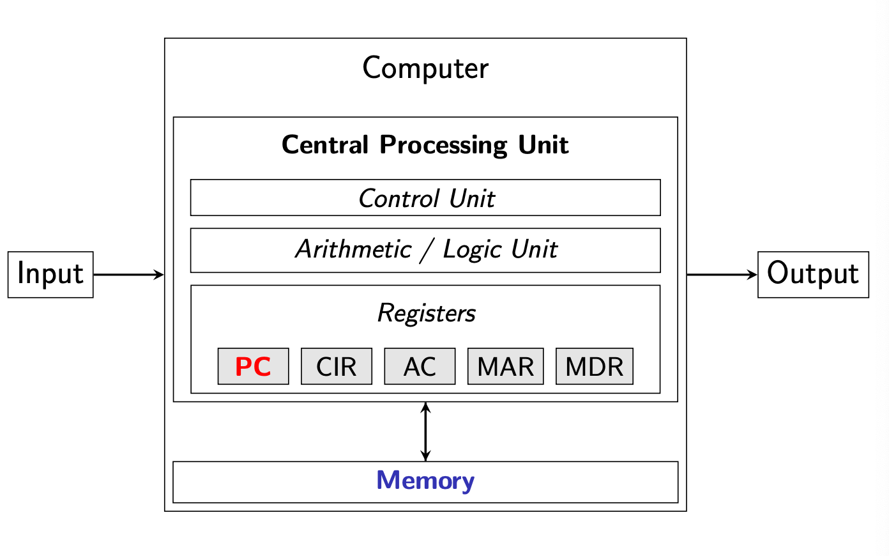
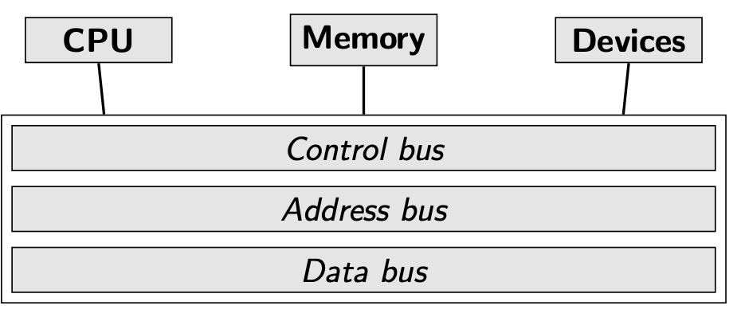
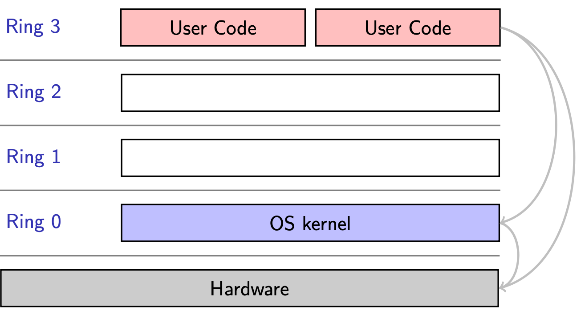
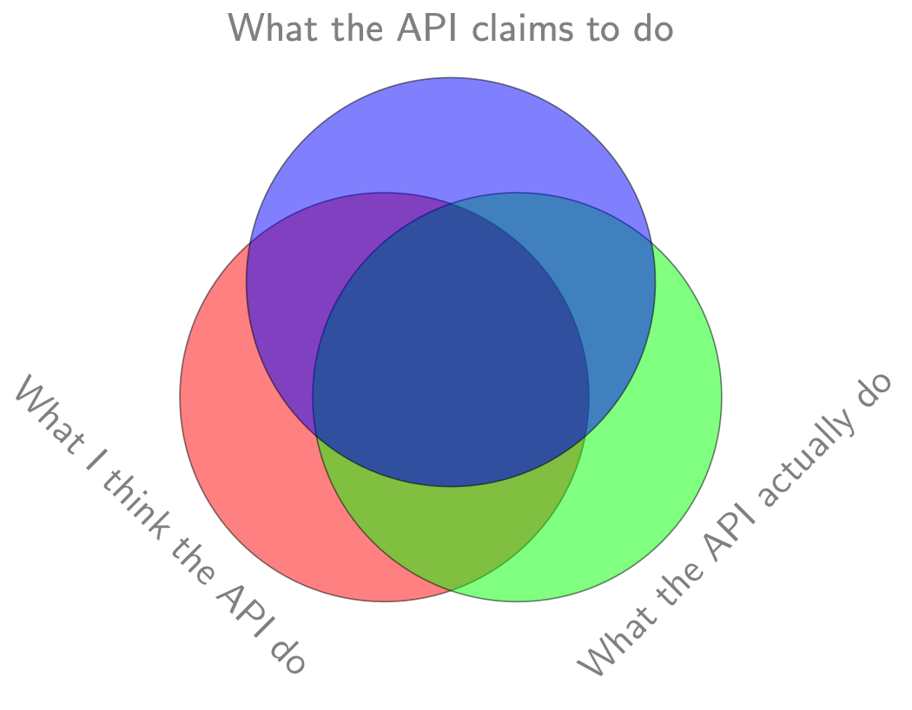

# Software systems security  
## Course syllabus
4 Assignments total, **NO** Mid term and Final Exam
- Assignment 1: **21 Jan - 31 Jan**
- Assignment 2: **04 Feb - 14 Feb**
- Assignment 3: **04 Mar - 14 Mar**
- Assignment 4: **18 Mar - 28 Mar**
- Mini Research Project: 04 Apr (optional, can be used to replace worst assignment grade).

## Week 1-1
### Frameworks for security concerns
- **Confidentiality:** Data cannot be accessed without permission (i.e reading). 
- **Integrity:** Data cannot be changed without permission (i.e writing).
- **Availability:** Data is there when you want it.

Computing system is **SECURE** if it has all **3** properties.

### Work in software security
- **Vulnerability:** Identify a bug in the program that may cause some damage.  
func(Code) --> Bug
- **Exploitation:** Given a set of bugs, exploit them to achieve a desired goal.  
func(Code,{...Bug...}, Goal) --> Action
- **Mitigation:** Given a set of buys and associated set of exploits, prevent them.  
func(Code,{...Bug...},{...Action...}) --> Blockage
- **Detection:** Given a program, check the existence of a specific type of bug.  
func(Code, Bug, [Action]) --> Signal  

**Prevention is the BEST**

## Week 1-2
## OS
### Layered abstractions
- Systems is designed as a stack of layers.
- Each layer hides implementation details of lower layers.

### C-Code to Bare Metal abstraction
**Recap: Von Neumann Architecture**   
  

example C code:
```
#include <stdio.h>

int main(void){
    printf("hello world");
    return 0;
}
```
The above code is abstracted into opcode for the CPU architecture (e.g von neumann).

**What happens behind the scenes:**  
Suppose there is a CPU instruction called `output <char>`, with opcode `0b <char>`.  
This operation sends a single character `<char>` to the output device (e.g terminal display).
Steps:
1. Find free memory locaiton (e.g 0x0010)
2. Put the byte value of `<char>` to the memory location.
3. Put 0x0010 into the PC register. (tells the program where to look for the character)

### Bus Systems
In modern CPUs there is no such opcode to send a single character `<char>` to the output device.  
Instead we use bus systems.  



To send a character to the I/O device (serial device for display), `write <control-address> <char>`.

**Device driver:**  
- Manages most if not all interactions between OS and hardware device.
- Provides the OS with hardware functions without needing to know precise details about hardware being used.
- Probe the bus system and devices during intialisation.
- Proxy requires between application and device.

**Abstraction using device driver:**
To send character to the I/O device we can now simply use a function call from the device driver, e.g `device_driver_function (WRITE_CHAR_COMMAND, <char>)`

**Getting the `<control-address> directly`**  
To send the character to the I/O device, we can now do this instead:  
1. function call `device_driver_function(GET_ADDRESS)`.
2. write to address `write <control-address> <char>`.

However might not work as the `<control-address>` might be a privileged address space that only kernel instrucitons can read and write to.

**Abstraction using kernel:**  
Therefore we need to go through the kernel to carry out the above function (outputing a character to I/O).



The kernel provides another layer of abstractions between the OS and the hardware device.

### System calls (syscalls)

System calls are the intermediate between interactions with the kernel such that programs running can access kernel fucntions without needing to know the **precise details** on how these funcitons are implemented.

## SE
### Modularisation 
- Breaking down a complex system into smaller, independent modules.
- Each module is responsible for a specific function and can be **developed, tested and maintained**.

### Decoupling
- Minimizing dependencies between modules such that changes to one module will not affect others.
- Components in a decoupled system communicate through well-defined interfaces or protocols.

For example, in the following program:
```
#include <stdio.h>

int main(void){
    printf("Hello world);
    return 0;
}
```
The `program` and `libc` is decoupled and the program only invokes `libc` funcrtions via well-defined interfaces, i.e interfaces included in `<stdio.h>`

Since `libc` is the C standard library, and a library is just a collection of functions, we can actually just replace `#include <stdio.h>` with the `printf` function directly, i.e:
```
int printf(const char *fmt, ...)

int main(void){
    printf("Hello world);
    return 0;
}
```

### Issues with abstraction


**Hidden dependency management:**
For increased usability, the common practice for compilers is to hide the depenencies that it uses.

For example in gcc and clang,
- finds stdio.h through pre-defined search path
- finds libc through a pre-defined set of locations.

**Supply chain Attack**
Attacker exploits vulnerability in dependency that your program runs on, instead of the actual program itself.  
For example, the attacker knows you have a vulnerable version of a dependency, he can create a program that attacks the vulnerability of that specific version.

### Compilers
```
#include <stdio.h>
#include <string.h>

int main(void) {
char buff[8];
int pass = 0;

printf("Enter the password: ");
gets(buff);

if(strcmp(buff, "warriors")) {
printf("Wrong password\n");
} else {
printf("Correct password\n");
pass = 1;
}

if(pass) {
printf ("Root privileges granted\n");
}
return 0;
}
```
by compiling the above code using 
```
gcc -m64 -fno-stack-protector
```
and password `golden-hawks`

it supposed to overwrite the byte value of `pass` in the memory stack and grant root privileges even when the password is wrong.  
This is because the buffer of 8 bytes is too small and the input overflows the fixed size buffer and overwrites the byte content of the memory address of `pass`, `pass` is now `True`, causing the code at line 18 to run.  
**this does not work on macos**  
gcc on mac is just an alias of clang, which is a different compiler, and will not have the same memory assignment as gcc, which is a possible reason to why the exploit fails to run on macos.

**Implications of the Von Neumann architecture:**  
1. Same memory space for code and data.
    - Code and data can be address the same way.
    - In you manage to get the PC register to point to a memory address containing your logic, you can hijack the control flow.  

2. Singular Unified memory. 
    - Job of the compiler/ language/ runtime to optimize the memory utilisation.
    - Mappling logic for variables need to be consistent in the same architecture.

continue from page 30 later.


