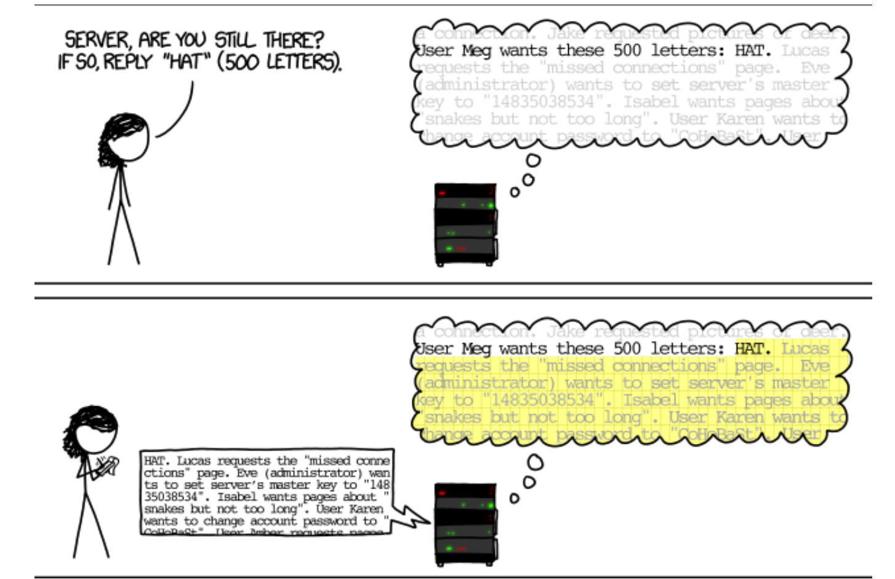

# Week 2 notes

## Hearbleed Vulnerability (CVE-2014-0610)


Keep sending heartbeat messages to server to maintain connection.  
Server doesn't verify the no. bytes of the echo message, and sends that overflow from that of the requested echo string.  

## demo buffer overflow

```
#include <stdio.h>
#include <unistd.h>

int vuln(){
    char buf(80);
    int r;
    r = read(0,buf,400)
    printf("\nRead %d bytes\n",r);
    return 0;
}
int main(int argc, char *argv[]){
    printf("Try to exec /bin/ls");
    vuln();
    return 0;
}
```

**Shellcode concept**  
Code can be data and Data can be code in shellcode.  
Can store data in shellcode buffer and then execute it later.

**Concept: Exploiting the code above**  
Buffer overflow exploit:  

buffer is 80 bytes long but r reads 400 bytes.  
To exploit this vulnerable code,  
overflow the buffer, then change the return address to something that you control (some function), then the function will be executed, allowing you to RCE.

**Exploiting the code method**  
1. generate needle file with 256 bytes.
2. in gdb, run the code file and use the needle file as input.
3. observe that the stack pointer ends at 67th byte
4. at the 68th byte is when the return address is stored.
5. find the return address of the buf to using gdb.
6. overwrite the return address at the 68th byte w the address of the start of the buf.
7. run the code and it will run the "ls" command.


## demo Use after free

continue at slide 15