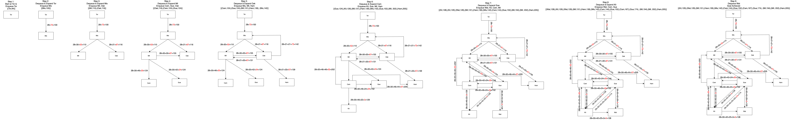
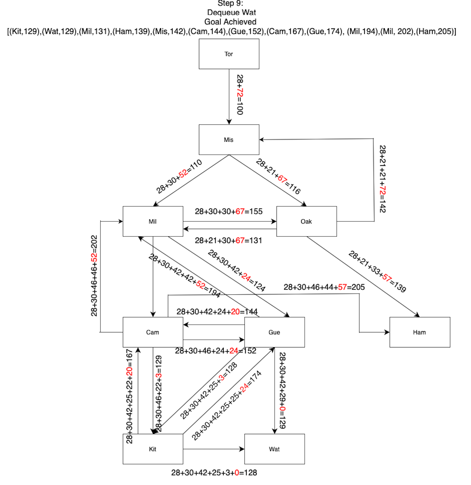
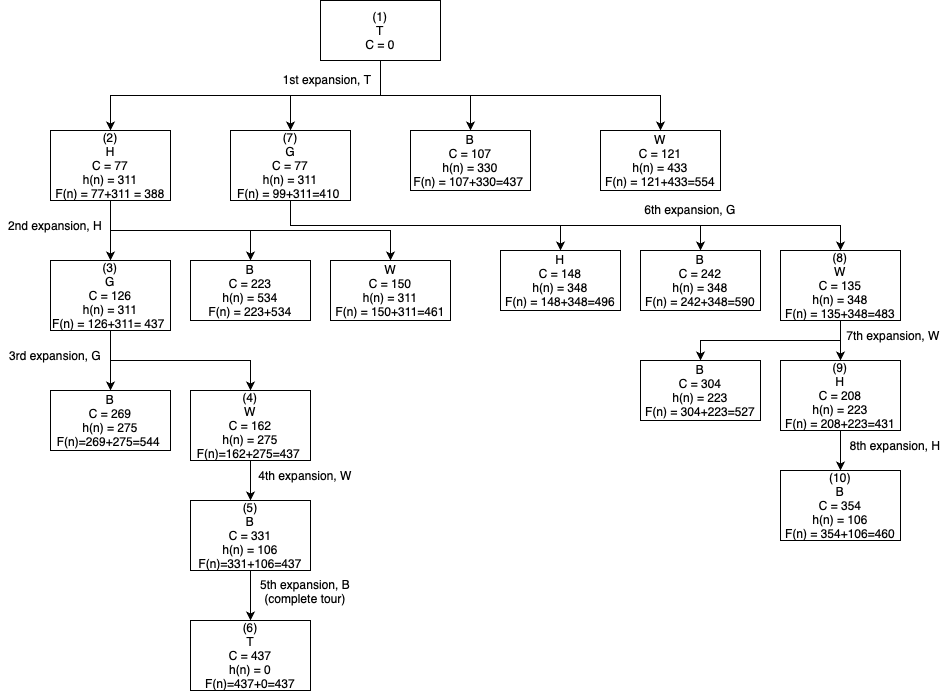

CS486 Assingment 1 submission

Name: Amos Sng  
Student Number: 21175177

## 1. Shortest Route to Waterloo

### 1.1
The Euclidean distance, h(C), is the shortest distance between 2 nodes as it is the straight line segment between the 2 nodes.  
Therefore the Euclidean distance function never overestimates the cost of reaching the goal it is already the lowest possible value.  
For func(C) is a function that calculates the actual distance between 2 nodes, h(C) <= func(C).  
Therefore Euclidean distance is a consistent heuristic function.

## 1.2
**Full Diagram:**   
  
**Final Diagram (for ease of viewing):**

The expansion path taken is
```
Tor (Start)--> Mis --> Mil --> Gue --> Kit --> Wat (Goal)
```

## 2. Travelling Salesperson

### 2.a
Representing the above graph in a python dictionary format:

```
graph = {
    "W": [("G", 36), ("T", 121), ("B", 169), ("H", 73)],
    "G": [("W", 36), ("H", 49), ("T", 99), ("B", 143)],
    "H": [("G", 49), ("T", 77), ("B", 146), ("W", 73)],
    "T": [("H", 77), ("G", 99), ("W", 121), ("B", 107)],
    "B": [("T", 107), ("H", 146), ("W", 169), ("G", 143)]
}
```
To represent a general TSP problem suitable for A*, each state of the search will have to consist of (current city, [List of visited cities], total cost). For example a state could be in the form of ("T", ["T","G"], 99), in other words, the current node is Toronto, The salesman has travelled through Toronto and Guelph, and the total cost of this traversal so far is 99.  
The inital state is when the salesman starts at any city in the given graph, with an empty visit history set other than the city he started in. For example, ("T", ["T"], 0) indicates that the salesman started this traversal at Toronto with the total travel cost of 0.  
The goal state of the TSP problem represented for A* is when all the cities in the graph have been visited at least once and the salesman returns to the starting city. For example, ("T", ["T","G","H","B","W"],584) indicates the sales person has started from Toronto, then traversed through Guelph, Hamilton, Barrie, Waterloo, then back to Toronto in that order, thus completing the TSP traversal.  
To generate the neighbours from any current city, move to any unvisited city (i.e check the list of visited cities and travel to any city not in the list), then add that city into the visited city list, and increase the total cost based on the cost of the edge betwwen the current city and the neighbour that will be traversed.  
To calculate the F value for A* search, where F = C + H, where C is the cost of traversing a particular edge between 2 cities and H be the heuristic value of a given city to visit. H can be determined using a Heuristic function, for example a Minimum Spanning Tree (MST) function that calculates the minumum total cost of traversing the remaining unvisited nodes in the graph.  
By establishing these representations, we are able to conduct A* search on any generic TSP graph.

### 2.b 
The cost function is the function that calculates the total sum of all costs pertaining to the edged traversed from the starting city to the current city.  
For example if the current state is ("G", ["T","H","G"],126), this means we started from Toronto, traversed the graph through the path, Toronto --> Hamilton --> Guelph, so the total cost, C = Cost of travelling from T to H + Cost of travelling from H to G. Hence C = 77 + 49 = 126.

### 2.c  
A possible heuristic function h(n) for node n can be a Minimum Spanning Tree (MST) of the remaining unvisited nodes and returning to the start.  
We can caluclate h(n) by using the following formula:  
h(n) = MST of unvisited cities + min(edge from an unvisited city back to start)  
We can use the h(n) heuristic to provide us information on which node to traverse next by computing the h(n) values of the unvisited nodes.  
For example, given the state ("G",["T","H","G"],126), i.e the current city is Guelph (G), we traversed T--> H --> G in that order, and the total cost of traversal by far is 126.  
To calculate the h(n) value, we first calculate the MST for remaining cities "B" and "W".  
B --> W = 169  
G --> B = 143  
G --> W = 36
We can traverse from G through the 2 remaining cities using G --> W --> B, where the MST cost is 36+169=205.  
Alternatively, we can traverse through the path G --> B --> W, where the MST cost is 143+169=312.  
Then we compute the min(edge from unvisited node back to start), where:  
B --> T = 106  
W --> T = 121
Thereforce in this example the  
h("B") = 205 + 106 = 311  
h("W") = 312 + 121 = 433  

### 2.e  


## 3. Sentences with the Highest Probability
### 3.1 
No, a greedy algorithm does not always yield the highest-probability sentence. This can be seen from the example below.  
First let our vocabulary be V = {A, B}, such that |V| = 2 $\le$ 3, and our sentence is of length n = 2.  
In this setup, in the autogressive model, the probability of the sentence <w<sub>1</sub>, w<sub>2</sub>, <$EOS$>> is P<sub>Θ</sub>(w<sub>1</sub>) x P<sub>Θ</sub>(w<sub>2</sub>|w<sub>1</sub>) x P<sub>Θ</sub>(<$EOS$>|w<sub>1</sub>,w<sub>2</sub>).
Let us estabilish that the 1st word probabilities are:  
P<sub>Θ</sub>(A) = 0.6  
P<sub>Θ</sub>(B) = 0.4  
and the 2nd word probabilities are:  
P<sub>Θ</sub>(A|A) = 1   
P<sub>Θ</sub>(B|A) = 0   
P<sub>Θ</sub>(B|B) = 1  
P<sub>Θ</sub>(B|A) = 0  
This means that the greedy algorithm will pick A for the first word since 0.6 > 0.4. Then after choosing A for the 1st word, it will always pick A again for w<sub>2</sub> since 1 > 0.  
Similarly, if B is chosen as w<sub>1</sub>, then B will be picked again for w<sub>2</sub>.  
We then establish that the probability of <$EOS$> given the 2 word prefix is:  
P<sub>Θ</sub>(<$EOS$> | A,A) = 0.1  
P<sub>Θ</sub>(<$EOS$> | B,B) = 0.9  
From this example, we can then derive that the probabilities of the 2 possible sentences of length n = 2 are:  
Sentence <A,A,<$EOS$>>:  
P<sub>Θ</sub>(A) x P<sub>Θ</sub>(A|A) x P<sub>Θ</sub>(<$EOS$>|A,A)= = 0.6 x 1 x 0.1 = 0.06  
Sentence <B,B,<$EOS$>>:  
P<sub>Θ</sub>(B) x P<sub>Θ</sub>(B|B) x P<sub>Θ</sub>(<$EOS$>|B,B)= = 0.4 x 1 x 0.9 = 0.36
From this we can see that the higher-probability senstence is actually <B,B,<$EOS$>>, however the greedy algorithm will yield <A,A,<$EOS$>>, which is the less probable sentence. As such making the locally optimal choice at each step does not guatantee the overall best sentence.

### 3.2  
Given that we want to find the single highest probability sentence of length n, and each API call is constant time, for each sentence <w<sub>1</sub>, w<sub>2</sub>,...,w<sub>n</sub>>, we would need to compute P<sub>Θ</sub>(w<sub>1</sub>) x P<sub>Θ</sub>(w<sub>2</sub>|w<sub>1</sub>) x ... x P<sub>Θ</sub>(w<sub>n</sub>|w<sub>1</sub>,...,w<sub>n-1</sub>). This will take n calls to the API, which each call takes constant time, resulting in O(n) complexity.
The total time complexity would be in the order of O(n)

### 3.3
**State:** represents a partial prefix of the sentence, e.g State = <w<sub>1</sub>, w<sub>2</sub>,..., w<sub>m</sub>>, where m $\le$ n.  
**Initial State:** is the empty prefix, i.e State = < >, where no words have been chosen yet.  
**Goal State:** any state that has exactly n words and an <$EOS$> token, e.g a sentence of length n=2 will have goal state of: <w<sub>1</sub>, w<sub>2</sub>,<$EOS$>>.  
**Successor Function:** is the function implemented by the API of the language model that will calculate the probability of the next word, w, using the function prob(w,c).  
**Cost Function:** The model gives the probability of each next word, P<sub>Θ</sub>(w|w<sub>1</sub>,..., w<sub>m</sub>), i.e prob(w,c). Since a higher probability should equate to lower cost, we can let the cost be the negative logarithmic function of the probability obtained from prob(w,c), i.e Cost = -log(P<sub>Θ</sub>(w<sub>m</sub>|w<sub>1</sub>,..., w<sub>m-1</sub>)).  
Then we can conclude that the total cost to achieve this state is:  
Cost = -$\sum_{i=1}^{m}log P$<sub>Θ</sub> (w<sub>i</sub> | w<sub>1</sub>,..., w<sub>i-1</sub>).
Therefore by minimizing this sum, it is equivilent to maximizing the sequence's total probability.  
To formulate this as a search problem using the Lowest-cost-first search, we execute the following steps:  
1. Initialize a priority queue of states, and insert the intial state, State = < > and cost = 0.
2. Pop from the priority queue the state, s, with the lowest cost so far.  
3. Check if s is a goal.
    - if s has length n and the last token is <$EOS$>, return s.
    - else continue.
4. Expand state s = <w<sub>1</sub>,..., w<sub>m</sub>> to its successors by appending each possible w $\in$ V, or <$EOS$> if m = n, and compute the new cost. new_cost = current_cost + (-log P<sub>Θ</sub> (w | w<sub>1</sub>,..., w<sub>m</sub>)).  
5. push each successor state s' = (w<sub>1</sub>,...,w<sub>m</sub>,w) with new_cost into priority queue.  
6. Repeat step 2-5 until either a goal is found or the search space is exhausted.  

### 3.4  
The memory complexity is O(|V|<sup>n,</sup>). For the 1st word, the frontier stores |V| costs of travelling to each word in V. Similarly, for the 2nd word, the frontier has to store |V| costs of travelling to each 2nd word from each first word. This causes |V|<sup>2</sup> memory complexity for n =2. Extending this to the n<sup>th</sup> word, the complexity is hence O(|V|<sup>n</sup>).  


