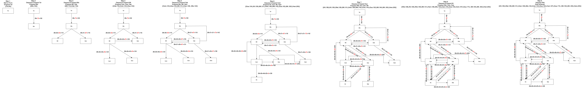

# CS486 Assingment 1 submission

Name: Amos Sng  
Student Number: 21175177

## 1. Shortest Route to Waterloo

### 1.1
The Euclidean distance, h(C), is the shortest distance between 2 nodes as it is the straight line segment between the 2 nodes.  
Therefore the Euclidean distance function never overestimates the cost of reaching the goal it is already the lowest possible value.  
For func(C) is a function that calculates the actual distance between 2 nodes, h(C) <= func(C).  
Therefore Euclidean distance is a consistent heuristic function.

## 1.2
**Full Diagram:**   
  
**Final Diagram (for ease of viewing):**

The expansion path taken is
```
Tor (Start)--> Mis --> Mil --> Gue --> Kit --> Wat (Goal)
```