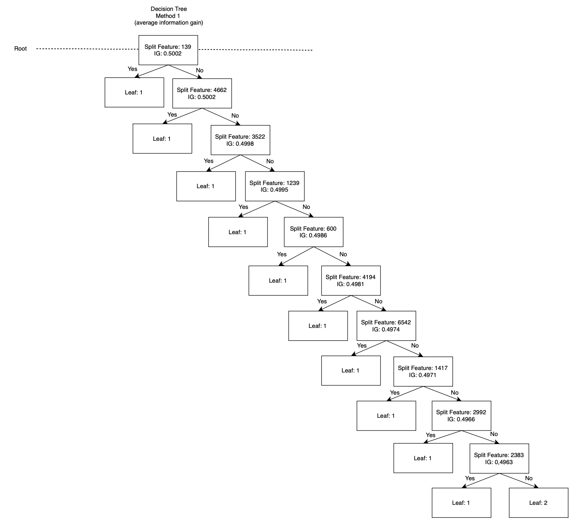
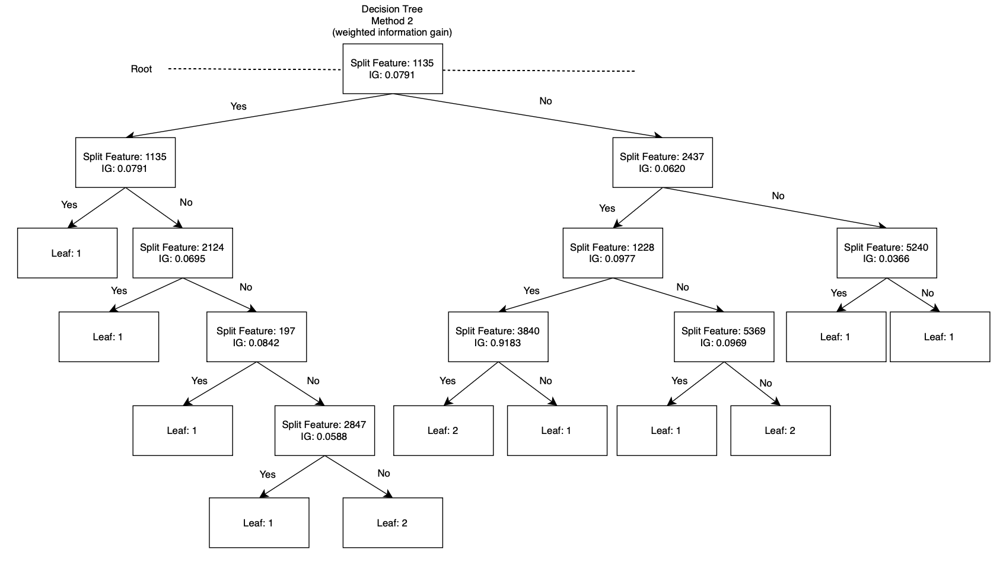
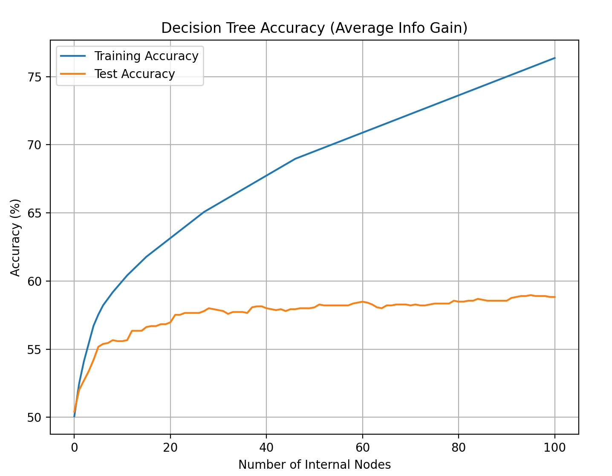
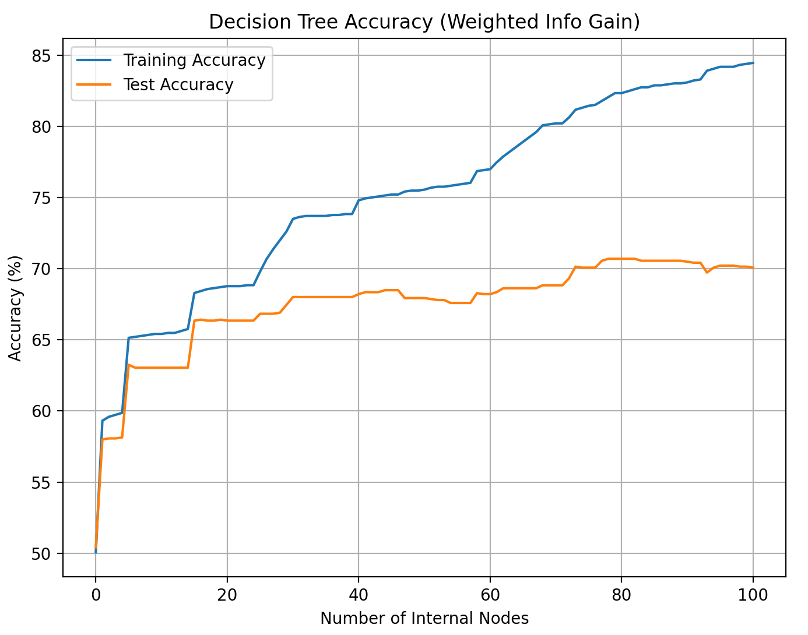
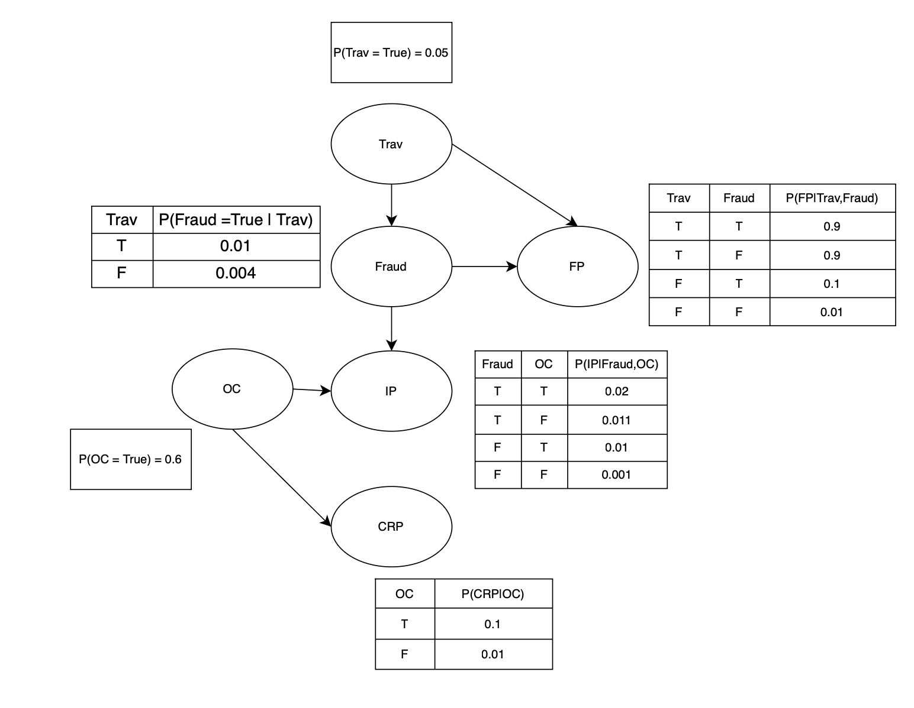

# CS486 Assignment 2 writeup
Name: Sng Wei Qi Amos  
Student ID: 21175177

## Question 1: Text Categorization with Decision Tress
### Part 1.
Code solution in file: [code.py](code.py)

### Part 2. 
**Method 1**  
(Average Information Gain):  

{width=50%}  
**Method 2** 
(Weighted Information Gain):  
{width=50%}

### Part 3.
**Method 1**
(Average Information Gain):  

{width=50%}

**Method 2:**   
(Weighted Information Gain):  
{width=50%}

## Question 2: Bayesian Networks and Variable Elimination
### Part a
#### Conditional Probabilities
1. Traveling (Trav):
    - P(Trav) = 5%
2. Fraud (Fraud):
    - Parent: Trav
    - Conditional Probabilities
        - P(F|Trav=yes) = 0.01
        - P(F|Trav=no) = 0.004
3. Foreign purchase (FP):
    - Parent: Trav, Fraud
    - Conditional Probabilities:
        - P(FP|Fraud=yes,Trav=yes) = 0.9
        - P(Fp|Fraud=no,Trav=yes)= 0.9
        - P(FP|Fraud=yes,Trav=no) = 0.1
        - P(FP|Fraud=no,Trav=no) = 0.01
4. Computer ownership (OC):
    - P(OC)= 0.6
5. Internet Purchases (IP)
    - Parent: Fraud, OC
    - Conditional Probabilities:
        - P(IP|Fraud=no, OC=yes) = 0.01
        - P(IP|Fraud=yes, OC=yes) = 0.02
        - P(IP|Fraud=no, OC=no) = 0.001
        - P(IP|Fraud=yes, OC=no) = 0.011
6. Computer Related Purchase (CRP)
    - Parent: OC
    -  Conditional Probabilities:
        - P(CRP|OC=yes) = 0.1
        - P(CRP|OC=no) = 0.01

#### Dependencies
Trav --> Fraud
Trav --> FP
Fraud --> FP
OC --> IP
Fraud --> IP
OC --> CRP

#### Bayes' Network diagram
{width=50%}

### Part b
#### b.i
To find $P(Fraud)$, we first need to find all the parent of the $Fraud$ node, which is the $Trav$ node. We note that Conditional probability, $P(Fraud|Trav) in the table below:

| $Trav$ | $P(Fraud \| Trav)$ |
|--------|--------------------|
| True   | 0.01               |
| False  | 0.004              |

We also know that $P(Trav=True)$ = 0.05 and $P(Trav=False)$ = 1-0.05=0.95

Then we can find $P(Fraud)$ using the law of total probability,

$P(Fraud) = P(Fraud|Trav=True)*P(Trav=True)+ P(Fraud|Trav=False)*P(Trav=False) = 0.01 * 0.05 + 0.004 * 0.95 = 0.005 + 0.0038 = 0.0043$

#### b.ii
We are given:
- FT = True
- IP = False
- CRP = True

We want to find $P(Fraud = True| FT=True, IP=False, CRP=False)$
Factors in Bayesian network:  
1. $f_1(Trav)$:
    - $P(Trav = T) = 0.05$
    - $P(Trav = F) = 0.95$
2. $f_2(Fraud|Trav)$:
    - $P(Fraud=T|Trav=T)=0.01$
    - $P(Fraud=F|Trav=T)=0.99$
    - $P(Fraud=T|Trav=F)=0.04$
    - $P(Fraud=F|Trav=F)=0.96$
3. $f_3(FP|Trav,Fraud)$: we know FP = T
    - $P(FP=T|Trav=T, Fraud=F)=0.9$
    - $P(FP=T|Trav=T, Fraud=T)=0.9$
    - $P(FP=T|Trav=F, Fraud=T)=0.1$
    - $P(FP=T|Trav=F, Fraud=F)=0.01$
4. $f_4(OC)$:
    - $P(OC=T)=0.6$
    - $P(OC=F)=0.4$
5. $f_5(IP|Fraud,OC)$: we know IP = F
    - $P(IP=F|Fraud=T, OC=T)=0.98$
    - $P(IP=F|Fraud=F, OC=T)=0.99$
    - $P(IP=F|Fraud=T, OC=F)=0.989$
    - $P(IP=F|Fraud=F, OC=F)=0.999$
6. $f_6(CRP|OC)$: we know CRP = T
    - $P(CRP=T|OC=T)=0.1$
    - $P(CRP=T|OC=F)=0.01$

Elimination:
- Step 1: we combine factors with $Trav$, i.e $f_1(T), f_2(Fraud|Trav), f_3(FP=T|Trav,Fraud)$
    - joint Factor $g(Fraud) = \sum_T{P(T)P(F|T)P(FP=T|F,T)}$
    - for $Fraud=T$:
        > $P(Trav=T)P(Fraud=T∣Trav=T)P(FP=T∣Fraud=T,Trav=T)+P(Trav=F)P(Fraud=T∣Trav=F)P(FP=T∣Fraud=T,Trav=T)$ = $(0.05)(0.01)(0.9)+(0.95)(0.004)(0.1)$ = $0.00083$
    - for $Fraud=F$:
        > $P(Trav=T)P(Fraud=F∣Trav=T)P(FP=T∣Fraud=F,Trav=T)+P(Trav=F)P(Fraud=F∣Trav=F)P(FP=T∣Fraud=F,Trav=T)$ = $(0.05)(0.99)(0.9)+(0.95)(0.996)(0.01)$ = $0.054$ 
    
    - joint Factor $g(Fraud=T) = 0.00083, g(Fraud=F) = 0.054$
- Step 2: Eliminate IP, OC, CRP, i.e $f_4(OC), f_5(IP=F|Fraud,OC), f_6(CRP=T|OC)$
    - joint Factor $h(Fraud) = \sum_{OC}{P(OC){(IP=F|Fraud,OC)P(CRP=T|OC)}}$ 
    - for $Fraud=T$:
        > $P(OC=T)P(IP=F|Fraud=T,OC=T)P(CRP=T,OC=T)+P(OC=F)P(IP=F|Fraud=T,OC=F)P(CRP=T,OC=F)=(0.6)(0.98)(0.1)+(0.4)(0.989)(0.01)=0.0588+0.003956=0.062756$
    - for $Fraud=F$
        > $P(OC=T)P(IP=F|Fraud=F,OC=T)P(CRP=T,OC=T)+P(OC=F)P(IP=F|Fraud=F,OC=F)P(CRP=T,OC=F)= (0.6)(0.99)(0.1)+(0.4)(0.999)(0.01)=0.003996$
- Step 4: combine both joint factors on F
    - $k(Fraud) = g(Fraud) * h(Fraud)$
    - For $Fraud =T$
        > $k(Fraud=T) = (0.00083)(0.062756)=0.00005213$
    - For $Fraud=F$
        > $k(Fraud=F) = (0.054)(0.063396) = 0.00342338$
- Step 5: 
    - $P(Fraud=T|evidence) = \frac{k(Fraud=T)}{k(Fraud=T)+k(Fraud=F)}= \frac{0.00005213}{0.00005213+0.00342338} \approx 0.015$

Hence there is a 1.5% chance of the transaction being Fraudulent given the evidence we are provided.

### Part c
We can first make a offline Computer Related Purchase in that week that we want to use the card for fraud. Since our Bayesian Network uses CRP to infer if the cardholder is a computer owner, i.e OC=T, and the Bayesian Network has knowledge that an Internet Purchase (IP) made by a cardholder of OC=T is less likely to be fraud than a cardholder of OC=F, we can use a CRP to trick our Bayesian Network into believing that the cardholder is OC=T. Then the chances of us getting caught for fraud when making the IP is lower as the Bayesian Network is less likely to detect the fraud as the probability for that internet transaction to be fraud is lower, given that the cardholder is OC=T.
    

