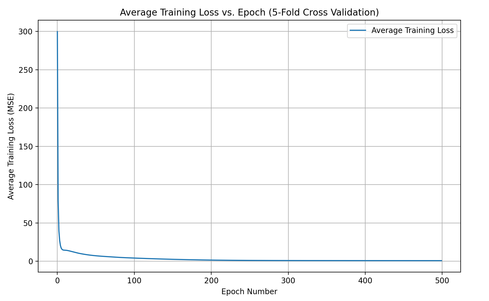

# CS486 Assignment 3 writeup
Name: Sng Amos
Student ID: 21175177

## Naive Bayes Learning 
### a. Naive Bayes classifier 
Print out of Naive Bayes Classifier code:
```python
from collections import defaultdict
import math

def load_data(data_file_name, label_file):
    docs = defaultdict(set)
    with open(data_file_name, 'r') as data_file:
        for line in data_file:
            parts = line.strip().split()  # Split each line into doc_id and word_id.
            if len(parts) != 2:
                continue 
            doc_id, word_id = int(parts[0]), int(parts[1])
            docs[doc_id].add(word_id)
    
    #read the labels from the label file, each line corresponds to a document's label.
    labels = {}
    with open(label_file, 'r') as label_file_obj:
        for idx, line in enumerate(label_file_obj, start=1):
            labels[idx] = int(line.strip())  # Store the label for each document (doc IDs assumed to be 1-indexed).
    return docs, labels

def load_words(words_file):
    # This function loads the vocabulary mapping: word_id -> actual word.
    word_map = {}
    with open(words_file, 'r') as words_file_obj:
        for idx, line in enumerate(words_file_obj, start=1):
            word_map[idx] = line.strip()  # Map the line number (word_id) to the word.
    return word_map

# Naive Bayes training function

def train_naive_bayes(train_docs, train_labels, V):
    num_docs = len(train_docs)
    class_counts = [0, 0]  # Counters for the two classes
    word_counts = [[0] * (V + 1) for _ in range(2)]
    
    for i in range(num_docs):
        label = train_labels[i]
        class_index = label - 1  # Convert label (1 or 2) to index (0 or 1).
        class_counts[class_index] += 1  # Increment count for this class.
        for word_id in train_docs[i]:
            if 1 <= word_id <= V:
                word_counts[class_index][word_id] += 1  # Increment count for word in the given class.
    
    # calc class priors
    class_priors = [count / num_docs for count in class_counts]
    
    # calc conditional probabilities with Laplace smoothing.
    cond_probs = [[0] * (V + 1) for _ in range(2)]
    for c in range(2):
        for w in range(1, V + 1):
            cond_probs[c][w] = (word_counts[c][w] + 1) / (class_counts[c] + 2)
    
    return class_priors, cond_probs

# prediction function

def compute_log_scores(doc, class_priors, cond_probs, V):
    scores = [0, 0]
    for c in range(2):
        # log the prior probability
        score = math.log(class_priors[c])
        total = 0.0
        # Sum the contribution of words that are not present in the document
        for w in range(1, V + 1):
            total += math.log(1 - cond_probs[c][w])
        score += total
        # Adjust score for each word present in the document
        for w in doc:
            if 1 <= w <= V:
                score += math.log(cond_probs[c][w]) - math.log(1 - cond_probs[c][w])
        scores[c] = score
    return scores

def classify(doc, class_priors, cond_probs, V):
    scores = compute_log_scores(doc, class_priors, cond_probs, V)
    # if log score for class 1 is higher, return label 1, else, return label 2
    return 1 if scores[0] > scores[1] else 2

# Eval function

def evaluate(docs, labels, class_priors, cond_probs, V):
    correct = 0
    total = len(docs)
    for i in range(total):
        prediction = classify(docs[i], class_priors, cond_probs, V)
        if prediction == labels[i]:
            correct += 1
    return (correct / total) * 100

# identify discriminative words

def print_top_discriminative_words(cond_probs, vocab, V, top_n=10):
    discriminative_features = []
    for word_id in range(1, V + 1):
        # Compute log probabilities for both class
        log_prob_label1 = math.log(cond_probs[0][word_id])
        log_prob_label2 = math.log(cond_probs[1][word_id])
        # Compute the absolute difference between the log probabilities
        diff = abs(log_prob_label1 - log_prob_label2)
        discriminative_features.append((word_id, diff))
    
    # Sort the features by the absolute difference in descending order
    discriminative_features.sort(key=lambda x: x[1], reverse=True)
    
    print("\nTop {} Discriminative Words:".format(top_n))
    for i in range(top_n):
        word_id, diff = discriminative_features[i]
        # Print the word ID, the corresponding word, and the discriminative score
        print("Word ID: {}, Word: '{}', |log P(word|label1) - log P(word|label2)| = {:.4f}".format(
            word_id, vocab[word_id], diff))

# main exec

def main():
    # Load the training and testing data 
    train_docs_dict, train_labels_dict = load_data("datasets/p1/trainData.txt", "datasets/p1/trainLabel.txt")
    test_docs_dict, test_labels_dict = load_data("datasets/p1/testData.txt", "datasets/p1/testLabel.txt")
    # Load the vocabulary
    vocab = load_words("datasets/p1/words.txt")
    V = len(vocab)
    
    # Convert dictionaries to lists
    train_ids = sorted(train_docs_dict.keys())
    train_docs = [train_docs_dict[doc_id] for doc_id in train_ids]
    train_labels = [train_labels_dict[doc_id] for doc_id in train_ids]
    
    test_ids = sorted(test_docs_dict.keys())
    test_docs = [test_docs_dict[doc_id] for doc_id in test_ids]
    test_labels = [test_labels_dict[doc_id] for doc_id in test_ids]
    
    print("Number of training documents:", len(train_docs))
    print("Number of testing documents:", len(test_docs))
    print("Vocabulary size:", V)
    
    # Train the Naïve Bayes classifier on the training data
    class_priors, cond_probs = train_naive_bayes(train_docs, train_labels, V)
    
    # Evaluate the classifier on the training set
    train_accuracy = evaluate(train_docs, train_labels, class_priors, cond_probs, V)
    # Evaluate the classifier on the testing set
    test_accuracy = evaluate(test_docs, test_labels, class_priors, cond_probs, V)
    
    print("Training Accuracy: {:.2f}%".format(train_accuracy))
    print("Testing Accuracy: {:.2f}%".format(test_accuracy))
    
    # Print top 10 discriminative words
    print_top_discriminative_words(cond_probs, vocab, V, top_n=10)

if __name__ == "__main__":
    main()
```


### b. Discriminative word features
Top 10 most discriminative word features, ranked in descending order: 
```
Word ID: 193, Word: 'christian', absolute difference = 3.5863
Word ID: 5240, Word: 'religion', absolute difference = 3.5143
Word ID: 4662, Word: 'atheism', absolute difference = 3.2986
Word ID: 2437, Word: 'books', absolute difference = 3.2399
Word ID: 1239, Word: 'christians', absolute difference = 3.2216
Word ID: 4829, Word: 'library', absolute difference = 3.2161
Word ID: 199, Word: 'religious', absolute difference = 3.0938
Word ID: 3163, Word: 'libraries', absolute difference = 3.0883
Word ID: 6898, Word: 'novel', absolute difference = 3.0883
Word ID: 3522, Word: 'beliefs', absolute difference = 2.9985
```
Yes they are good features in discriminating between the 2 classes.  
Words like "christian," "religion," and "atheism" are related to discussions surrounding belief systems which would have high likelihood in appearing in a subreddit like r/atheism, which predominantly contains discussions about belief systems and religion.  
Words like "books," "library," "libraries," and "novel" are clearly aligned to literature, making them highly likely to come from the r/books subreddit, which would predominantly have discussions surrounding the topic of literature. 

### c. Model evaluation (Accuracy)
Training and Testing accuracy printout:
```
Training accuracy: 0.9260273972602739
Test accuracy: 0.736551724137931
```

### d. Assumption of independence
No that assumption might not be applicable to languages because words in natural languages are inherently related. For example, words like "christian" and "religion"
or "books" and "library" tend to occur in phrases or sentences together due to grammatical or semantic relationships. This means that the presence of one word will influence the presence of a related word, which goes against the assumption of independence, which assumes that the presence of one word does not influence the presence of another.

### e. Extension of Naive Bayes model
We can use groups of words/short phrases instead of singular words as features.  
By using short phrases or sentences, we are able to capture teh dependencies between adjacent words, which might possibly improve the Naive Bayes model produced as sentence structures reset every sentence, and adjacent sentences are more likely to be independent of each other.

### f. Using MAP
If we want to use MAP, we would need to add a prior distribution over the parameters.  
The MAP algorithm would then maximize the posterior probability of the parameters by maximizing the product of the likelihood of the observed data and the prior, hence combining the observed data with the prior knowledge we defined.

## 2. Neural Networks for Classification and Regression

### Output from running public test code:
```
=====================================
Mean Absolute Error Test:
Result:    0.58
Expected:  0.58
=====================================
Sigmoid Value Test:
Result:
 [[0.67127781 0.56855769 0.67557056]
 [0.72816587 0.5095089  0.64199991]]
Expected:
 [[0.67127781 0.56855769 0.67557056]
 [0.72816587 0.5095089  0.64199991]]
=====================================
Sigmoid Derivative Test:
Result:
 [[0.22066391 0.24529984 0.21917498]
 [0.19794034 0.24990958 0.22983603]]
Expected:
 [[0.22066391 0.24529984 0.21917498]
 [0.19794034 0.24990958 0.22983603]]
=====================================
ReLU Value Test:
Result:
 [[0.71397008 0.275969   0.73348954]
 [0.98533681 0.03804018 0.58405493]]
Expected:
 [[0.71397008 0.275969   0.73348954]
 [0.98533681 0.03804018 0.58405493]]
=====================================
ReLU Derivative Test:
Result:
 [[1. 1. 1.]
 [1. 1. 1.]]
Expected:
 [[1. 1. 1.]
 [1. 1. 1.]]
=====================================
All tests executed successfully.
=====================================
```

### k-fold (k=5) cross validation

**Size of layers and Activation Function**:
|Layer|Size|Activation|
|-----|----|----------|
|Input Layer|11|N/A|
|Hidden Layer 1|32|ReLU activation|
|Hidden Layer 2|32|ReLU activation|
|Hidden Layer 3|16|Sigmoid activation|
|Output Layer|1|Identity activation|

**Epoch Number vs Average Training Loss Plot**:
{width=50%}

**Mean Absolute Error across all folds**:  
Average Validation MAE: 0.6677  
Validation MAE Standard Deviation: 0.0692

