# CS 486 Assignment 4 submission
Name: Amos Sng  
Student ID: 21175177

## Question 1 
### Part 1
Based on the passage, we know,  

Where DS=0 is absence of Dunetts Syndrom, 1 is mild and 2 is severe,
Probability of presence and severity of Dunetts Syndrome P(DS):
1. P(DS=0) = 0.5
2. P(DS=1) = 0.25
3. P(DS=2) = 0.25

Where T=0 is absence of TRIMONO-HT/S gene, T=1 is presence,
Probability of presence of TRIMONO-HT/S gene P(T):

1. P(T=0) = 0.9
2. P(T=1) = 0.1

Then, inferring from the text we can estimate and assign the priors to each CPT.

CPT for Foriennditis P(F), affected by DS:  
|DS|P(F=1)|P(F=0)|
|--|------|------|
|0|0.1|0.9|
|1|0.8|0.2|
|2|0.3|0.7|

CPT for Sloepnea P(S), affected by DS and T:
|DS|T|P(S=1)|P(S=0)|
|--|-|------|------|
|0|0|0.1|0.9|
|0|1|0.01|0.99|
|1|0|0.8|0.2|
|1|1|0.05|0.95|
|2|0|0.8|0.2|
|2|1|0.05|0.95|

CPT for Deger spot P(D), affected by DS:
|DS|P(D=1)|P(D=0)|
|--|------|------|
|0|0.05|0.95|
|1|0.2|0.8|
|2|0.8|0.2|

####  Bayesian network diagram:  
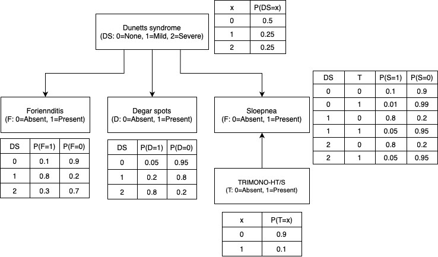

### Part 2
**Python code:**
```python
import numpy as np
import matplotlib.pyplot as plt

# Load data as NumPy arrays (columns: Sloepnea, Foriennditis, Degar, TRIMONO, Dunetts)
train_data = np.loadtxt('a4datasets/traindata.txt', dtype=int)
test_data  = np.loadtxt('a4datasets/testdata.txt', dtype=int)

# Initial CPTs
P_D   = np.array([0.5, 0.25, 0.25])  # Dunetts: none, mild, severe
P_T   = np.array([0.9, 0.1])          # Gene TRIMONO: absent=0, present=1
P_S_DT = np.array([[[0.9,  0.1], [0.99, 0.01]],   # Sloepnea given DS and Gene
                   [[0.3,  0.7], [0.95, 0.05]],
                   [[0.2,  0.8], [0.97, 0.03]]])
P_F_D = np.array([[0.8, 0.2],    # Foriennditis given DS
                  [0.2, 0.8],
                  [0.7, 0.3]])
P_G_D = np.array([[0.85, 0.15],  # Degar spots given DS
                  [0.7,  0.3],
                  [0.1,  0.9]])

# Function to add noise to a CPT with a two-element probability vector along the last axis
def add_noise(CPT, delta):
    noisy_CPT = CPT.copy()
    # Iterate over all indices except the last dimension.
    for idx in np.ndindex(*CPT.shape[:-1]):
        d1, d2 = np.random.uniform(0, delta, 2)
        noisy_CPT[idx + (0,)] = (CPT[idx + (0,)] + d1) / (1 + d1 + d2)
        noisy_CPT[idx + (1,)] = (CPT[idx + (1,)] + d2) / (1 + d1 + d2)
    return noisy_CPT

# Expectation step: compute the posterior weights for DS for each data point
def expectation(data, P_D, P_T, P_S_DT, P_F_D, P_G_D):
    N = data.shape[0]
    weights = np.zeros((N, 3))
    for i in range(N):
        slo, fo, deg, tri, dun = data[i]
        if dun != -1:  # DS is observed
            weights[i, int(dun)] = 1.0
        else:
            probs = np.empty(3)
            for d in range(3):
                probs[d] = (P_D[d] * P_T[tri] *
                            P_S_DT[d, tri, slo] *
                            P_F_D[d, fo] *
                            P_G_D[d, deg])
            weights[i] = probs / (probs.sum() + 1e-12)
    return weights

# Maximisation step: update CPTs based on the weights
def maximisation(data, weights):
    N = data.shape[0]
    # Update P_D: average of weights over all examples
    P_D_new = weights.sum(axis=0) / N

    # Update P_T: use frequency in the data (gene is observed and independent of DS)
    P_T_new = np.array([np.sum(data[:, 3] == t) for t in [0, 1]]) / N

    # Update P_S_DT: for each DS and gene combination, count frequency for each value of Sloepnea
    P_S_DT_new = np.zeros_like(P_S_DT)
    for d in range(3):
        for t in range(2):
            for s in range(2):
                mask = (data[:, 0] == s) & (data[:, 3] == t)
                P_S_DT_new[d, t, s] = np.sum(weights[mask, d])
            s_sum = P_S_DT_new[d, t].sum()
            if s_sum > 0:
                P_S_DT_new[d, t] /= s_sum
            else:
                P_S_DT_new[d, t] = 0.5  # fallback if no data available

    # Update P_F_D: for each DS, count frequency for Foriennditis values
    P_F_D_new = np.zeros_like(P_F_D)
    for d in range(3):
        for f in range(2):
            mask = data[:, 1] == f
            P_F_D_new[d, f] = np.sum(weights[mask, d])
        f_sum = P_F_D_new[d].sum()
        if f_sum > 0:
            P_F_D_new[d] /= f_sum
        else:
            P_F_D_new[d] = 0.5

    # Update P_G_D: for each DS, count frequency for Degar spots values
    P_G_D_new = np.zeros_like(P_G_D)
    for d in range(3):
        for g in range(2):
            mask = data[:, 2] == g
            P_G_D_new[d, g] = np.sum(weights[mask, d])
        g_sum = P_G_D_new[d].sum()
        if g_sum > 0:
            P_G_D_new[d] /= g_sum
        else:
            P_G_D_new[d] = 0.5

    return P_D_new, P_T_new, P_S_DT_new, P_F_D_new, P_G_D_new

# Compute the complete-data log-likelihood (for monitoring convergence)
def compute_likelihood(data, P_D, P_T, P_S_DT, P_F_D, P_G_D):
    log_likelihood = 0.0
    N = data.shape[0]
    for i in range(N):
        slo, fo, deg, tri, dun = data[i]
        if dun != -1:
            d_val = int(dun)
            prob = (P_D[d_val] * P_T[tri] *
                    P_S_DT[d_val, tri, slo] *
                    P_F_D[d_val, fo] *
                    P_G_D[d_val, deg])
        else:
            prob = 0.0
            for d in range(3):
                prob += (P_D[d] * P_T[tri] *
                         P_S_DT[d, tri, slo] *
                         P_F_D[d, fo] *
                         P_G_D[d, deg])
        log_likelihood += np.log(prob + 1e-12)
    return log_likelihood

# Prediction function: for each test instance, choose DS with highest probability
def predict(data, P_D, P_T, P_S_DT, P_F_D, P_G_D):
    N = data.shape[0]
    predictions = np.empty(N, dtype=int)
    for i in range(N):
        slo, fo, deg, tri, _ = data[i]
        probs = np.empty(3)
        for d in range(3):
            probs[d] = (P_D[d] * P_T[tri] *
                        P_S_DT[d, tri, slo] *
                        P_F_D[d, fo] *
                        P_G_D[d, deg])
        predictions[i] = np.argmax(probs)
    return predictions

# Main experiment: try different noise levels (delta) and record accuracy before and after EM
delta_vals = np.linspace(0, 3.8, 20)
n_trials   = 20
acc_before = np.zeros((len(delta_vals), n_trials))
acc_after  = np.zeros((len(delta_vals), n_trials))

for i, delta in enumerate(delta_vals):
    for trial in range(n_trials):
        print(f"Iteration {trial+1} for delta {delta:.2f}")
        # Add noise to each CPT
        P_S_DT_noisy = add_noise(P_S_DT, delta)
        P_F_D_noisy  = add_noise(P_F_D, delta)
        P_G_D_noisy  = add_noise(P_G_D, delta)
        P_D_noisy    = P_D + np.random.uniform(0, delta, size=P_D.shape)
        P_D_noisy    /= P_D_noisy.sum()
        P_T_noisy    = P_T.copy()

        # Prediction accuracy before EM (using the noisy initialization)
        preds_before = predict(test_data, P_D_noisy, P_T_noisy, P_S_DT_noisy, P_F_D_noisy, P_G_D_noisy)
        acc_before[i, trial] = np.mean(preds_before == test_data[:, 4])

        # Run EM until convergence (max 50 iterations, or change in likelihood < 0.01)
        prev_likelihood = -np.inf
        for _ in range(50):
            weights = expectation(train_data, P_D_noisy, P_T_noisy, P_S_DT_noisy, P_F_D_noisy, P_G_D_noisy)
            curr_likelihood = compute_likelihood(train_data, P_D_noisy, P_T_noisy, P_S_DT_noisy, P_F_D_noisy, P_G_D_noisy)
            if np.abs(curr_likelihood - prev_likelihood) < 0.01:
                break
            P_D_noisy, P_T_noisy, P_S_DT_noisy, P_F_D_noisy, P_G_D_noisy = maximisation(train_data, weights)
            prev_likelihood = curr_likelihood

        # Prediction accuracy after EM
        preds_after = predict(test_data, P_D_noisy, P_T_noisy, P_S_DT_noisy, P_F_D_noisy, P_G_D_noisy)
        acc_after[i, trial] = np.mean(preds_after == test_data[:, 4])

# Print mean accuracies over trials for each delta value
print("Mean accuracy before EM:", acc_before.mean(axis=1))
print("Mean accuracy after EM: ", acc_after.mean(axis=1))

# Plot the results
plt.errorbar(delta_vals, acc_before.mean(axis=1), yerr=acc_before.std(axis=1), fmt='-o', label='Before EM')
plt.errorbar(delta_vals, acc_after.mean(axis=1), yerr=acc_after.std(axis=1), fmt='-o', label='After EM')
plt.xlabel("Delta")
plt.ylabel("Accuracy")
plt.title("Accuracy vs Delta Before and After EM")
plt.legend()
plt.grid(True)
plt.show()
```

### Part 3
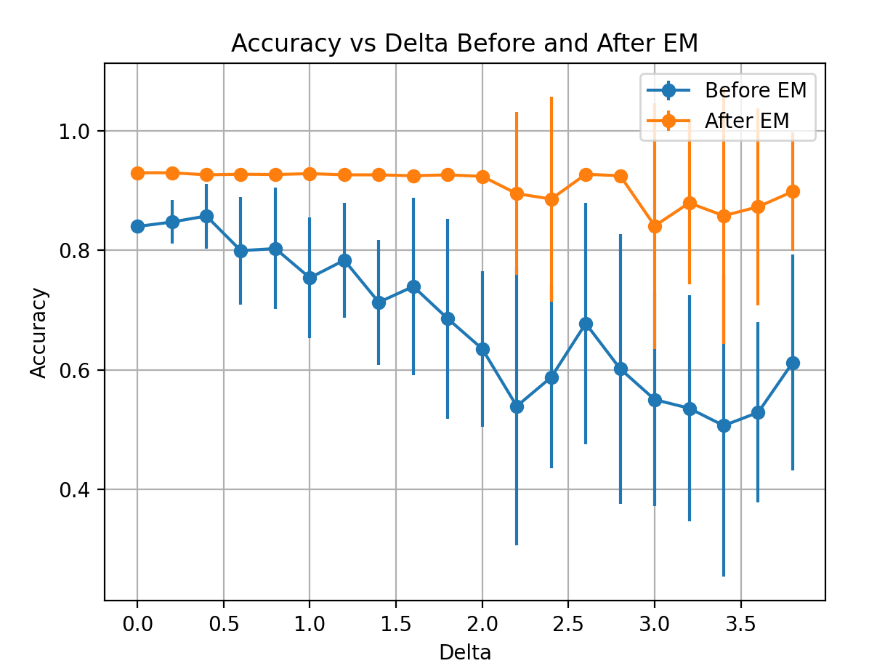

| Delta | Mean Accuracy Before EM | Mean Accuracy After EM |
|:-----:|:-----------------------:|:----------------------:|
| 0.0   | 0.8400                  | 0.9300                 |
| 0.2   | 0.8475                  | 0.9300                 |
| 0.4   | 0.8575                  | 0.9265                 |
| 0.6   | 0.7995                  | 0.9275                 |
| 0.8   | 0.8030                  | 0.9270                 |
| 1.0   | 0.7540                  | 0.9285                 |
| 1.2   | 0.7835                  | 0.9265                 |
| 1.4   | 0.7130                  | 0.9265                 |
| 1.6   | 0.7395                  | 0.9250                 |
| 1.8   | 0.6855                  | 0.9265                 |
| 2.0   | 0.6350                  | 0.9240                 |
| 2.2   | 0.5390                  | 0.8950                 |
| 2.4   | 0.5875                  | 0.8860                 |
| 2.6   | 0.6775                  | 0.9275                 |
| 2.8   | 0.6015                  | 0.9250                 |
| 3.0   | 0.5500                  | 0.8410                 |
| 3.2   | 0.5355                  | 0.8795                 |
| 3.4   | 0.5065                  | 0.8580                 |
| 3.6   | 0.5285                  | 0.8730                 |
| 3.8   | 0.6120                  | 0.8985                 |


## Question 2
### Part 1
Since we have an empty 5x5 grid, we have 25 cells to explore in this grid, where the reward can be in any of these 25 cells with equal probability.  
We know that the receiver takes route that visits every cell exactly once without crossing itself during the search, and is given a reward of 1.0 as soon as it reaches the prize, also the discount factor, $\gamma$, is 0.95.  
This means that if the prize is found at step $i$, where $i \in [0,24]$, then the reward value is discounted to $\gamma^i$.  
We can find the average discounted reward over the 25 cells by using the sum of geometric series formula:  
$$ \text{Avg discounted reward} = \frac{1}{25}\sum_{i=0}^{24}{\gamma^i} = \frac{1}{25}(\frac{1-\gamma^{25}}{1-\gamma})$$
substituting $\gamma=0.95$,
$$ \text{Avg discounted reward} = \frac{1}{25}\sum_{i=0}^{24}{0.95^i}= \frac{1}{25}(\frac{1-0.95^{25}}{1-0.95})\approx0.578$$  
Therefore, the discounted average reward = 0.58
**Move Grid:**   
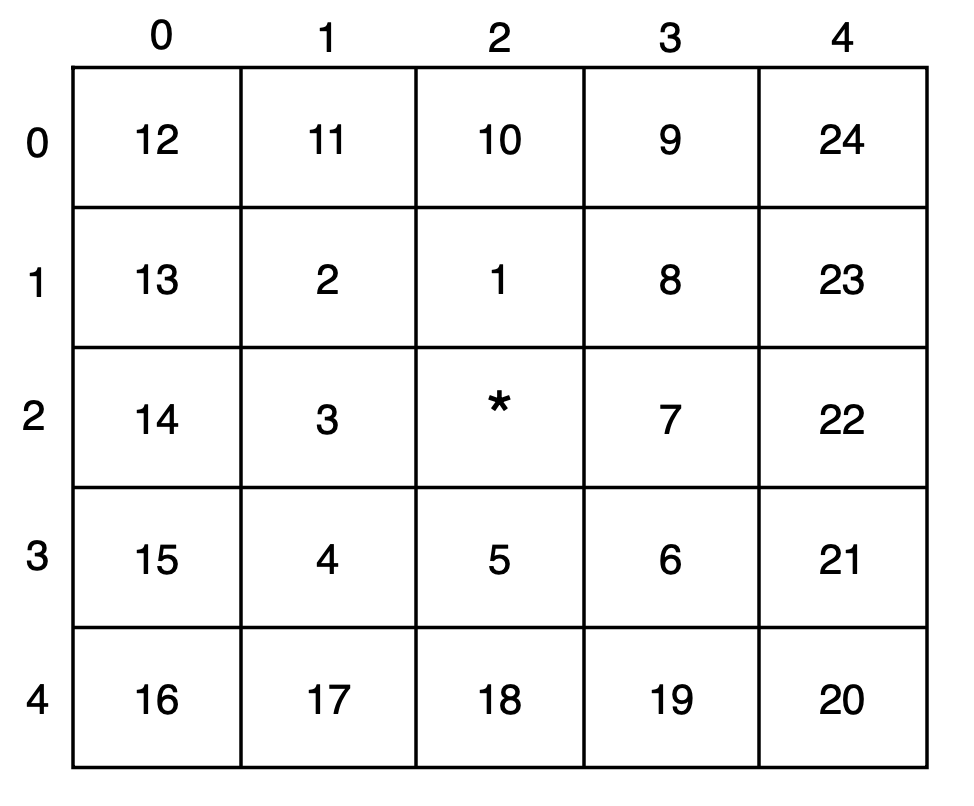{width=50%}
**Move order:** 
```bash
0.  2,2 (start)
1.  2,1 (up)
2.  1,1 (left)
3.  1,2 (down)
4.  1,3 (down)
5.  2,3 (right)
6.  3,3 (right)
7.  3,2 (up)
8.  3,1 (up)
9.  3,0 (up)
10. 2,0 (left)
11. 1,0 (left)
12. 0,0 (left)
13. 0,1 (down)
14. 0,2 (down)
15. 0,3 (down)
16. 0,4 (down)
17. 1,4 (right)
18. 2,4 (right)
19. 3,4 (right)
20. 4,4 (right)
21. 4,3 (up)
22. 4,2 (up)
23. 4,1 (up)
24. 4,0 (up)
```

### Part 2
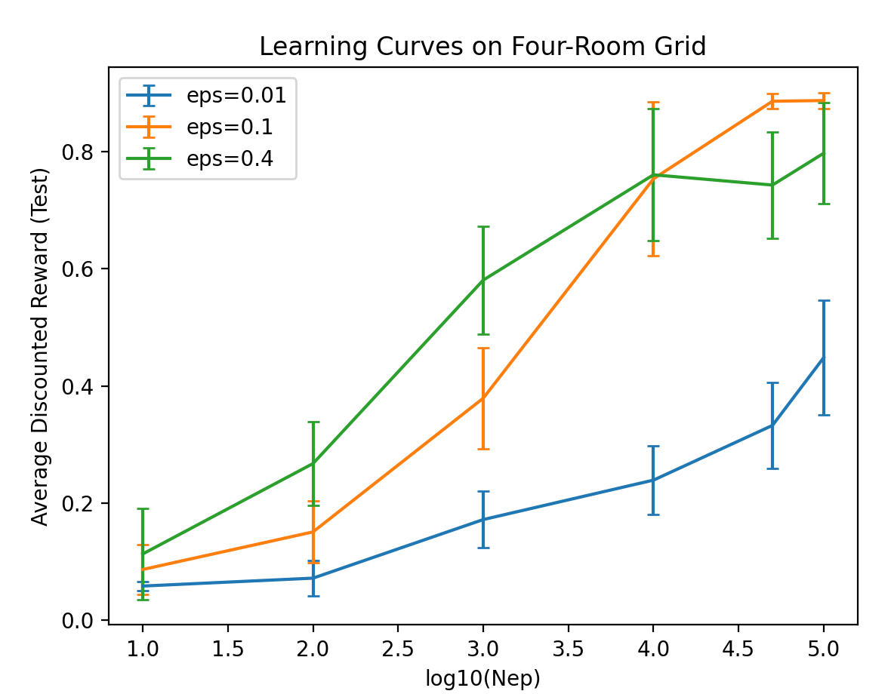  

#### Example policy for $\epsilon= 0.1$ and $N_{ep}=100000$:
**Message 0 grid:**  
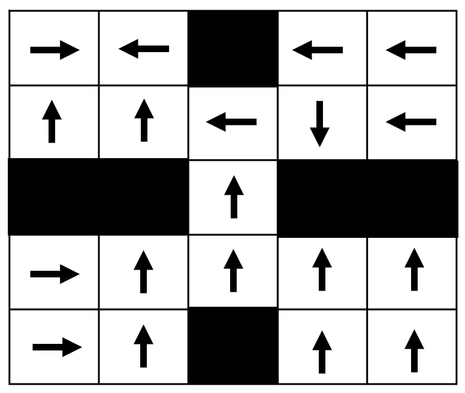{width=50%}  
**Message 1 grid:**  
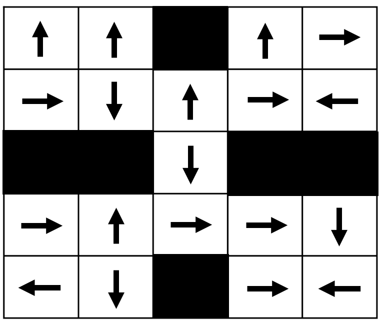{width=50%}  
**Message 2 grid:**  
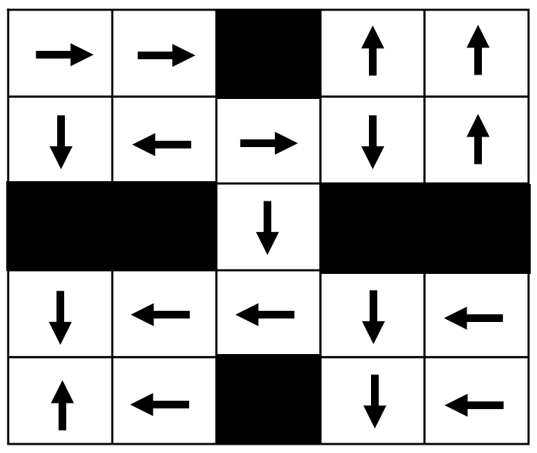{width=50%}  
**Message 3 grid:**  
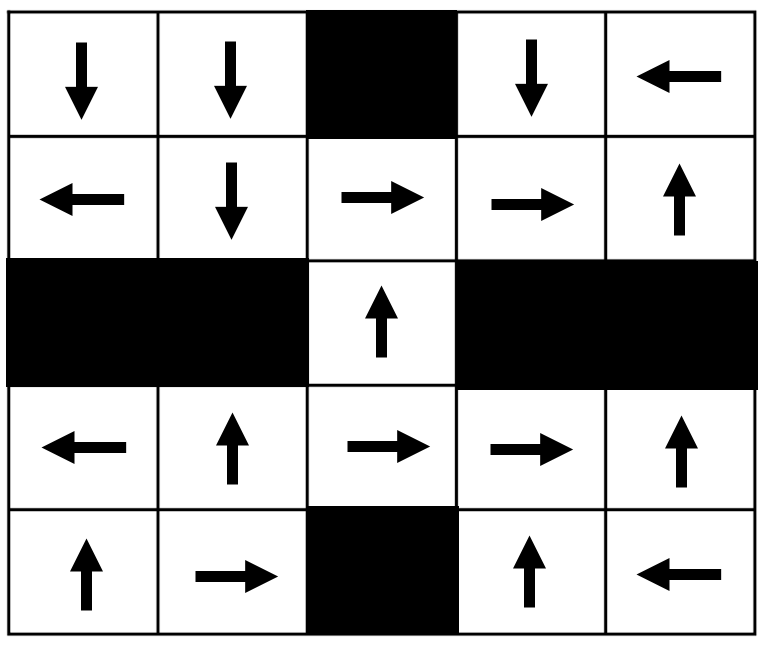{width=50%}  
**Sender Policy:**  
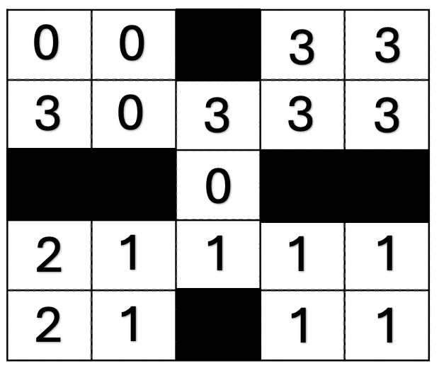{width=50%}  

### Part 3
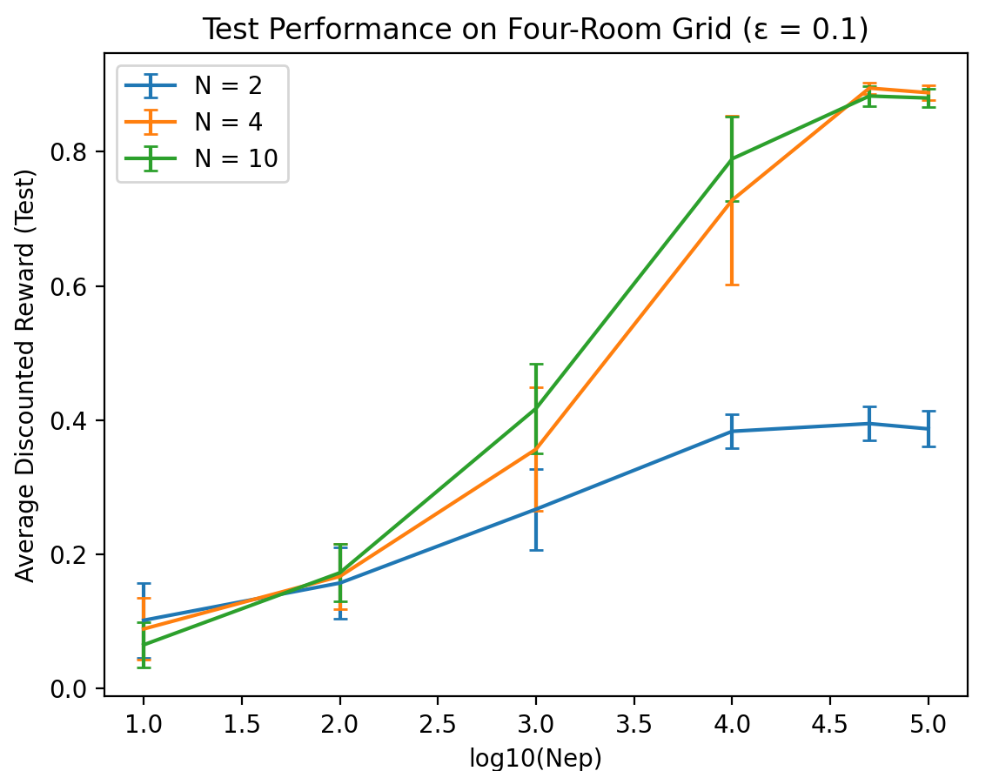  

### Part 4
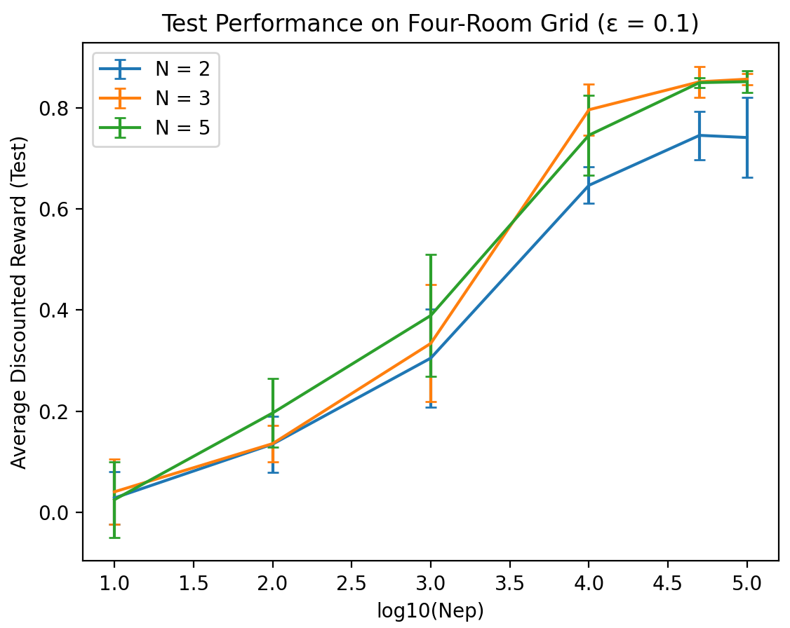  

### Part 5
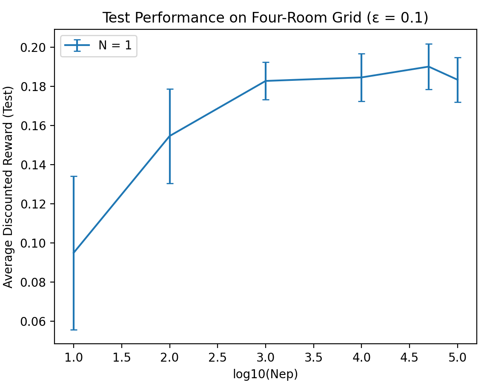  

### Part 6
In part 1 we calculated that the optimal Hamiltonian search strategy in an empty 5x5 grid will yield an average discounted reward of 0.58. Based on the graph observed from part 5, we notice that the average reward increases only very gradually with the number of training episodes.  
We can also observe that even with 10<sup>5</sup> episodes, the average discounted reward is at about 0.18, which is well below 0.58. Based on this, we can extrapolate that we might need about 10<sup>7</sup> or more learning episodes to reliably learn the optimal search strategy such that the learned policy consistently achieves an average discount reward close to 0.58.