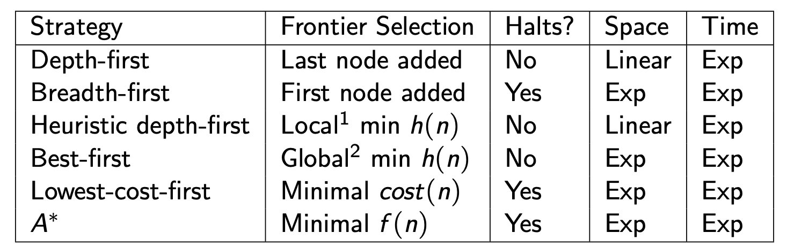
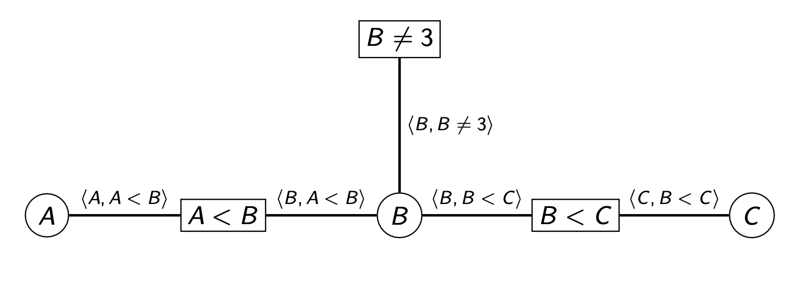
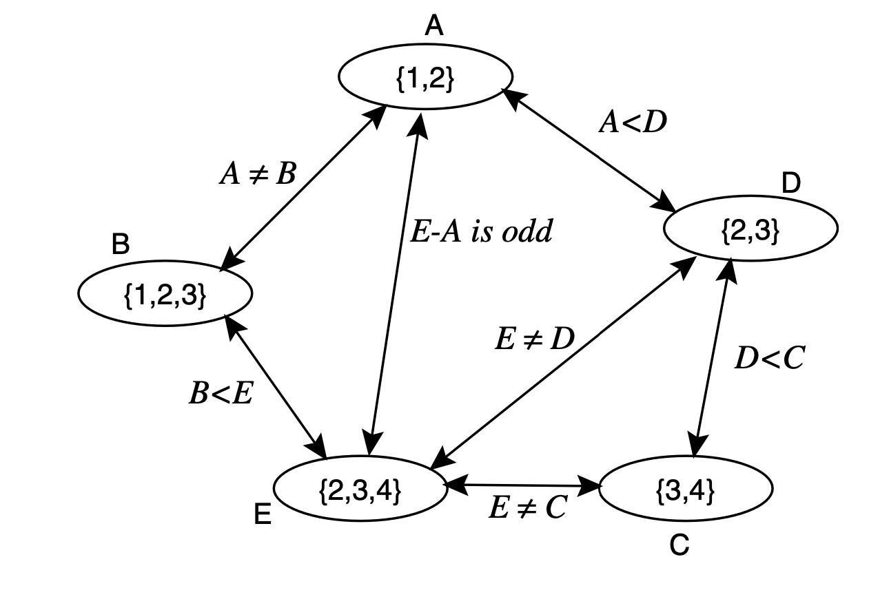
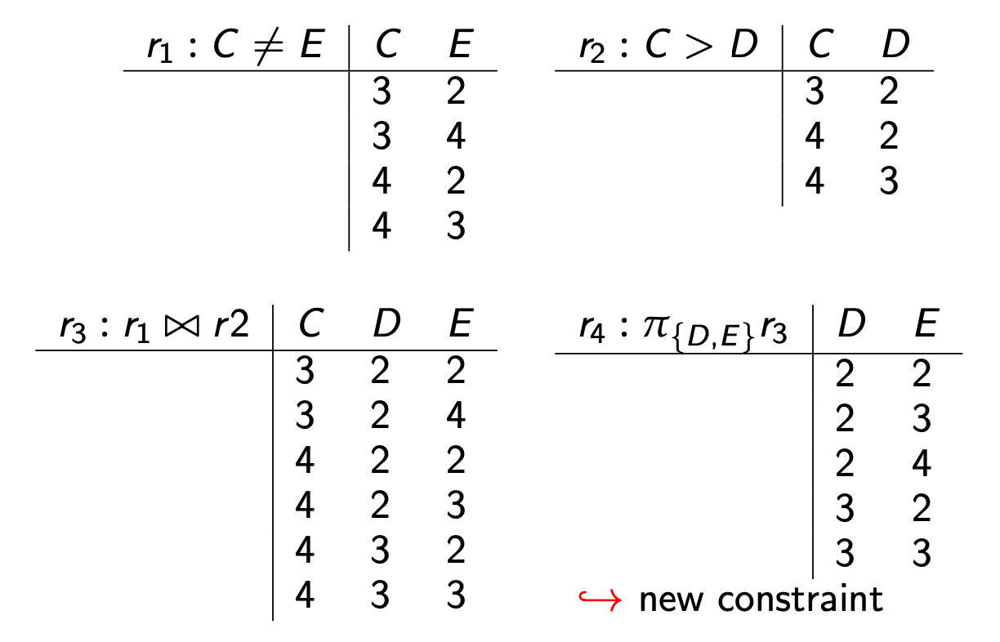
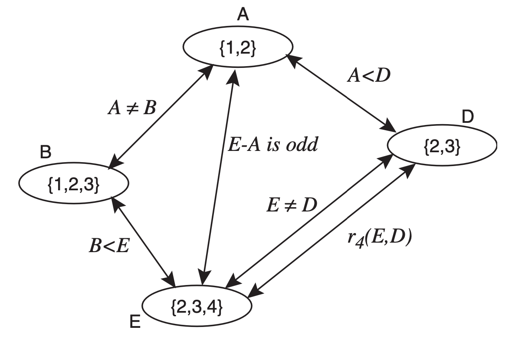
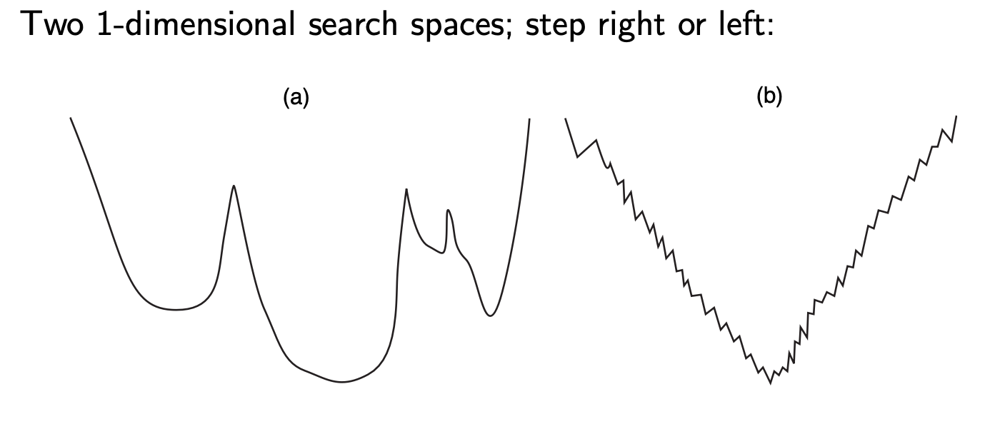

# Mid term notes

## Graphs
- N no. nodes
- A no. arcs/edges (ordered pairs of nodes)
- $n_2$ is neighbour of $n_1$ if $(n_1,n_2) \in A$
- path <$n_1,n_2,n_3,...,n_k$> is a sequence of node such that $<n_{i-1},n_i> \in A$ 
- cost of path = $\sum$ cost of arcs in path

## Search problem
- Set of states
- Initial state
- Goal state or goal test
    - Boolean function which tells whether a given state is a goal state
- Successor (neighbour) function
    - Function that decides which state to move to next
- cost associated with each action

```python
# Graph search general algorithm
graph = {
    'A': ['B', 'C'],
    'B': ['A', 'D'],
    'C': ['A'],
    'D': ['B']
}
frontier = []
def goal(n,goal_node):
    return n ==  goal_node

def search_algo(start_node,goal_node)
    frontier.append([start_node])
    while len(frontier) != 0:
        #choose first path in frontier
        path = frontier[0] 
        #remove selected path from frontier
        frontier = frontier[1:len(frontier)] 
        #check goal is last node in selected path 
        path_last_node = path[-1]
        if goal(path_last_node,goal_node):
            return path
        else:
            for n in  graph[path_last_node]:
                #pruning can be introduced here
                new_path = path + [n]
                frontier.append(new_path)   
```
- We assume after the search algo returns an answer, it can be asked for more answers and the procedure continues
- The neighbors define the graph structure
- Function that decides which value to select from, and add values to frontier defines the search strategy.
- Goal defines what is the solution.

## Search types
- Uninformed (frontier selection function doesn't care about characteristic of nodes)
- Heuristic (frontier selection function uses some characteristic of nodes to make a "informed" decision)

### Depth first search
- Frontier uses a stack / Implemented using recursion
- Frontier selection function pops the element at the top of stack
- Cycle checking: 
    - Check if the end node is already in the path, the prune. 
    - O(1) time using hashing


```python
# Implementation of DFS with stack
graph = {
    'A': ['B', 'C'],
    'B': ['A', 'D'],
    'C': ['A'],
    'D': ['B']
}
frontier = []
def goal(n,goal_node):
    return n == goal_node

def dfs(start_node,goal_node)
    frontier.append([start_node])
    while frontier:
        #pop the last path from frontier
        path = frontier.pop()
        #check goal is last node in selected path 
        path_last_node = path[-1]
        if goal(path_last_node,goal_node):
            return path
        else:
            for n in  graph[path_last_node]:
                if n not in path: # pruning step
                    new_path = path + [n]
                    frontier.append(new_path)   
    return None #return None if no path found
```

```python
# Implementation of DFS with recursion 
graph = {
    'A': ['B', 'C'],
    'B': ['A', 'D'],
    'C': ['A'],
    'D': ['B']
}

def goal(n,goal_node):
    return n == goal_node

def recursive_dfs(current, goal_node, path=None):
    # Initialize the path if this is the first call.
    if path is None:
        path = []
    
    # Append the current node to the path.
    path = path + [current] 
    # Check if the goal has been reached.
    if goal(current,goal_node):
        return path
    
    # Explore each neighbor of the current node.
    for neighbor in graph[current]:
        #pruning step
        if neighbor not in path:
            result = recursive_dfs(neighbor, goal, path)
            if result is not None:
                return result  # Return the path as soon as we find the goal.
    
    # If no path leads to the goal, return None.
    return None
```
Properties of DFS:
- Space Complexity: O(b*m)
    - b is branching factor (max no. children of any node)
    - m is max depth of search tree
- Time Complexity: O(b<sup>m</sup>)
    - Visit the entire search tree in worst case
- Not complete
    - not guaranteed to find a solution if it exists
    - can get stuck on infinite path
- Not optimal
    - Doesn't guarantee an optimal solution if it terminates
    - pays no attention to costs and makes no guarantee of solution's quality. (blind search algorithm)
- Uses:
    - Space restricted (not infinite)
    - Many solutions exists, each with long paths
    - Singular/ few paths to each node

### Breadth first search
- Treats frontier as queue
- Frontier selection function dequeues next node from queue
- Multiple path pruning:
    - Checks previously discovered paths if they end in n, consider it a new path if none of the previous paths end in n.
        - this means BFS only remembers the first path to discover a node, all subsequent discoveries of path to this same node are disregarded
    - Subsumes cycle checking since it remembers all the nodes visited in that path, if the same node is visited, that path of traversal is disregarded, eliminating any occurrence of cycles.
    - Guarantees the first path found to a node is confirmed to be the shallowest path to that node, but this does NOT mean optimality.


```python

graph = {
'A': ['B', 'C'],
'B': ['A', 'D'],
'C': ['A'],
'D': ['B']
}

def goal(n,goal_node):
    return n == goal_node

def bfs(graph, start, goal):
    # Initialize the queue with the starting path.
    frontier = [[start]]
    
    # Set to store nodes that have already been reached by some path.
    visited = set([start])
    
    while queue:
        # Get the next path from the queue.
        path = frontier[0]
        frontier = frontier[1:]
        current_node = path[-1]
        
        # Check if we have reached the goal.
        if goal(current_node,goal):
            return path
        # Expand the current node by iterating over its neighbors.
        for neighbor in graph[current_node]:
            # If the neighbor has not been reached before, add it to the queue.
            if neighbor not in visited:
                # Prune all future paths that reach 'neighbor'
                visited.add(neighbor)
                new_path = path + [neighbor]
                queue.append(new_path)
    
    # Return None if no path is found.
    return None
```
Properties of BFS:
- Space Complexity: O(b<sup>d</sup>)
    - b is branching factor
    - d is depth of shallowest goal node
- Time Complexity: O(b<sup>d</sup>)
    - Visit whole search tree in worst case
- Complete
    - Explores the search tree level by level until a solution is found
- Not Optimal
    - Only guaranteed to find the shallowest goal, not the most optimal
- Uses:
    - Space not concern
    - Want to find solution with least edge traversed
    - Many solutions shallow in the tree
    - Problem is small and graph is static (noy dynamically generated)

### Iterative Deepening Search
- Combines the best of BFS and DFS
- Frontier search function takes extra parameter (max_level), then stops popping nodes from stack once a node with max_level-1 search tree level is reached.

Properties of IDS:
- Space Complexity: O(b*d)
    - b is branching factor
    - d is depth of shallowest goal node
    - same as DFS
- Time complexity: O(b<sup>d</sup>)
    - same as BFS

- Complete
    - Will find solution if solution exists (same as BFS)
    - Explores the tree level by level until it finds the goal

- Optimality
    - Not guaranteed to return optimal solution
        - A blind search algo after all
    - Guaranteed to find shallowest goal node (same as BFS)


### Lowest-Cost-First Search
- Frontier search function selects path on the frontier with lowest cost
    - Implemented with priority queue, sorted by path cost (ascending)
    - BFS when edges have equal cost
- Finds least-cost path to goal node
- Uninformed/blind search (doesn't take goal into account)

Properties of LCFS:
- Space Complexity:
    - exponential
- Time Complexity:
    - exponential
- Complete
    - Will always return a solution if it exists
- Optimal
    - Will return the most optimal solution, contingent on
        - branching factor is finite
        - cost of every edge is strictly positive

### Dijkstra's Algorithm
- A form of LCFS with multiple path pruning
- Frontier search function selects path on frontier with lowest cost
    - implemented with priority queue, sorted by path cost
- For every node in graph, keep track of the lowest cost to reach it so far
    - If we find a lower cost path to a node, update that value, then resort priority queue
- A form of dynamic programming since we trade space for time

## Heuristic Search
- Takes the goal into account when selecting paths
- h(n) is an estimate of the cost of the shortest path from node n to a goal node
- h(n) uses readily obtainable and computed information about an node
- computing the heuristic must be much easier than solving the problem
- h(n) is an underestimate if: All paths from n to goal > h(n)
- Examples:
    - If nodes are points on Euclidean plane, cost is time, the straight-line distance from n to closest goal can be h(n) function
    - If nodes are locations on a grid, Manhattan distance is the h(n) function

### Greedy Best-First Search
- Frontier search function chooses path on frontier with its end node being closest to the goal according to h(n)
- Frontier is a priority queue sorted by h values
- selects path on the frontier with minimal h-value

Properties of GBFS:
- Space & Time complexities: exponential
- Not complete, can be stuck in a cycle
- Not optimal, can return a sub-optimal path first

### Heuristic DFS
- Do DFS but add paths to the stack ordered according to h values sorted in descending order.
- Properties are similar to DFS

## A* Search
- Use cost and heuristic
    - cost(p): cost of path p
    - h(p): estimate the cost from the end of p to a goal
    - f(p): cost(p) + h(p): estimate total path cost from going from start node to p, then p to goal
- Mix of lowest-cost-first and best-first search
- Frontier is a priority queue ordered by f(p)
- Frontier selecting function chooses node on frontier with lowest estimated distance
- Complete and optimal if:
    - branching factor is finite
    - costs of edges are bounded strictly more than zero.
    - h(n) is a lower bound on the length (cost) of the shortest path from n to a goal node.
- Admissible heuristic: never overestimates the cost to the goal

A* with admissible h always optimal. Proof:  
1. Assume s-->p-->g is optimal
2. f(p) = cost(s,p) + h(p) < cost(s,g), since h is lower bound, i,e h(p) <= cost(p,g)
3. cost(s,g) < cost(s,p') + cost(p',g), as s-->p--> is optimal
4. cost(s,p) + h(p) = f(p) < cost(s,p') + cost(p',g)
5. A* will never choose s-->p'-->g while s-->p-->g is unexplored
6. A* halts as costs of the paths on the frontier keeps increasing and will eventually exceed any finite number

Properties of A* search
1. Space & Time complexity
    - Exponential
2. Complete & optimal
    - heuristic function is admissible
    - branching factor is finite
    - edge costs bounded above 0
3. Optimally efficient
    - Among all optimal algorithms that start from the same start node and use the same heuristic, A* will expand the fewest nodes.
        - No algorithm can do it better
        - A* expands the minimum number of nodes to find the optimal solution
        - Proof from intuition: any algo that does not expand all nods with f(n) < cost(s,g) might miss the optimal solution

### Construction admissible heuristic
1. Define a relaxed problem: simplify or remove constraints on original problem
2. Solve relaxed problem without search
3. The cost of the optimal solution to the relaxed problem is an admissible heuristic for the original problem

Desirable Heuristic properties
1. Admissible, so that A* is optimal
2. closer h value to h*, the real value, so that h is more accurate
3. h value that is very different for different states
    - h should help us choose among paths, if it is close to constant then it is useless.
### Dominant Heuristic  
Given $h_1(n)$ and $h_2(n)$, $h_2(n)$ dominates $h_1(n)$ if:
- $h_2(n)$ is at least as large as $h_1(n)$
    - i.e heuristic estimate given by $h_2(n)$ is always larger than the estimate given by $h_1(n)$
- There exist at least 1 node where $h_2(n)$ is strictly larger than $h_1(n)$
    - $h_2(n)$ is not just equal to $h_1(n)$ everywhere, but actually provides a strictly better estimate at least in one case.
- Using a dominant heuristic is more optimal as it provides a better estimate of h, that is closer to the true cost.
- If $h_2(n)$ dominates $h_1(n)$, A* using $h_2(n)$ will never expand more nodes than A* using $h_1(n)$

### Multiple path pruning in A*
Problem: What is subsequent path to n is shorter than the first path to n  
Solution:
- Remove all paths from the frontier that use the longer path
- Change the initial segment of the paths on the frontier to use the shorter path
- Make sure the shortest path to a node is found first using lowest-cost-first search
- Monotone heuristic:
    - h(m) - h(n) $\le$ cost(m,n) for every edge < m, n >
    - aka consistent heuristic function
    - heuristic estimate of path cost is always less than the actual cost
    - if h satisfies the monotone restriction, A* with multiple path pruning always finds the shortest path to a goal
    - Like admissibility but between any 2 nodes

## Summary of search strategies


## Adversarial Search
### Minimax
```python
def h_func(n):
    # function to calculate h
    h_value = n.white - n.black
    return h_value

def minimax(position, depth, max_player):
    best_val = 0
    if depth == 0 or position.game_over:
        return h_func(position)
    if max_player:
        best_val = float('-inf')
        for child in position.children:
            val = minimax(child, depth-1, False)
            best_val= = max(max_val,val)
    else:
        best_val = float('inf')
        for child in position.children:
            val =  minimax(child, depth-1, True)
            best_val = min(max_val,val)
    return best_val
```

### Optimizing Minimax
- Alpha-beta pruning
    - Method that allows us ignore portions of the search tree in minimax without losing optimality
    - Useful in practical application but does not change worst-case performance (exponential)
- Can also stop search early by evaluating non-lead nodes via heuristics
    - Can no longer guarantee optimal play
    - Can set a fixed max depth for search tree
- Direction of search
    - Definition of searching is symmetric: find path from start to goal, goal to start is the same.
    - Forward branching factor = no. edges out of a node
    - Backwards branching factor = no. edges into a node
    - If forward branching factor < backward branching factor, use forward branching factor.
- Bidirectional search
    - Can search backwards from goal and forward from start simultaneously
    - This is better as 2b<sup>k/2</sup> << b<sup>k</sup>, exponential savings in time and space
    - Main problem is making sure the frontiers meet
    - Use BFS to find a set of locations that can lead to goal, another method use to find a path to locations in this set from goal

### Island driven search
- Find set of island between s and g, s --> $i_1$ --> $i_2$ --> $i_{m-1}$ --> g 
- m smaller problems rather than 1 big problem
- m*b<sup>k/m</sup> << b<sup>k</sup>
- The problem is identifying the island that the path must pass through, difficult the guarantee optimality

## Features and Constraints

### Constraint Satisfaction Problems (CSP)
- A set of variables
- A domain for each variable
- A set of constraints or evaluation function
- 2 Kind of problems
    - Satisfiability problem: Find an assignment that satisfies constraints (hard constraints)
    - Optimization problem: Find an assignment that optimizes the evaluation function (soft function)
- Solution to a CSP is an assignment to variables that satisfies all constraints
- A solution is a model of the constraints

### CSP as Graph searching problem
- Complete Assignment:
    - Node: assignment of value to all variables
    - Neighbors: change one variable value
- Partial Assignment:
    - Nodes: assignment to first k-1 variables
    - Neighbors: assignment to k<sup>th</sup> variable
- Note:
    - search spaces can be large, branching factor is big
    - path to goal is not important, only goal is
    - no predefined starting nodes

#### example: representing crossword as CSP
- Primal representation:
    - Nodes represent word positions: 1-down ... 6-across
    - Domains are the words
    - Constraints specify that the letters on the intersections much be the same
- Dual representation:
    - Nodes represent the individual squares
    - Domains are the letters
    - Constraints specify the words must fit

## Constraints
- Can be N-ary (Unary, Binary, etc) over sets of N variables 
- Solutions:
    - Generate and test
        - Exhaustively go through all combinations/states, check each one for a satisfiable state.
        - Not optimal as we might have some knowledge that allows us to prune large portion of the state space
    - Backtracking
        - Order all variables
        - Evaluate constraints into the order as soon as they are grounded
        - e.g in a given state, A=1,B=1, but we know A!=B, we can disregard all the child states of that given state as we know they will not be satisfiable.
        - Efficiency depends on order of variables
        - Finding optimal ordering is as hard as solving the problem
        - Ideas is to push failures as high as possible, to cut off large branches of the search tree ASAP.
    - Consistency
        - More general approach
        - Look for inconsistencies
            - e.g constraint is C < D ,assuming D= {1,2,3} then C=4 is inconsistent with any value of D
        - Backtracking will 'rediscover' this
        - Consistency Networks:
            - Domain constraint is unary constraint on values in a domain, written (X,c(X))
            - a node in CN is domain consistent if no domain value violates any domain constraint
            - a CN is domain consistent if all nodes are domain consistent
            - Arc (x,c(X,Y)) is a constraint on X
            - an arc (X,c(X,y)) is arc consistent if for each X $\in$ D<sub>x</sub>, there is some Y $\in$ D<sub>y</sub> such that c(X,Y) is satisfied
            - a CN is arc consistent if all arcs are arc consistent
            - a set of variables {$X_1, X_2, X_3,...,X_N$} is path consistent if all arcs and domains are consistent.
    - Hill-Climbing
    - Randomized incl. Local Search

### Constraint Satisfaction Graphically


## AC-3
- Makes a CN arc consistent and domain consistent
- To-Do-Arcs (TDA) queue has all inconsistent arcs
- Steps:
    1. Make all domains domain consistent
    2. Put all arcs (Z,c(Z,...)) in TDA
    3. Repeat till TDA empty:
        1. select and remove an arc (X,c(X,Y)) from TDA
        2. remove all values of domain of X that don't have a value in domain of Y that satisfies the constraint c(X,Y)
        3. If any were removed, add all arcs (Z, c'(Z,X)) to TDA where Z!=Y
- AC-3 terminates with one of the following conditions
    1. Every domain is empty: no solution
    2. Every domain has single value: solution
    3. Some domain has more than 1 value: then,
        - split domain into 2 run AC-3 recursively on 2 halves
        - put back all arcs (Z,c'(Z,X)) if X was the domain that was split
- Properties
    - Guaranteed to terminate
    - Time complexity: O(c*d<sup>3</sup>)
    - Checking consistency can be done in O(d<sup>2</sup>)

## Variable elimination 
- Eliminate the variables one by one passing their constraint to their neighbor
- When there is a single variable remaining, if it has no values, the network was inconsistent
- The variables are eliminated according to some elimination ordering
- Different elimination ordering s result in different size intermediate constraints
- Steps:
    1. If there is only one variable, return the intersection of the (unary) constraints that contain it
    2. Select variable X
        a. Join the constraints in which X appears, forming constraint R
        b. Project R onto its variables other than X, call this R<sub>2</sub>
        c. Place new constraint R<sub>2</sub> between all variables that were connected to X
        d. Remove X
        e. Recursively solve the simplified problem
        f. Return R joined with the recursive solution
Diagram representation:  
Initial arc consistent network  
  
Eliminate C  
  
Resulting network  
  
## Local Search
- Maintain an assignment of value to each variable
- At each step, select neighbor of the current assignment (on that improves some heuristic value)
-  Stop when a satisfying assignment is found, or return the best assignment found
- Requirements:
    - Definition of what is a neighbor
    - Method of selecting a neighbor

### Local Search for CSP
- Aim is to find an assignment with zero unsatisfied constraints
- Given an assignment of a value to each variable, a conflict is an unsatisfied constraint
- The goal is an assignment with zero conflicts
- Heuristic function to be minimized: number of conflicts

### Greedy Descent Variants
- Find the variable-value pair that minimizes the number of conflicts at every step
- Select a variable that participates in the most number of conflicts
    - then, Select a value that minimizes the number of conflicts
- Select a variable that appears in a ny conflict
    - then, select a value that minimizes the number of conflicts
- Select a variable at random
    - then, select a value that minimizes the number of conflicts
- Select a variable and value at random, accept this change if it doesn't increase the number of conflicts

### Problems with Greedy Descent
- Might find a local minimum that is not a global min
- A plateau where the heuristic values are uninformative
- A ridge is a local minimum where n-step look-ahead might help

### Randomized Greedy Descent
- As well as downward steps, we can allow for:
    - random steps: move to random neighbor
    - random restart: reassign random values to all variables
- A mix of the 2 = stochastic local search


a: random restart is better as it help to explore different regions of the search space.  
b: random steps is better as it can help it escape since the local minima is not that deep.

### High Dimensional Search Spaces
- Often consist of long, nearly flat "canyons"
- Hard to optimize using local search
- Step size can be adjusted

## Stochastic local search
- Mixes:
    - greedy descent: move to lowest neighbor
    - random walk: take some random steps
    - random restart: reassigning values to all variables

### Variant: simulated annealing
- pick a random variable and a new value at random
- if improvement, adopt it
- if not improvement, adopt it probabilistically depending on a temperature parameter, T
    - move to n' from n with probability = e<sup>-(h(n')-h(n))/T</sup>
- Temperature can be reduced
- Higher temperature, probability of accepting worse solution is high, algorithm performs random exploration
- Low temperature, probability of accepting worse solution is low, algorithm performs like a greedy descent
- Steps:
    1. n be random assignment of values to all variables
    2. T be high temperature
    3. Repeat
        1. Select neighbor n' of n at random
        2. if h(n') < h(n) then
            - n = n'
        3. else
            - n = n' with probability = e<sup>-(h(n')-h(n))/T</sup>
        4. reduce T
    5. Stopping criteria is reached

## Tabu lists
- Greedy satisfiability (GSAT): never choose same variable twice
- to prevent cycling we maintain a tabu list of the k last assignment
- Don't allow an assignment that is already on the tabu list
- if k=1 we don't allow an assignment of to the same value of the same variable chosen
- we can implement more efficiently than a list of complete assignments
- expensive when k is large

## Parallel search
- Total assignment is called an individual
1. maintain population of k individuals instead of one
2. at every stage, update each individual in the population
3. whenever an individual is a solution, it can be reported
4. like k restarts, but uses k times the minimum number of steps

## Beam search
- like parallel search, with k individuals but choose the k best out of all the neighbors (all if they are less than k)
- when k = 1, greedy descent
- value of k lets us limit space and parallelism

### Stochastic beam search
- like beam search but it probabilistically chooses the k individuals at the next generation
- probability that a neighbor is chosen is proportional to its heuristic value: e<sup>-h(n)/T</sup>
- Maintains diversity amongst the individuals
- Heuristic value reflects the fitness of the individual
- each individual mutates and the fittest one survives

## Genetic algorithms
- like stochastic beam search but pairs of individuals are combined to create offspring
- for each generation:
    1. randomly choose pair of individuals where the fittest individuals are more likely to be chosen
    2. each pair, perform cross-over, form offspring, each taking different part of their parents
    3. mutate some values
- stop when solution is found

