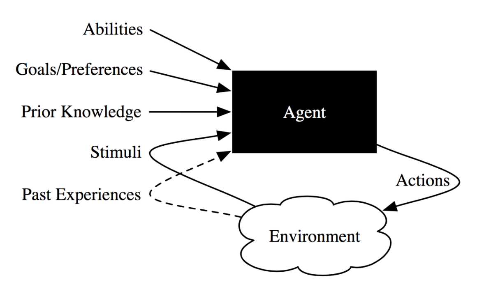
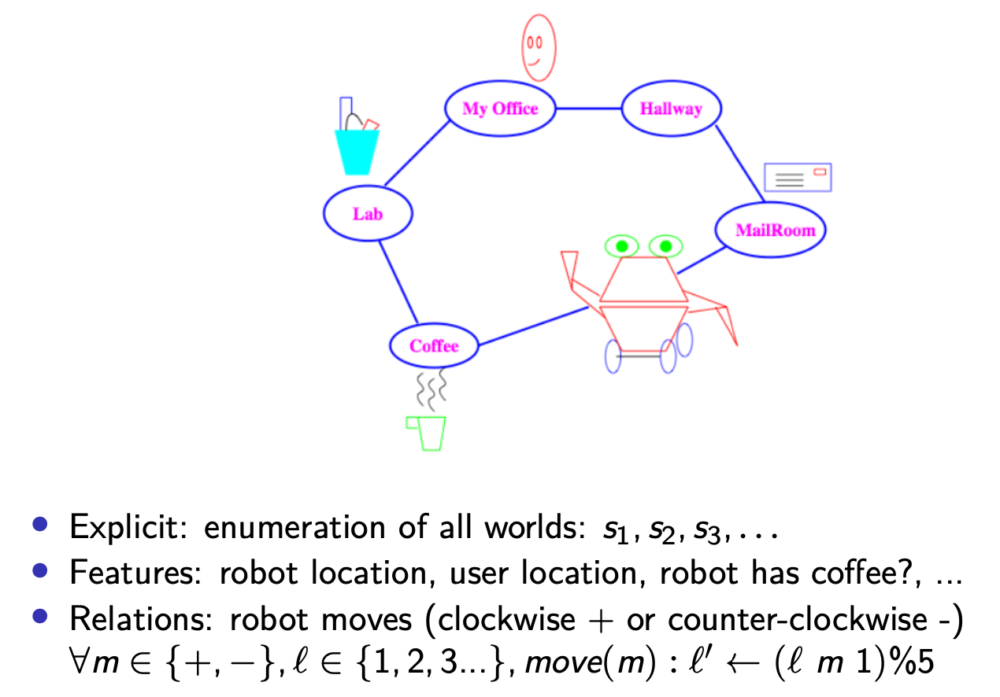
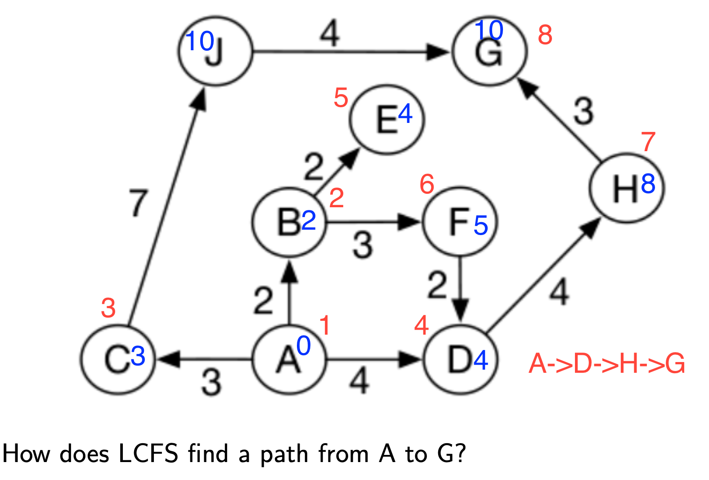

# Intro to Artificial Intelligence Week 1 Notes

## Agents

### Situated Agent

**Agents**
- an entity that performs action in its environment
- agent + environment = world
- inside the **black box** is the **belief state**

**example of application domains**
- Autonomous delivery robot
    - roam around an office environment and delivers coffee, parcels.
-  Diagnostic assistant
    - help human troubleshoot problems and suggest repairs.

**Domain for delivery robot**

The robot must:
- Deliver coffee & mail when needed
- avoid getting wet

**Delivery robot**
- Abilities: movement, speech, pickup and place items, sense weather
- Stimuli: environmental information from camera, sonar, sound, laser range finder, keyboards.
- Prior knowledge: know its capabilityies, objects it may encounter, maps
- Past experiences: which actions are useful and when, what objects are there and how its actions affect its position.
- Goals: what it needs to deliver and when, tradeoff between acting quickly and acting safely, effect of getting wet.

**What the robot needs to do**  
- Determine user location
- Path finding between locations
- Planning to carry out multiple task
- make default assumptions about where user is.
- make tradeoffs under uncertainty.
- learn from experience.
- sense and act in the world

**Knowledge representation**
- knowledge: information used to solve tasks
- representation : data structures used to encode knowledge
- knowledge base (KB): representation of all knowledge.
- model: relationship of kb to world
- level of abstraction: accuracy of model
- Non-AI:
    - Specify how to compute something
    - Specify what the next step is
    - programmer does the computation
- AI:
    - Specify what needs to be computed
    - Specify how the world works
    - Agent figures out how to do the computation

### Dimensions of Complexity: 
1. **Modularity**: flat --> modular --> hierarchical
2. **Planning horizon**: non-planning --> finite horizon --> indefinite horizon --> infinite horizon
3. **Representation**: explicit states --> features --> individuals and relations
4. **Computational limits**: perfect rationality --> bounded rationality
5. **Learning**: knowledge is given --> knowledge is learned
6. **Uncertainty**: fully observable --> partially observable
7. **Preference**: goals --> complex preferences.
8. **Reasoning by number of agents**: single agent --> adversarial --> multiagent
9. **Interactivity**: offlie --> online

**Planning horizon**  
How far the agent looks into the future when deciding what to do.
- Static: world doesn't change
- Finite horizon: agent reasons about a fixed finite number of time steps
- Indefinite horizon: agent is reasoning about finite, but not predetermined, number of time steps (e.g until goal completiong)
- Infinite horizon: agent plans for going on forever (process oriented)

**Representation**
Finding compact representations and exploiting that compactness for computational gains.
- Explicit states: state directly represents one way the world could be
- Features or propositions: 
    - more natural ot describe states in terms of features
    - 30 binary features can represent 2<sup>30</sup> states.
- Individuals and relations
    - There is a feature for each relationship on each tuple of individuals
    - we can reason without knowing the individuals or when there are infinitely many individuals.
    

**Computational limits**
Feasible to calculate the exact solutions?
- Perfect rationality: agent always choose the optimal action
- Bounded rationality: agent chooses a possibly sub-optimal action given its limited computational capacity (e.g chess bot)
    - Satisficing (good enough) solution
    - Approximately optimal solution


**Learing from experience**  
Is the model's knowledge given or learned from experience.

**Uncertainty**  
- Fully-observable: the agent knows the state of the world from observations
- Partially-observable: there can be many stats that are possible given an observation

**Uncertain world dynamics**  
If the agent knew the initial state and the action, can it predict the resulting state?
- Deterministic: state resulting from carrying out an action in state is determined from the action and the state.
- Stochastic: there is uncertainty over the states resulting from executing a given action in a given state.

**Goals or Complex preferences**  
- Achievement goal: goal to achieve (e.g complex logical formula)
- Maintenance goal: is goal to be maintained
- Complex preferences: involve tradeoffs between various desiderata, perhaps at different times, can be ordinal or cardinal.
    - e.g coffee delivery robot, medical doctor.
    - Goals may conflict
    - Goals may be combinatorial
    - Goals may change

**Reasoning by number of agents**  
- Single agent: agent assumes other agents are part of environment
- Adversarial: considers another agent that acts in opposiotion to our goal
- Multiagent: agent needs to reason strategically about reasoning of other agents (e.g trading agents)

Agents can have their own goals: cooperative, competitive, independant goals.

## Uninformed Search

**Searching**  
Search for the solution by exploring a **directed graph** that represents the **state space**

**Directed graphs**
- N nodes
- A edges/arcs (pais of nodes)
- Path, i.e a sequence of nodes such that (n<sub>1</sub>,n<sub>2</sub>) ⊆ A.
- Cost associated with arcs.

**Search problem**
- set of states
- initial state
- goal states or goal test
    - boolean function which tells whether a given state is a goal state
- Successor (neighbour) function
    - action which takes us from one state to other state
- Cost associated with each action (optional)

**Graph Search Algorithm**
```
Input: A graph, a set of start nodes, Boolean procedure goal(n)
that tests if n is a goal node
1: frontier ←{⟨s⟩: s is a start node}
2: while frontier is not empty do
3: select and remove path ⟨n0, . . . , nk⟩from frontier
4: if goal(nk) then
5: return ⟨n0, . . . , nk⟩
6: for each neighbor n of nk do
7: add ⟨n0, . . . , nk, n⟩to frontier
```

## Depth-First search
- Uses a stack or recurrsion  

**Depth-First search (Stack)**  
- Traverse the graph using a certain rule (e.g always go left/ always go right), until there is no more node left.
- Every visited node is pushed into the stack.
- Once we have no more child node to traverse to, pop from the stack and visit the other child of the node.

**Depth-First seach (recursive)**  
- Traverse the graph using a certain rule (e.g always go left/always go right), on the child node selected, run the DFS function on that child node.
- When the child node eventually terminates due to lack of children, return to the parent node.
- The DFS algorithm then traverse the other children of the node after the 2nd instance of DFS from the child returns.  

**Depth-First search cycle checking**  
- searcher can prune a path that ends in a node already on the path.

### Characteristics of DFS 
**Complexity**   
b: branching factor (max no. of children per node)  
m: max depth of the search tree   

**Space complexity**: O(bm)  

**Time complexity**: O(b<sup>m</sup>)
    
**Completeness**  
- DFS **NOT** guaranteed to find a solution if a solution exists
- Can get stuck in infinite path

**Optimality**  
- DFS doesn't guarantee to return an optimal solution if it terminates.

**Use cases**  
- Space is restricted
- Many solution exists, perhaps with long paths.
**Misuse cases**  
- There are infinite paths
- Optimal solutions are shallow
- Multiple paths to a node

## Breadth-First search
- Uses a queue

**Breadth-First search**  
- Traverse graph withs some rule (always go left/ always go right).
- Enqueue each node visited to the queue.
- Visit the child of that node, then enqueue that child node into the queue.
- Dequeue a node from the queue then visit any unvisited child nodes of that node.
- Continue till no nodes left unvisited.  

**Multiple path pruning**  
- prune a path to node n if any previous-found path terminates in n
- subsumes a cycle check
- entails storing all nodes it has found paths to
- want to guarantee optimal solution can still be found

## Characteristics of BFS

**Complexity**  
- **Space complexity:** O(b<sup>d</sup>)
- **Time complexity:** O(b<sup>d</sup>)

**Completeness**  
- BFS is guaranteed to fin a solution if it exists
- explore the tree level by level until the goal is found

**Optimality**  
- Not guaranteed to return optimal solution if it terminates.
- Guaranteed to find shallowest goal node.

**Use cases**  
- Space not a concern
- Want a solution in the fewest arcs  

**Misuse cases**
- All solutions are deep in the tree
- Problem is large and graph is dynamically generated.

## Iterative Deepening seach (IDS)
A combination of BFS and DFS

Steps:
1. Initialize the Depth Limit: Start with a depth limit of 0.
2. Perform Depth-Limited Search (DLS): Use a DFS algorithm that halts when the depth limit is reached.
3. Increase the Depth Limit: Increment the depth limit and repeat the DLS until a solution is found or all possibilities are exhausted.
4. Terminate: If a solution is found, return it. If the depth limit surpasses the maximum depth (or all nodes are exhausted), return failure.

Pseudocode:
```
def iterative_deepening_search(start, goal):
    depth = 0
    while True:
        result = depth_limited_search(start, goal, depth)
        if result == "FOUND":
            return "Goal Found!"
        elif result == "NOT_FOUND":  # Indicates all nodes were explored
            return "Goal Not Found"
        depth += 1


def depth_limited_search(node, goal, depth_limit):
    if depth_limit == 0:
        if node == goal:
            return "FOUND"
        else:
            return "LIMIT_REACHED"
    elif depth_limit > 0:
        any_cutoff = False
        for child in expand(node):  # expand(node) generates all possible successors
            result = depth_limited_search(child, goal, depth_limit - 1)
            if result == "FOUND":
                return "FOUND"
            elif result == "LIMIT_REACHED":
                any_cutoff = True
        return "LIMIT_REACHED" if any_cutoff else "NOT_FOUND"

```

**Complexity**
- Space: O(bd)
- Time: O(b<sup>d</sup>)

**Completness**
- Guaranteed to find a solution if it exists
- explores tree level by level until goal is found

**Optimality**
- Might not return a optimal solution if it terminates.
- Guaranteed to find shallowest goal node.

## Lowest cost first search
Path cost = Sum of all arcs (edges)

**Implementation**  
Implemented using priority queue (min heap)  

Steps:
1. Start from initialised node.
2. Create a priority queue of neighbour nodes, (lowest to highest weight) from start node.
3. Dequeue the first element in priortiy queue (lowest cost neighbour)
4. Explore the edges of this new node, sum up the cost of these new neighbours and the cost of visiting this newly visited node.
5. Add these neighbours into the priority queue.
6. Dequeue the next node in priority queue and repeat step 3 - 6.


Example:  


Steps:  
1. Push Node A into priority Queue
    - [(A,0)]


