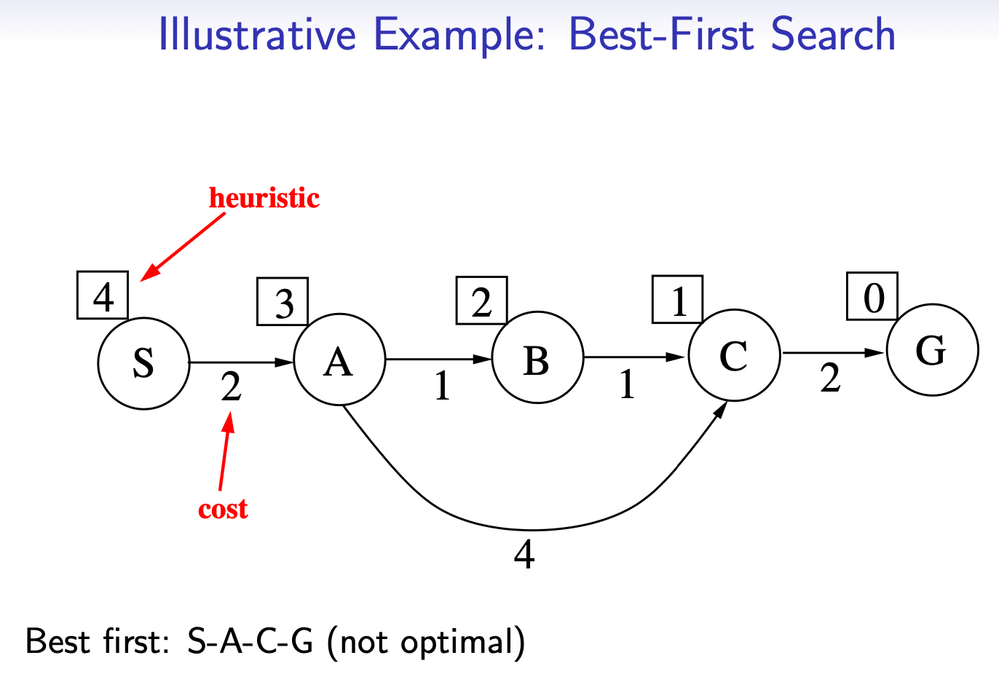
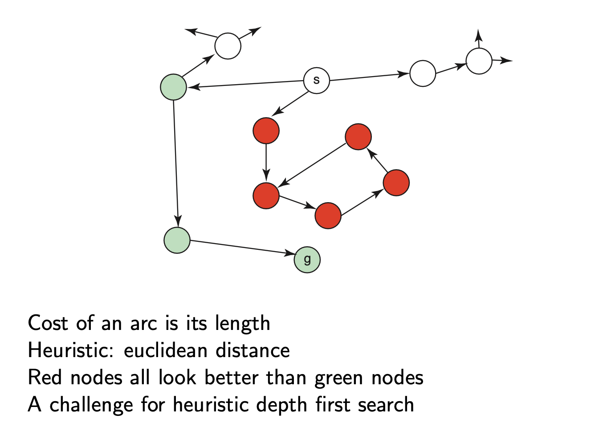
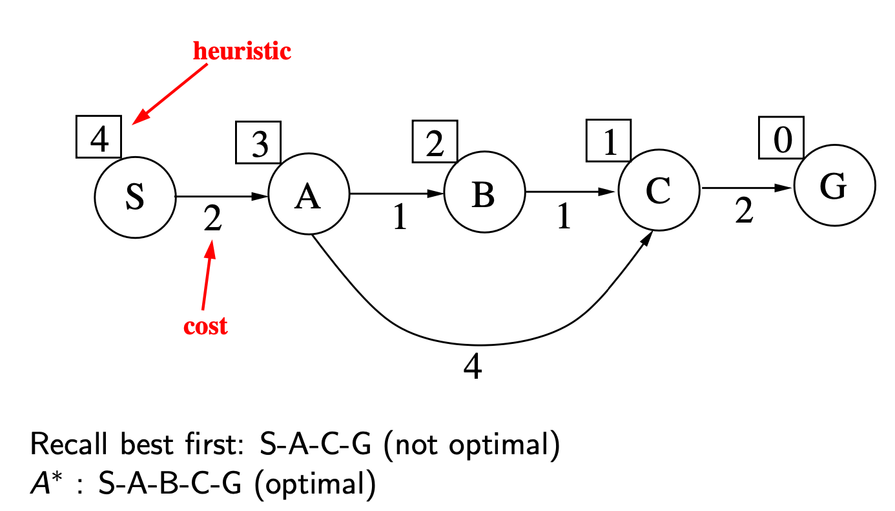

# Week 2 notes AI

## Heuristic Search
Idea: remember the goal node when selecting paths.  
There is extra knowledge that can be used to guide the search.

h(n) is an estimate of the cost of the **shortest path** from node n to a goal node

h(n) uses only readily obtainable + easily computed information about a node

computing the heuristic must be **much easier** than solving the problem.

h(n) is an **underestimate** if 
h(n) > path length from n to goal.

### Greedy Best-First Search
Select the path whose end is closest to a goal according to the **heuristic function**.

Best-first search selects a path on the frontier with minimal h-value.

Implemented using a priority queue ordered by h.

Example:  

### Characteristics of GBFS  
**Complexity**  
Space & Time complexity exponential

**Completeness**  
No GBFS is not complete, can be stuck in a cycle.  

**Optimality**  
GBFS is not optimal, can return sub optimal path first.

### Heuristic Depth-First Search

Conduct DFS but add paths to the stack ordered according to h-value.

Example:  

## A* Search
Use both cost and heuristic values
Mix lowest-cost-first  and best-first search
**cost(p)**: the cost of path *p*  
**h(p)**: estimates the cost from the end of p to a goal  
**f(p)** = cost(p) + h(p); f(p) estimates the total path cost of going from a start node to a goal via path *p*  

Implemented using a priority queue ordered by f(p)-values.  

Always select the node on the **frontier** with the **lowest estimated distance** from the start to a goal node constrained to go **via that node**.

Example:  

Note:
- f(p) of B is 2+1+2, where 2+1 is the cost of going to B from S, and 2 is the heuristic of B.
- Important to note that cost to get to a node accumulates while the heuristic of a node does not accumulate.
- This aligns ideologically as the cost is of the **path** taken to get to the node, while the h(p) value is a calculated estimated value of going from node p to goal node.

