# 1 Assessment of Data and Applying Normalization

I first ensured that there are no null values present in both datasets. If there was, I would drop them.

## Wine

Since the color of the wine is our target label, I first converted white to 0 and red to 1. Then, I created a summary table that shows the mean, median, variance, skewness, and kurtosis of each feature from the *scipy.stats* library to understand their distribution.

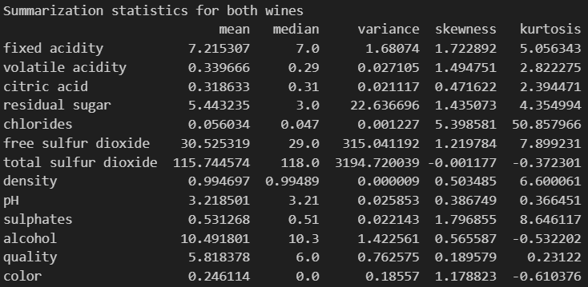{ width=90% }

**Observations:** Volatile acidity has a kurtosis value of 2.82, which is relatively close to 3, suggesting that it could follow a normal distribution.  
The chlorides level has a very high kurtosis value of 50.9 and skewness value of 5.4, which may imply that it has extreme outlier values mostly on the right side of the distribution.  
Total sulfur dioxide has a very high variance of 3195, which means it spans a wide range of values, but they are fairly distributed evenly on both sides as suggested by the low skewness and kurtosis values.

I decided to create pairplot with the features "volatile acidity", "chlorides", "total sulfur dioxide", "quality", "alcohol", and "color" as they stood out based on my observations.

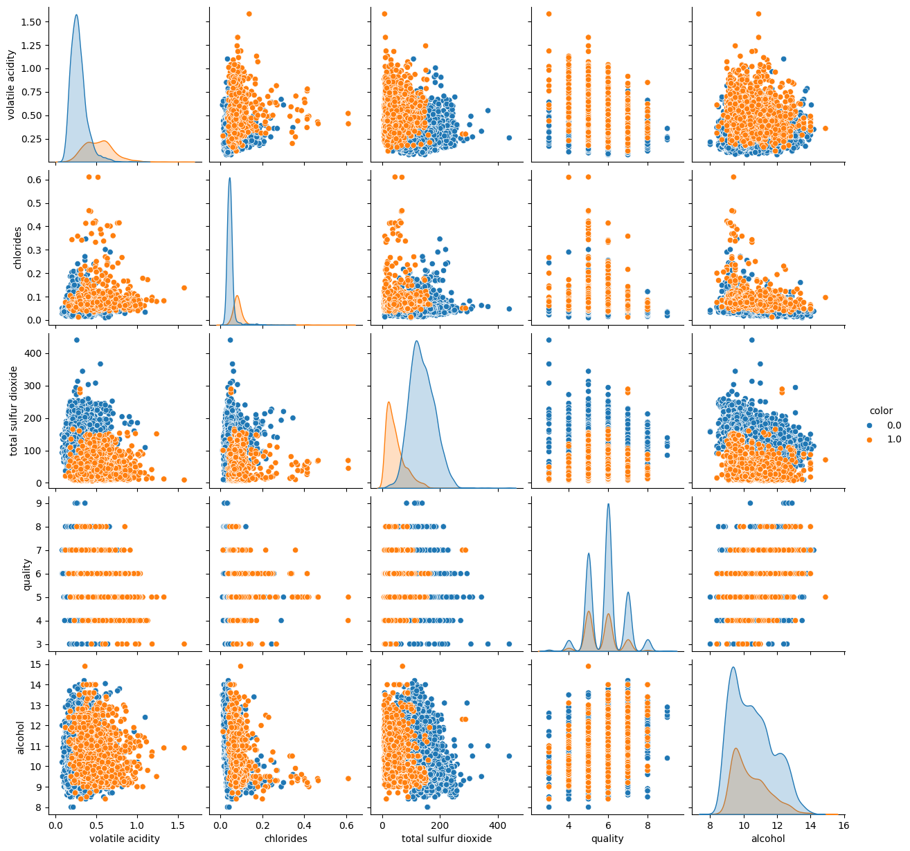{ width=90% }

Although total sulfer dioxide has a very high variance, it seems that most of the data still correspond with low chloride levels of 0.2 and below. In the pairplot between alcohol and total sulfur dioxide, it appears that regardless of alcohol level between 8 to 14, the total sulfur dioxide level remains generally below 300.  
There seems to be a small correlation between quality and volatile acidity, where volatile acidity generally slightly falls as quality increases from 4 to 9.  
Red wine appears to generally have a lower total sulfur dioxide value compared to white wine, while having higher volatile acidity and chlorides.

Looking at the number of data for white and red wine, I consider it balanced as both wines have sufficient representations of over 1000.

Lastly, I performed Z-score normalization on the dataset apart from the 'color' column.

## Abalone

I created a summary table that shows the mean, median, variance, skewness, and kurtosis of each feature from the *scipy.stats* library to understand their distribution.

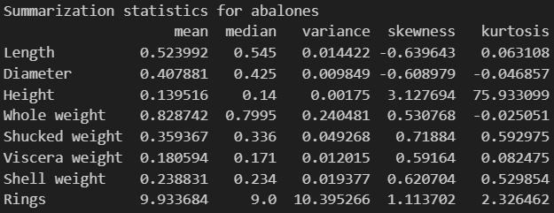{ width=90% }

**Observations:** Height has a very high kurtosis of 75.9, which suggests that it is a distribution with a heavy tail, with more outliers than expected. The height is also concentrated closely near the mean, as seen from its low variance of 0.00175.  
Rings has a relatively high variance of 10.4, which could suggest that the rings could be fairly distributed, which is optimal since it is our target feature.  
The other features have a low kurtosis value near to 0, which indicates that they have a relatively normal distribution.

Hence, I selected a few features to create a pairplot ("Sex", "Rings", "Height", "Shucked weight", and "Viscera weight").

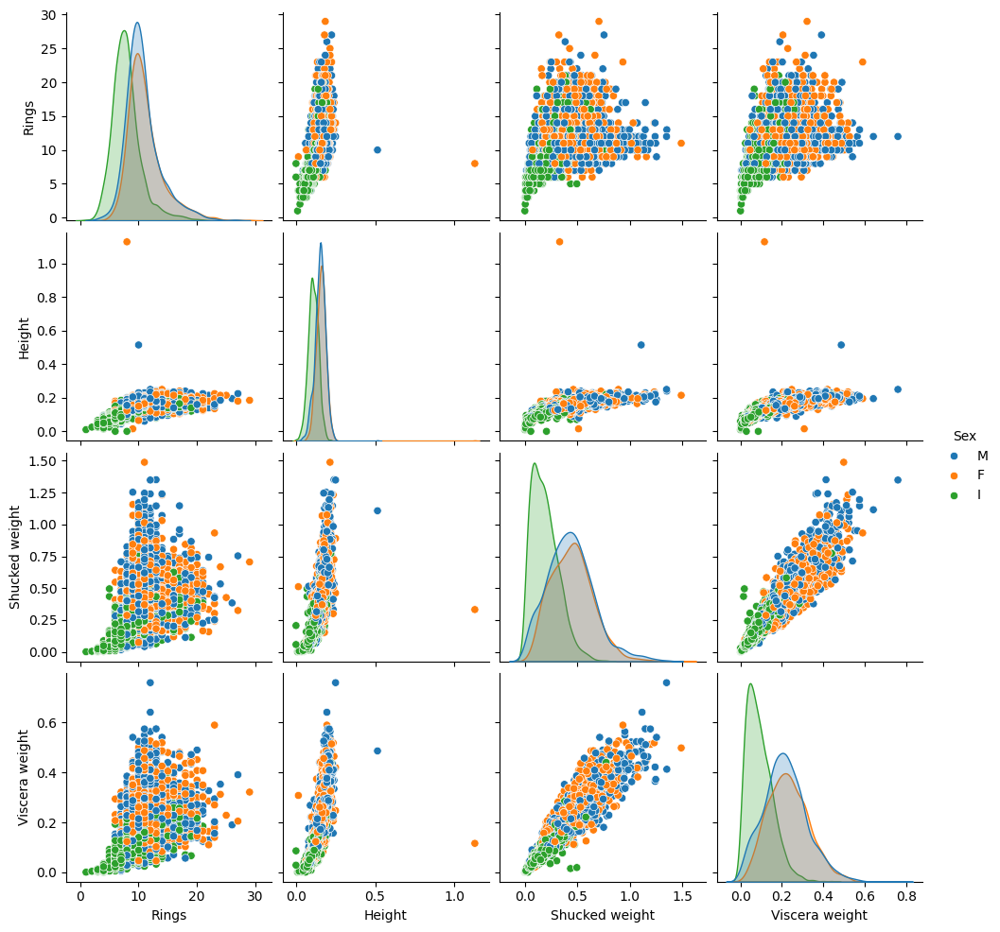{ width=90% }

The heights of all abalones seem to generally be below 0.3, of which infants tend to lie below the 0.2 mark.  
There seems to be a correlation between height and rings as the rings increases when the height increases. In comparison, the other features like shucked weight and viscera weight seems to have a wider spread above 5 rings and show little correlation with the rings.  
Shucked weight also increases as viscera weight increases, suggesting a positive relationship, with infants populating majority of the data points at the lower end.

Looking at the counts of each ring values in the dataset, I feel that it is imbalanced and has a skewed distribution, with most samples lying in the 8-12 rings range, and few in the extreme ends (<4 rings and >18 rings).  
This could result in the model predicting the 8-12 rings range accurately, while having very little sample size for each ring value, for example 25 rings and 1 ring, where the sample size is only 1.

After removing the classes with sample size less than 5, which is 27, 24, 1, 26, 29, 2, and 25 rings specifically, I performed Z-score normalization apart from the 'Sex' column.

# 2 Classification with KNN

For both dataset, I first seperated the target label from my features, before dividing both data to 80%/20% training/test split using the *train_test_split* function from *sklearn.model_selection* library.

After that, I performed KNN with *k* neighbours, where *k* ranges from 1 to 29, inclusive. I would then calculate the cross validation scores using *cross_val_score* from *sklearn.model_selection* and find the best mean score based on the different *k* values.

## Wine

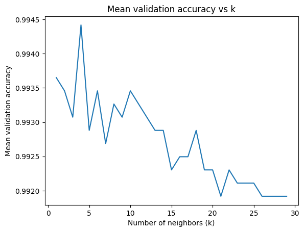{ width=90% }

From the dataset, I obtained the best *k* value of 4. Using *k=4*, I used the KNN on the test set and obtained an accuracy of 0.992. Upon improvising and using weighted KNN based on distance, it obtained a similar accuracy of 0.992.

## Abalone

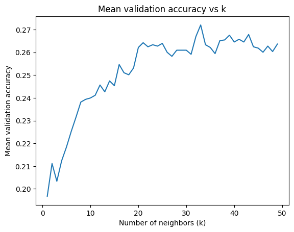{ width=90% }

From the dataset, I obtained the best *k* value of 33. Using *k=33*, I used the KNN on the test set and obtained an accuracy of 0.241. Upon improvising and using weighted KNN based on distance, it obtained a slightly higher accuracy of 0.246.

# 3 Decision Trees Classifier

For both datasets, I used *GridSearchCV* with parameters "max_depth" set from 1 to 29 inclusive, to calculate the accuracy of the decision tree.

## Wine

For the wine dataset, I found out that the best tree depth is 9, which obtained an accuracy of 0.987. Below shows the plot between mean accuracy and the tree depth.

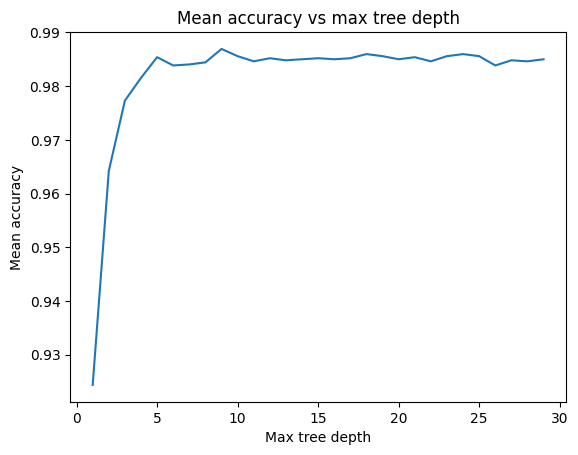{ width=90% }

Using the tree depth of 9 on the test set, I obtained an accuracy of 0.983.

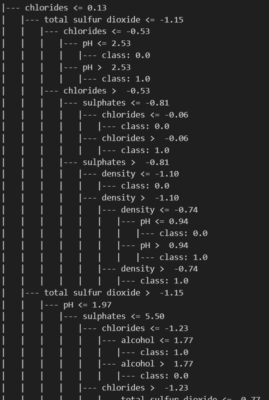{ width=90% }

I tried to visualise the decision tree using *export_text* and I gathered that total sulfur dioxide is the first split, which strongly suggsets that it is important in differentiating between red and white wines. This is also observed from the pairsplot, where red wine tend to have lesser total sulfur dioxide than white wine.  
Chlorides also seem to be important as it appears as the second split for both subtrees after the first split.  
Sulfates and the volatile acidity also seem to play a role in differentiating between the wine color.

## Abalone

For the abalone dataset, I found out that the best tree depth is 5, which obtained an accuracy of 0.263. Below shows the plot between mean accuracy and the tree depth.

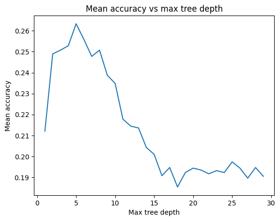{ width=90% }

Using the tree depth of 5 on the test set, I obtained an accuracy of 0.264.

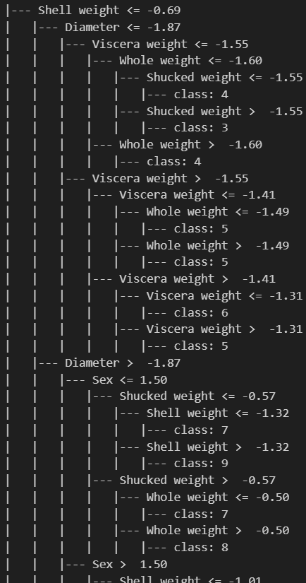{ width=90% }

I tried to visualise the decision tree using *export_text* and I gathered that the first split is based on shell weight, suggesting that shell weight plays an important role in determining the number of rings of an abalone.  
Other factors that play a role includes sex, diameter, shell weight, and viscera weight.

# 4 Random Forest Classifier

For both datasets, I used *GridSearchCV* with parameters "max_depth" set from 1 to 29 inclusive, and "n_estimators" (number of trees) set from 1 to 29 inclusive to calculate the accuracy of the decision tree.

## Wine

For the wine dataset, I found out that the best tree depth is 15, while the best number of trees is 27, which gave an accuracy of 0.995. This is the heatmap that I plotted to observe how these 2 parameters affected the accuracy.

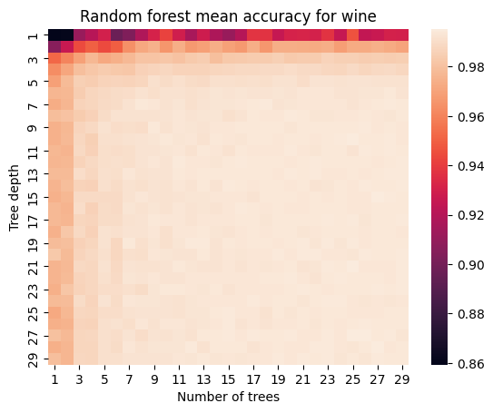{ width=90% }

From the heatmap, it can be seen that a tree depth of 1 results in lower accuracy even if there are a lot of trees. In comparison, the accuracy significantly improves even when there is only 1 tree, as tree depth increases.

Using *max_depth=15* and *n_estimators=27* on the test dataset, I obtained an accuracy of 0.995.

## Abalone

For the abalone dataset, I found out that the best tree depth is 4, while the best number of trees is 9, which gave an accuracy of 0.275. This is the heatmap that I plotted to observe how these 2 parameters affected the accuracy.

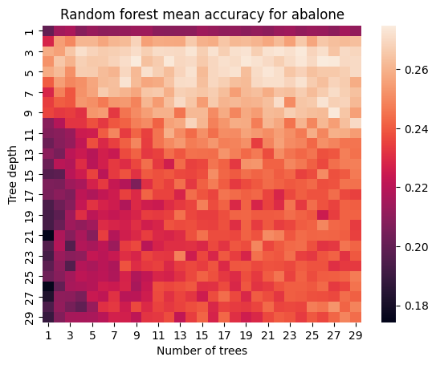{ width=90% }

From the heatmap, it can be seen that when the max depth increases beyond 10, the accuracy seems to worse when there is only 1 tree. Better accuracy is also obtained near the top area, where the tree depth is low (3-7).

Using *max_depth=4* and *n_estimators=9* on the test dataset, I obtained an accuracy of 0.259.

# 5 Final Results

|  | best settings (wine) | best settings (abalone) | wine | abalone |
| --- | --- | --- | --- | --- |
| KNN | k = 4, weighted = distance | k = 33, weighted = distance | 0.992308 | 0.245803 |
| Decision Tree | max depth = 9 | max depth = 5 | 0.983077 | 0.263789 |
| Random Forest | max depth = 15, number of trees = 27 | max depth = 4, number of trees = 9 | 0.994615 | 0.258993 |

Overall, the KNN seemed to performed slightly worse in comparison to decision tree and random forest. The decision tree with max depth 5 seemed to work best for the abalone dataset, while random forest with max depth of 15 and 27 trees seemed to work best for the wine dataset.