# Assignment 2 Report Submission

**Group**:  
**Names**: Sng Amos, Pea Darren  
**Student ID**: 21175177,  21175237

## 1. MLE and MAP Derivation
### 1. MLE Derivation
Key information from assignment brief:
N samples, $x_1,...,x_i,...,x_N$  
$x_i \sim Kumaraswamy(a,b): f(x|a,b) = abx^{\alpha -1}(1-x^\alpha)^{(b-1)}$, where $x_i \in (0,1)$
$a$ is known, and we want to estimate $b$

#### (a) Define likelihood function
Given N independent samples, the likelihood function is:  
$L(b) = \prod_{i=1}^{N}{f(x_i|a,b)}=\prod_{i=1}^{N}[abx_i^{\alpha -1}(1-x_i^\alpha)^{(b-1)}]$
#### (b) log likelihood
$\ln{L(b)} = \ln{[\prod_{i=1}^{N}[abx_i^{\alpha -1}(1-x_i^\alpha)^{(b-1)}]]}$  
$=\sum_{i=1}^{N}{\ln{[abx_i^{\alpha -1}(1-x_i^\alpha)^{(b-1)}]}}$  
$= \sum_{i=1}^{N}{[\ln{(a)+\ln{(b)}+(\alpha-1)\ln{(x_i)}+(b-1)\ln{(1-x_i^a)}}]}$   
$= N\ln{(a)} + N\ln{(b)} + (a-1)\sum_{i=1}^{N}{\ln{(x_i)}} + (b-1)\sum_{i=1}^{N}{\ln{(1-x_i^a)}}$

#### (c) Differentiate the log-likelihood w.r.t $b$
$\frac{d}{db}[{N\ln{(a)} + N\ln{(b)} + (a-1)\sum_{i=1}^{N}{\ln{(x_i)}} + (b-1)\sum_{i=1}^{N}{\ln{(1-x_i^a)}}}]$  
$=0+ \frac{N}{b} + 0 +  \sum_{i=1}^{N}{\ln{(1-x_i^a)}}$

#### (d) Equating the derivative to 0 and solving
$\frac{N}{b} + \sum_{i=1}^{N}{\ln{(1-x_i^a)}} = 0$  
$b = -\frac{N}{\sum_{i=1}^{N}{\ln{(1-x_i^a)}}}$

MLE for $b$ is $-\frac{N}{\sum_{i=1}^{N}{\ln{(1-x_i^a)}}}$

### 2. MAP Derivation
$p(b|x_1,...x_N) \propto L(b)p(b)$  

From above we know,  
$L(b) = \prod_{i=1}^{N}[abx_i^{\alpha -1}(1-x_i^\alpha)^{(b-1)}]$

From the passage we know,  
$b \sim \mathcal{N}{(\mu,\sigma^2)} = e^{-\frac{(b-\mu)^2}{2\sigma^2}}$ 
#### (a) Log posterior including prior
$\ln{p(b)} = \ln{e^{-\frac{(b-\mu)^2}{2\sigma^2}}} =-\frac{(b-\mu)^2}{2\sigma^2} $ 
From the likelihood from part 1,
$L(b) = N\ln{(a)} + N\ln{(b)} + (a-1)\sum_{i=1}^{N}{\ln{(x_i)}} + (b-1)\sum_{i=1}^{N}{\ln{(1-x_i^a)}}$
since $N\ln(a)$ and $(a-1)\sum_{i=1}^{N}{\ln{(x_i)}}$ depend on a known $a$, they are constant, we can simplify $L(b)$ into,
$L(b) =(b-1)\sum_{i=1}^{N}{\ln{(1-x_i^a)}} + constant$
For the prior we can ignore the normalizing constant that does not depend on b,
$\ln{p(b|x_1,...,x_N)} = \ln{L(b)} + \ln{p(b)}$
$ = N\ln{(b)} + (b-1)\sum_{i=1}^{N}{\ln{(1-x_i^a)}} -\frac{(b-\mu)^2}{2\sigma^2}$

#### (b) Differentiate the log-posterior w.r.t $b$
$\frac{d}{db}\ln{p(b|x_1,...,x_N)} =\frac{d}{db} [N\ln{(b)} + (b-1)\sum_{i=1}^{N}{\ln{(1-x_i^a)}} -\frac{(b-\mu)^2}{2\sigma^2}]$ 
$= \frac{N}{b} + \sum_{i=1}^{N}{\ln{(1-x_i^a)}} - \frac{(b-\mu)}{\sigma^2}$

#### (c) Equate derivative to 0 and solve
$\frac{N}{b} + \sum_{i=1}^{N}{\ln{(1-x_i^a)}} - \frac{(b-\mu)}{\sigma^2} =0$
$\frac{\sigma^2N}{b} + \sigma^2\sum_{i=1}^{N}{\ln{(1-x_i^a)}} - (b-\mu) = 0$
$-b^2 + b\mu +b\sigma^2\sum_{i=1}^{N}{\ln{(1-x_i^a)}} + \sigma^2N= 0$
$b^2 -b[\mu+\sigma^2\sum_{i=1}^{N}{\ln{(1-x_i^a)}}]-\sigma^2N =0 $
Simplifying the equation by substitutions,
$C = \mu+\sigma^2\sum_{i=1}^{N}{\ln{(1-x_i^a)}}$ and $ D = \sigma^2N$
we get the simplified form,
$b^2 - Cb -D =0$
then solving with the general solution to quadratic equations,
$b=\frac{C\pm\sqrt{C^2+4D} }{2}$
since b>0 we choose the positive root, then substituting the initial constants back,
$\hat{b}_{MAP} = \frac{\mu+\sigma^2\sum_{i=1}^{N}{\ln{(1-x_i^a)}}+\sqrt{(\mu+\sigma^2\sum_{i=1}^{N}{\ln{(1-x_i^a)}})^2+4\sigma^2N}}{2}$

## 2. Regression
### Wine dataset
#### kNN
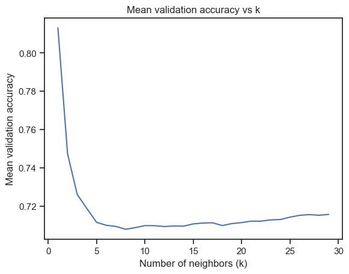
Upon using kNN with 5-fold cross validation, we obtained the best k = 8, and the weighted kNN using distance has obtained a lower RMSE value of 0.5944 compared to the orignal kNN of 0.6711.

#### Decision Tree
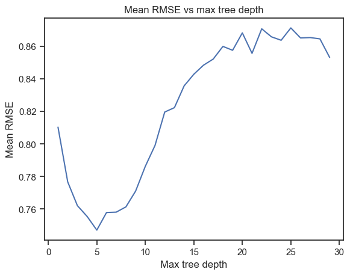
Using Decision Tree Regression, we obtained a best tree depth of 5, and obtained a RMSE value of 0.6881 on the test set.

#### Random Forest
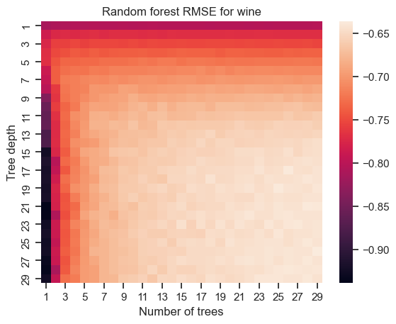
Using Random Forest Regression, we found out that the best tree depth is 26, with 29 trees. Using these parameters on the test set, we obtained a RMSE of 0.5717.

#### Gradient Tree Boosting
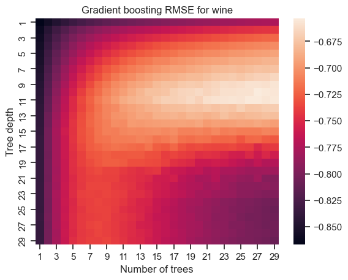
Using Gradient Tree Boosting, we found out that the best tree depth is 10, with 27 trees. With these parameters, we obtained a RMSE of 0.5980 on the test set.

| Model | Test RMSE |
| ----- | --------- |
| Random Forest | 0.5717 |
| Weighted KNN | 0.5944 |
| Gradient Boosting | 0.5980 |
| KNN | 0.6711 |
| Decision Tree | 0.6881 |

From the above training algorithms, the model produced by Random Forest has the best performance when evaluated with Root Mean Square Error as the performance metric as it has the lowest Root Mean Square Error value.

### Abalone dataset
We removed data that has very little sample size for each ring value, liek 25 rings and 1 ring, where their sample size is only 1. This is because it might result in an imbalanced distribution and the model will be unable to have reliable predictions for these abalones.

#### kNN
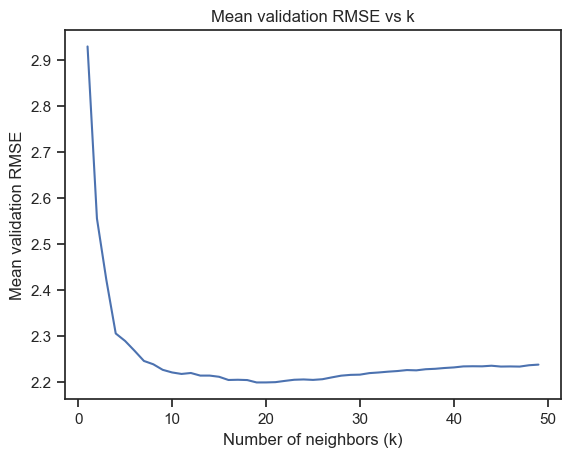
Upon using kNN with 5-fold cross validation, we obtained the best k = 19, and the weighted kNN using distance has obtained a lower RMSE value of 2.0697 compared to the orignal kNN of 2.0872.

#### Decision Tree
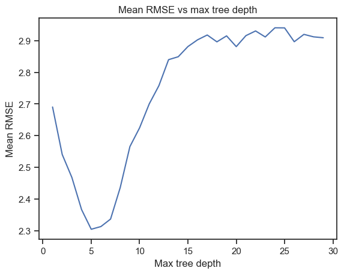
Using Decision Tree Regression, we obtained a best tree depth of 5, and obtained a RMSE value of 2.2203 on the test set.

#### Random Forest
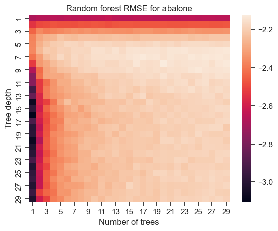
Using Random Forest Regression, we found out that the best tree depth is 8, with 20 trees. Using these parameters on the test set, we obtained a RMSE of 2.0622.

#### Gradient Tree Boosting
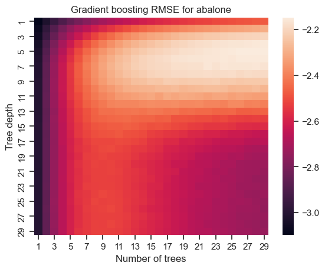
Using Gradient Tree Boosting, we found out that the best tree depth is 5, with 29 trees. With these parameters, we obtained a RMSE of 2.0489 on the test set.

| Model | Test RMSE |
| ----- | --------- |
| Gradient Boosting | 2.0489 |
| Random Forest | 2.0622 |
| Weighted KNN | 2.0697 |
| KNN | 2.0872 |
| Decision Tree | 2.2203 |

From the above training algorithms, the model produced by gradient tree boosting has the best performance when evaluated with Root Mean Square Error as the performance metric as it has the lowest Root Mean Square Error value.   
That being said, the Root Mean Square Error of 2.177 is considerably high, which might indicate that the models is unable to find a optimal solution to the regression problem. This might indicate that there is either little to no correlation between the Rings on the Abalone and the other features input into the regression.

### Forest Fires dataset
We decided to compare the fire area using its logarithmic form to better capture the datapoints instead of the raw area.

#### kNN
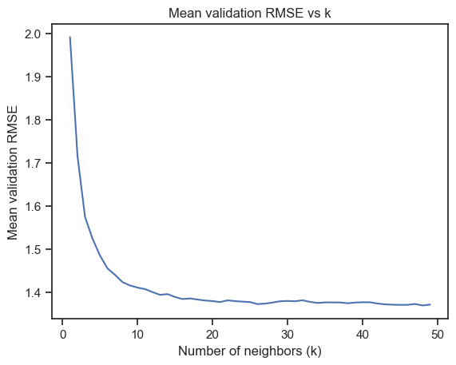
Upon using kNN with 5-fold cross validation, we obtained the best k = 48, and the weighted kNN using distance has obtained a higher RMSE value of 1.4467 compared to the orignal kNN of 1.4419.

#### Decision Tree
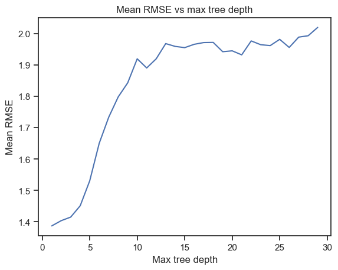
Using Decision Tree Regression, we obtained a best tree depth of 1, and obtained a RMSE value of 1.4577 on the test set.

#### Random Forest
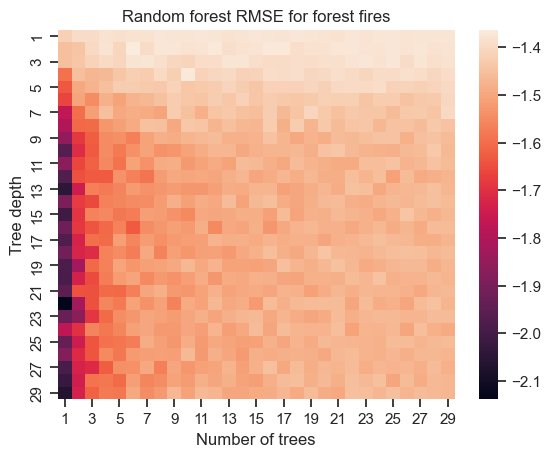
Using Random Forest Regression, we found out that the best tree depth is 2, with 6 trees. Using these parameters on the test set, we obtained a RMSE of 1.4687.

#### Gradient Tree Boosting
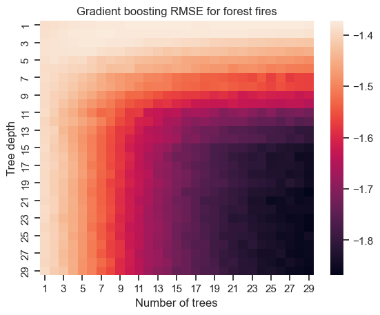
Using Gradient Tree Boosting, we found out that the best tree depth is 1, with 25 trees. With these parameters, we obtained a RMSE of 1.4491 on the test set.

| Model | Test RMSE |
| ----- | --------- |
| KNN | 1.4419 |
| Weighted KNN | 1.4467 |
| Gradient Boosting | 1.4491 |
| Decision Tree | 1.4577 |
| Random Forest | 1.4687 |

From the above training algorithms, the model produced by Weighted KNN has the best performance when evaluated with Root Mean Square Error as the performance metric as it has the lowest Root Mean Square Error value. 
That being said the Root Mean Square Error of 1.316 is slightly higher than ideal, which might mean that the model is having some difficulty finding a optimal solution to the regression problem.  
This might mean that either there is little correlation from the features provided to the area of the forest fires, or that future data processing is required to more accurately model the area of the fires.

## 3. Representation Learning

### Wine dataset

#### t-SNE
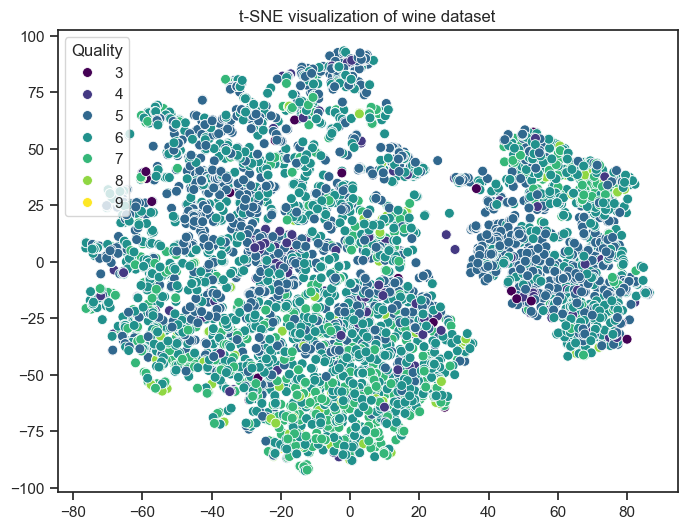
Through the 2D t-SNE plot, I notice that there seems to be 2 groups, split by x = 35. There is a much greater spread in data points for x < 35 and wine of higher quality appears to be located nearer to the bottom for the left group and nearer to the top for the right group.

#### PCA
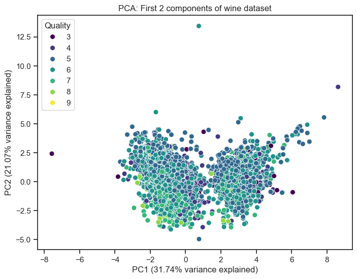
For the PCA plot, the existence of a datapoint where PC2 = 13, seems to overexaggerate the range of PC2 values as the rest of the data points are scattered between -5 to 7. There also seems to be a divide into 2 different groups at PC1 = 1.5.

#### LDA
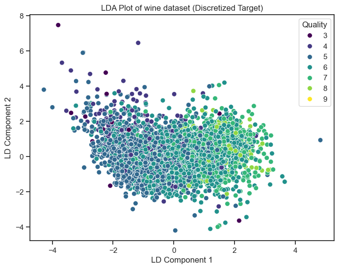
Using LDA, it appears that the higher quality wines have higher LD Component 1 values. Most of the data points are also closely scattered between -2 and 2 for LD Component 2.

#### PCA Scree plot
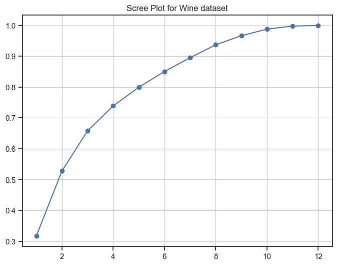
Using scree plot, we decided to use a dimension of 8 for wine-pca and 4 for wine-lda.

### Abalone dataset
#### t-SNE
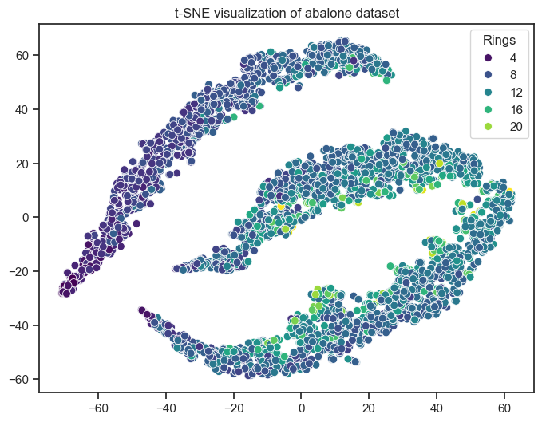
The t-SNE plot seems to split the datapoints to 3 distinct groups, where they are distributed across majority of the x-axis. The datapoints with the least rings can mostly be seen at the lower end of the x-axis.

#### PCA
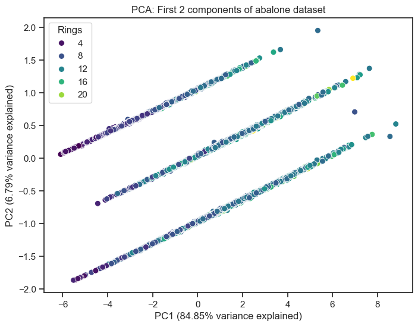
In the PCA plot, the datapoints are mostly following 3 seperate lines of the same gradient. The datapoints with the lowest rings can be observed at the lower end of the PC1 spectrum. The data is also spread relatively evenly across the entire axis, explaining the high variance of PC1.

#### LDA
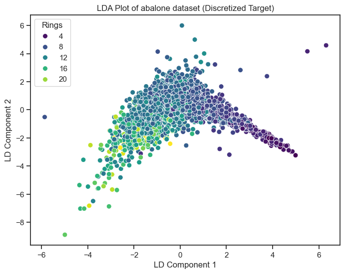
With LDA, it seems that abalones with lesser rings have higher LD Component 1 values. The datapoints seem to have lesser spread for LD Component 1 between 2 to 5, and the spread grows between -3 and 2.

#### PCA Scree plot
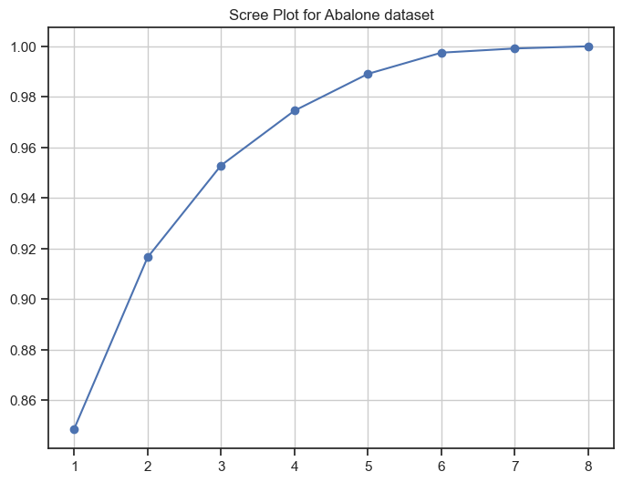
Using scree plot, we decided to use a dimension of 2 for abalone-pca and 2 for abalone-lda.

### Forest fires dataset
#### t-SNE
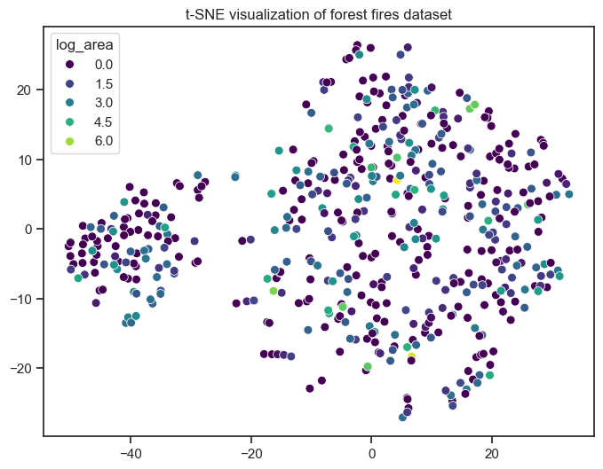
For the t-SNE plot, the datapoints seem to be scattered throughout, with the datapoints closely grouped for x-axis below -20, and scattered with high variance for x-axis above -20.

#### PCA
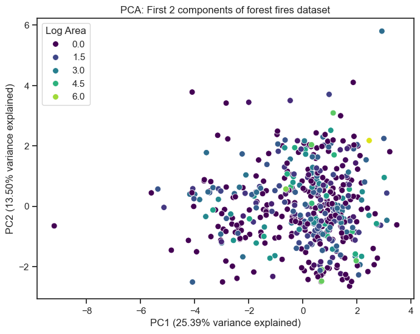
In the PCA plot, it seems that majority of the datapoints lie above -6 for PC1. Datapoints for Log Area = 0 does not seem to follow any trend.

#### LDA
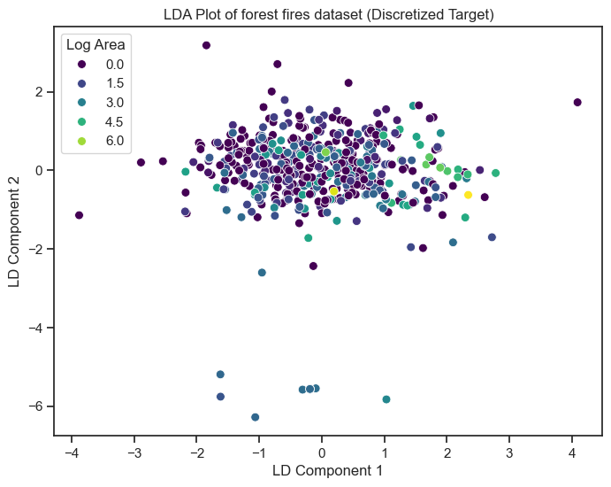
With LDA, it seems that most points lie above LD Copmonent 2 > -2, with a few outliers at around -6. The datapoints with Log Area = 0 seem to lie around the range of -2 and 2 for LD Component 2.

#### PCA Scree plot
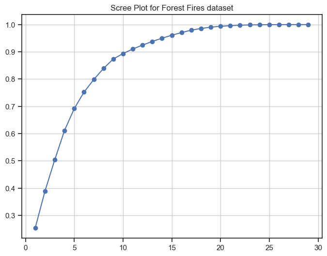
Using scree plot, we decided to use a dimension of 11 for forest_fires-pca and 4 for forest_fires-lda.

After running the above regressions on all the newly reduced datasets, we obtained the following performance table based on Root Mean Square Error (RMSE).

| Dataset | k-NN | RF | GB |
| ------- | ---- | -- | -- |
| wine | 0.6711 | 0.5717 | 0.5980 |
| wine-pca | 0.6720 | 0.5883 | 0.6135 |
| wine-lda | 0.6645 | 0.6105 | 0.6394 |
| abalone | 2.0872 | 2.0622 | 2.0489 |
| abalone-pca | 2.4244 | 2.4233 | 2.4191 | 
| abalone-lda | 2.0634 | 2.0592 | 2.0604 |
| forest_fires | 1.4419 | 1.4687 | 1.4491 |
| forest_fires-pca | 1.4656 | 1.4277 | 1.4245 | 
| forest_fires-lda | 1.4270 | 1.5731 | 1.5067 |

Based on the summary performance, it seems that Random Forest appears to give the lowest RMSE for all wine datasets, with the best performance on the original wine dataset. For all abalone datasets, it seems that the best results are obtained from Random Forest and Gradient Boosting. However, the reduction in dimensions using PCA seemed to result in a much worser RMSE. For all forest fires datasets, it seems that reduction using PCA is effective in lowering RMSE as both Random Forest and Gradient Boosting on forest_fires-pca have obtained a RMSE of 1.42, which is better than most of the other RMSE for all 3 forest_fires dataset.