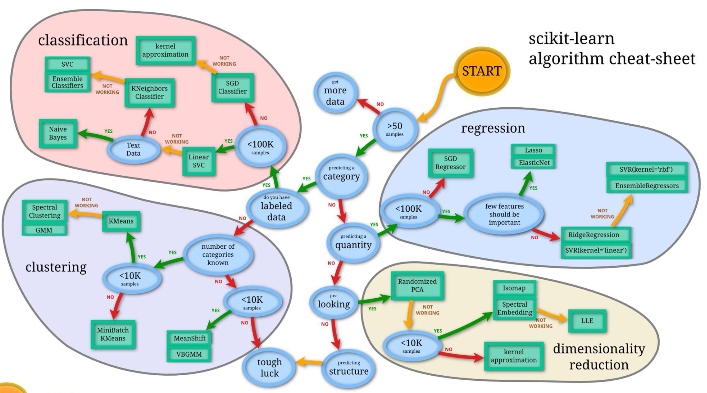

# Artificial Intelligence and Machine Learning (ECE 457B)

## Weightage
- ~~Assignment 0 - 2%~~ (completed on 10 Jan 2025)
- Assignment 1 - 5%
- Assignment 2 - 8%
- Assignment 3 - 15%
- Midterms - 20%
- Finals - 50%

# Scikit Learn cheat sheet

