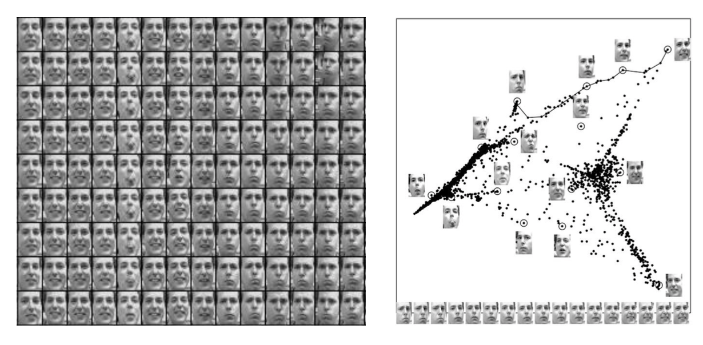

# Week 2 Notes

## Cardinality vs Dimensionality

**Cardinality**
- Number of unique elements in a dataset, measures the variation of valid data inputs in a field.
- High Cardinality: a "customer ID" field where every value is unique for each customer
- Low Cardinality: a "Gender" field with values of only "male" or "female".

**High cardinality** increases complexity in computation and indexing.  
**Low cardinality** makes it easier for optimization of data and storage and analysis.  

**Dimensionality**
- Number of features or attribute in a dataset.
- High Dimensionality: each row represents a customer and there are many columns to capture many metrics of each customer, age, income, gender, race, etc.
- Low Dimensionality: each row represents a customer but only 2 columns to capture race, gender.

**Curse of dimensionality** adding more features makes pattern harder to find and computationally expensive.

## Degrees of variation

**Example**: images are highly dimensional vectors but their degrees of variation are small (angle/ orientation/ expression)  

**Dimensionality reduction**: can be applied to high dimension data to show lower dimensional patterns. unfolds complex manifolds to explain the local geometry of the space.

## Data representation  
common strategy: represent data in Euclidean space as vectors.  
We can do linear algebra with vectors.

## Training dataset
Consist of collection of pairs of input vectors "x" and its corresponiding **target** or **label (t)**.
- Regression: **t** is an element of continuous reals.
- Classification: **t** is an elements of a **discrete** set.

Training set:  
Dtr = {x1,t1,x2,t2,...,xn,tn}

## Nearest Neighbors
find the nearest vector in the training set to the **new input vector ($\hat{x}$)**, then copy the training vector's label.

**Euclidean Distance**  
distance(xa, xb) = ||xa,xb||2 = $\sqrt{\sum_{j=1}^{d} (x_j^a-x_j^b)^2}$

**Lp-norms**  
Lp-norms:=||x||p:= ($\sum_{i=1}^{n}|x_i|^p)^\frac{1}{p}$
