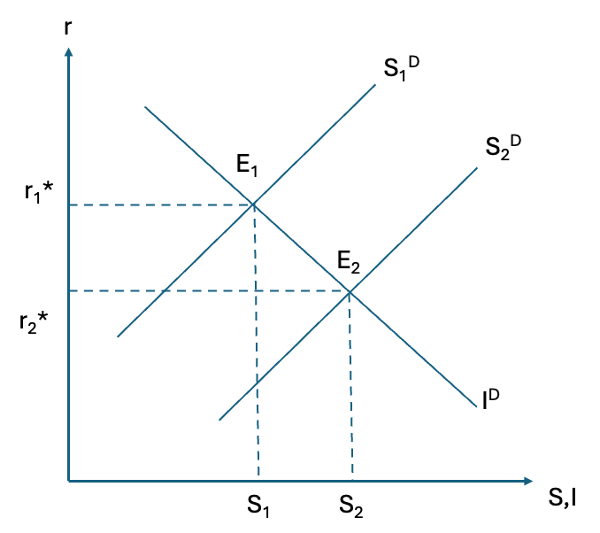
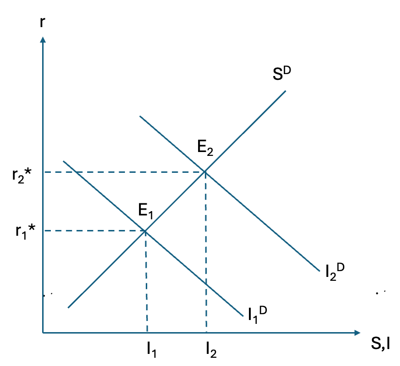
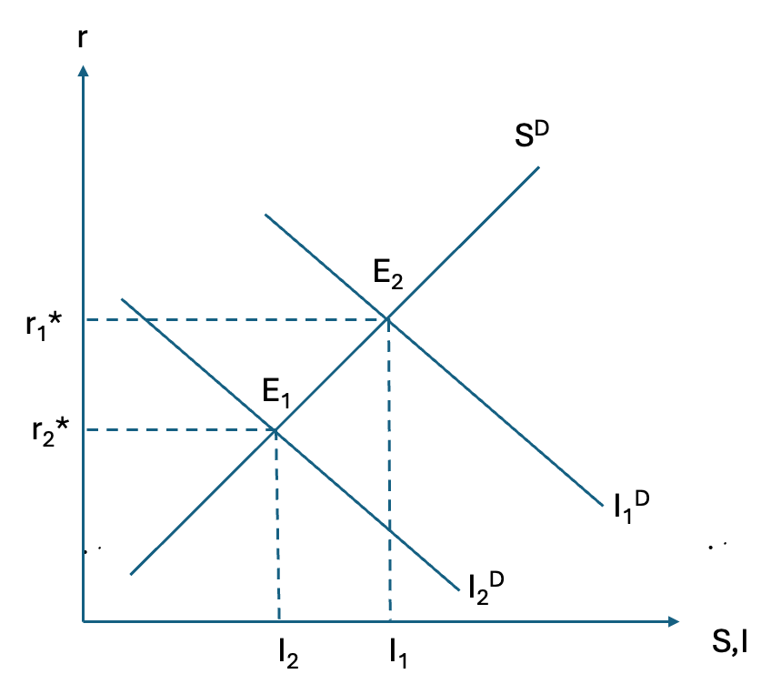
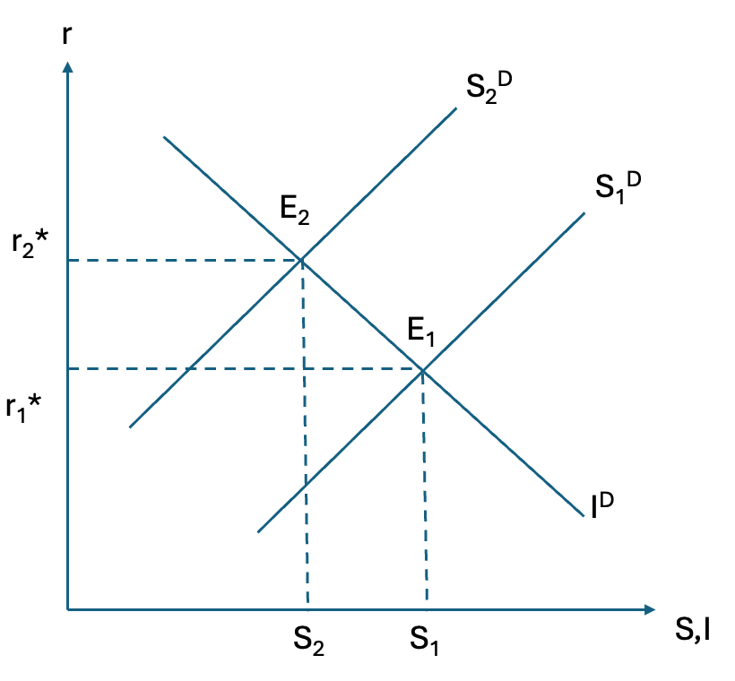
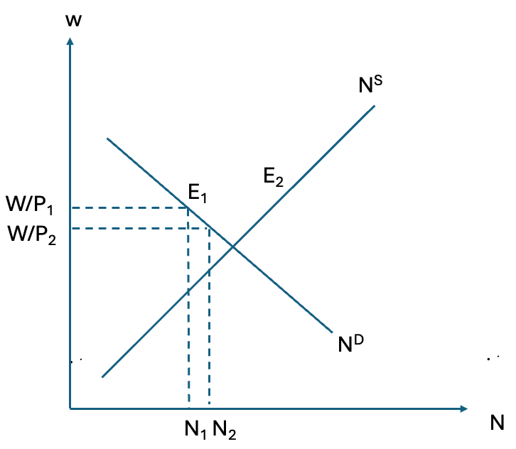
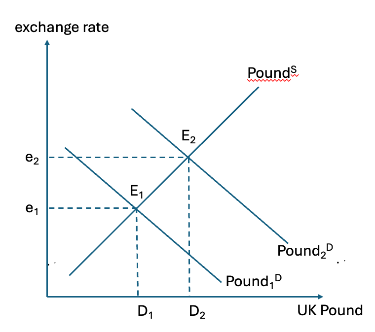
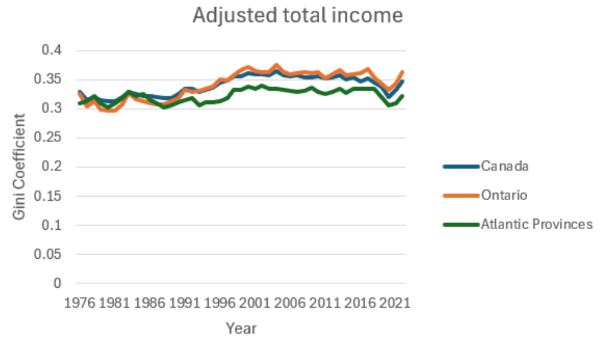
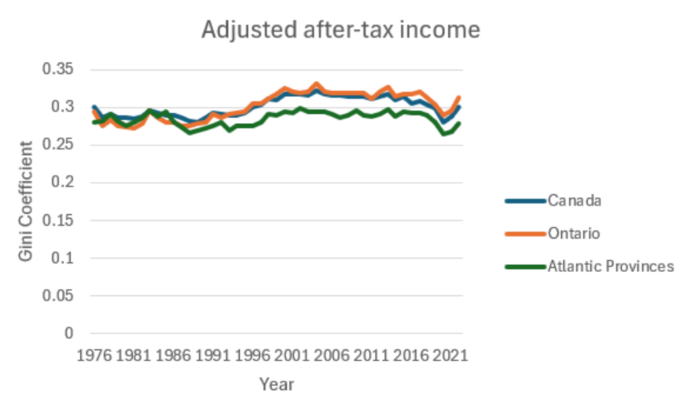

# ECON 102 Assignment 2 submission
**Name:** Amos Sng  
**Student ID:** 21175177

## Question 1
### Part a.
If current income (Y) increases, household s have more disposable income, hence they tend to save more at every interest rate. This shifts the saving curve to the right, while the investment demand curve remains unchanged. This results in the equilibrium $r^*$ decreases from $r_1^*$ to $r_2^*$. The level of $S$ and I also increases from $S_1$ to $S_2$. This can be observed from the graph below.  
{width=50%}

### Part b
Lowering the tax rate on capital increases the after-tax return on investments, making investments more profitable. This will cause the investment demand curve to shift right as investors will be more willing to invest. Meanwhile this policy change does not affect the saving curve, which remains constant.  
This higher demand for investment will cause the equilibrium interest rates to rise from $r_1^*$ to $r_2^*$, and the level of S and I also increases as seen from the rightward shift of $I_1$ to $I_2$ as households are incentivised to save more in higher interest rate environment.  
{width=50%}

### Part c
A higher depreciation rate reduces the net return on capital, making investment less attractive. This shifts the investment demand curve to the left. The saving curve is unaffected and remains constant.  
With lower demand for investment funds, the equilibrium interest rate falls which can be seen from the decrease from $r_1^*$ to $r_2^*$. The level of S and I also decreases from $I_1$ to $I_2$ as households save less at lower interest rates.  
{width=50%}

## Question 2
### Part a
The currency-deposit ratio (C/D) is the amount of currency the public holds relative to the deposits they place in banks. 
$$\frac{M}{\text{Monetary Base}} = \frac{\text{currency deposit ratio}+ 1}{\text{currency deposit ratio}+\text{reserve deposit ratio}} $$
A lower ratio means people hold less cash and keep more money in deposit accounts. When more money is deposited in banks, the base available for banks to lend increases. Because banks lend a fraction of their deposits, while only keeping a required reserve, more deposits mean more potential loans via the multiple deposit expansion process, the reserve deposit ratio is always less than or equal to 1.  
As a result, even though both the numerator and denominator decreases, the numerator will decrease less proportionally compared to the denominator, $\frac{M}{\text{Monetary Base}}$ increases. Assuming that Monetary base is constant, the money supply increases and banks are able to create more money though multiple expansions of loans and deposits as more money is kept in the banking system rather than currency outside the system.

### Part b
**Advantage**: Enhanced profitability through more loans.
With a lower reserve ratio, banks are required to hold a smaller fraction of deposits as reserves. This frees up a larger portion of deposits for lending. Since banks earn interest on loans, this can boos this can boost their profitability and expand their earing potential.  
**Disadvantage**: Increased Liquidity Risk.  
Holding fewer reserves means that if any depositors demand their money back simultaneously, i.e a bank run or sudden liquidity shock, the bak might not have enough liquid funds available. This makes the bank more vulnerable to liquidity crisis, which can jeopardize its stability and confidence among depositors.

### Part c
A reserve deposit ratio of 1 means that banks must hold 100% of deposits as reserves. $\frac{M}{\text{Monetary Base}}=1$, which means banks are not able to loan out money. With no new loans being generated from deposits, as the potential of multiple expansions of loans and deposits is eliminated, the money supply will decrease as banks cannot create money by lending to others.

## Question 3
### Part a
When government spending increases, Y increases as G is a component of Y. Since $S^D = Y - C^D -G$, saving demand decreases decreases due to the increase in G. As such the saving demand curve shifts left, while the investment demand curve remains unchanged.  
It can be from the graph below, that $r^*$ increases from $r_1^*$ to $r_2^*$ while $S^*$ and $I^*$ decrease from $S_1$ to $S_2$.  
{width=50%}  
The increase in the aggregate demand from the increase in G will cause firms to increase production and hire more workers to fulfil this increase in production as firms cannot raise wages due to sticky wages. As such, the labor demand curve shifts right. This results in N increasing and w decreasing as the equilibrium shifts from $E_1$ to $E_2$. Since W is relatively constant due to sticky wages, the decrease in W/P suggests that price, P, increases.  
{width=50%}  
### Part b

During the covid pandemic, the Canadian government implemented significant fiscal stimulus packages, which resulted in increased spending through programs like the Canadian Emergency Response Benefit. It increased Y as Canada's GDP contracted in 2020, but the GDP recovered in 2021 as the government spending boosted aggregate demand.  
That being said, interest rates were kept very low, near to 0% at the beginning of 2020, which could have been caused by the reduced consumption opportunities due to the lockdowns.  
Employment, i.e N, initially fell, likely due to lockdowns, but recovered over the years as the economy reopened with the aid of government spending.  
P increases as there was high inflation rates during the period of 2020 to 2021, likely due to disruptions in supply chains as a result of lockdowns and travel restrictions.

## Question 4
### Part a
With the German expansionary monetary policy, the increase in Y will lead to an increase in German demand for goods, including imports from the UK. This would increase UK's exports as the demand for them increases, increasing UK's NX. Since Y = C + I + G + NX, the increase in NX would also lead to an increase in UK's Y. The increase in Y in the UK would increase money demand, resulting in a higher interest rate, r.

### Part b
Since the interest rate in the UK is high, German investors might move their capital to the UK for better returns, which in turn increases the demand for UK's currency.  
Since UK's exports increase, the demand for UK's currency will also increase since importing countries have to buy UK's products in British pounds. These 2 reasons will cause the demand curve of UK pound to shift right, causing the exchange rate to increase from $e_1$ to $e_2$.  
{width=50%}

## Question 5
### Part a
{width=50%}  
{width=50%}

From the graphs, it can be observed that the Gini coefficient value for total income is generally higher than the Gini coefficient value for after-tax income.  
This might be an indicator that income taxes in Canada have helped reduce the income inequality and the differences between the 2 Gini coefficient values reflects the effectiveness of income taxes redistributing wealth in the country.
### Part b
The Gini coefficient value in Ontario is generally higher than that Atlantic Provinces after 1991, which is an indication that there is more income inequality in Ontario compared to the Atlantic Provinces.  
That being said, it can also be observed that both Ontario and the Atlantic Provinces follow the same trend, where both experience peaks and troughs of their Gini coefficient at similar time periods.
