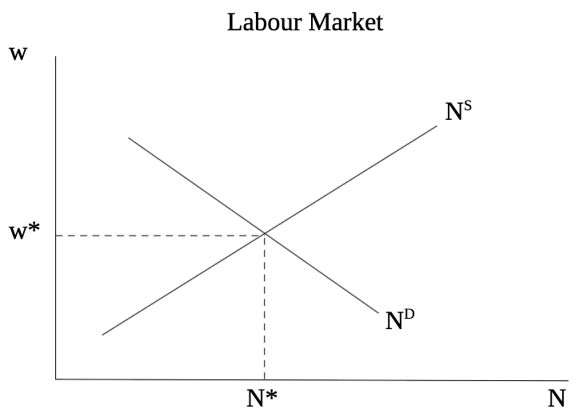
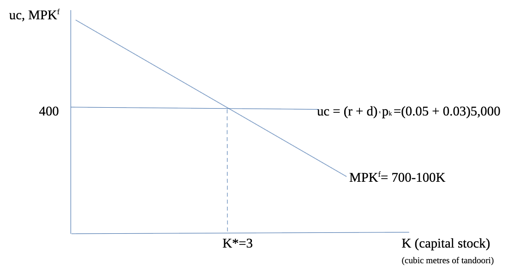
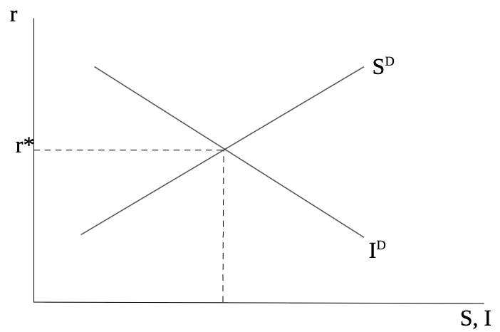

# ECON102 finals notes

**Not covered in finals**:  
slides 203, 270 & 272 were excluded, along with the concept of Hysteresis

## Normative vs Positive statements
- **Positive economics:** what are the effects of a policy
    - Based on facts
- **Normative economics:** should a policy by implemented
    - Opinions driven, value judgments

## Measurement & Accounting
### System of National Accounts (SNA)
- Compile accurate and systematic measures of aggregate economic activity of a nation or jurisdictional area.
- set up **standardized** measurements of macroeconomic variables based on a set of accounting principles, such as GDP.

#### Gross Domestic Product (GDP)
- market value (value of goods at market prices)of all final goods and services produced in an economy during a fixed period of time.
##### Measuring GDP
1. Product approach
    - Sum all the `final` goods and services **produced** in the economy at their market value
    - `final` means that all intermediate production is excluded from the sum
2. Expenditure Approach
    - Sum all final goods and services **purchased** in the economy
    - $GDP = C+I+G+NX$
        - Personal Consumption Expenditure ($C$)
            - Durable goods
            - semi-durable goods
            - nondurable goods
            - services
        - Investment ($I$)
            - Residential construction
            - Nonresidential construction, machinery & equipment
            - Intellectual properly products (IPP)
            - Business Inventory Investment
        - Government expenditure ($G$)
            - Government purchases of goods and services
            - Government Investments
        - Net exports (NX)
            - Exports - Imports
3. Income approach
    - Sum all income received by workers, the government and firms (wage, tax, profits)
        - Breakdown of components of income
            - Labor income
            - Corporate profits
            - Interest and Investment income
            - Unincorporated Business income
            - Indirect taxes less subsidies 
            - Capital consumption allowances/depreciation
#### Fundamental Identity of National Income Accounting
**Total Production =  Total Expenditure = Total Income**  
No matter which approach we use we have the same GDP  
Using different methods to measure the GDP gives us a different perspective on which components contribute the most to an economy's production activities within a given time frame.  
#### Issues of measuring GDP
- GDP can only be compared between countries when converted to a common currency
- might not measure overall progress, does not take into account factors like income inequality
- does not take into account of costs of pollution
- does not take into account value of unpaid work
- does not capture quality or value
- does not measure happiness of a country

#### Gross National Product
- Total market value of production by all national factors of production
- GNP =  GDP + NFP
    - Net Factor Payments (NFP)
        - Income earned abroad by Canadian factors minus income earned in Canada by foreign factors
### Saving Identities and formulas
- **Private disposable income (Yd)**
    - $Yd = \text{Y or GDP} + NFP + TR +INT-T$
        - Y = private disposable income
        - NFP = net factor payments
        - TR =  net transfers 
        - INT = interest of government debt
        - T =  Taxes
    - Yd =  private disposable income = income that households have to spend = income received from all sources, less taxes
- **Private savings (Spvt)** 
    - Spvt = private disposable income - consumption
    - Spvt = Yd - C = (Y + NFP + TR + INT - T) - C
    - Spvt = I + (-Sgovt) + CA
- **Government Saving (Sgovt)**
    - Sgovt = net government income  - government purchases
    - Sgovt = (T-TR-INT) - G
    - if Sgovt<0 then govt has budget deficit
- **National Saving (S)**
    - S = Spvt + Sgovt = Y + NFP - C - G = I + NX + NFP = I + CA
    - National Savings = total income - total spending of economy

#### International components of savings
- Current Accounts (CA): payments received from abroad less payments made to foreign countries by domestic economy
- CA = NX + NFP
#### Saving vs Wealth
- **Flow variable**: calculated over a period of time
- **Stock variable**: calculated at a point in time
- **Wealth**: Asset - Liability of an agent
    - National wealth = total wealth of residents of a country =  domestic physical assets + net foreign assets
    - net foreign assets: foreign financial & physical assets - foreign liabilities 

### Nominal vs Real
- **Nominal variable**: variable measured in terms of current market values
- **Real variables**: variable measured in terms of a base unit (takes into account inflation)

#### Accounting for inflation
Inflation rate: the percentage increase in the price level over a specific period of time.
$$\pi_{t+1}=\frac{P_{t+1}-P_t}{P_t}=\frac{\Delta{}P}{P_t}$$
#### Measuring inflation
- **Price index:** measure of the `average` level of prices for some specified set of goods and services relative to `prices in a specified base year`
- Three commonly used indices:
    1. GDP deflator  
        - price index that measures the overall level of prices of goods & services included in GDP
        - GDP deflator = $\frac{\text{nominal GDP}}{\text{real GDP}}$
    2. CPI
        - measures changes in prices of subset of consumer goods, a "fixed" basket of goods, relative to base reference period.
        - Problems:
            1. basket becomes outdated
            2. goods may have not existed then and do now
            3. historical measures of real GDP often have to be recalculated

    3. Chain Fisher Volume Index:
        - Laspeyres index = $\frac{\text{GDP in t+1 at t prices}}{\text{GDP in t at t prices}}$
        - Paasche index = $\frac{\text{GDP in t+1 at t+1 prices}}{\text{GDP in t at t+1 prices}}$
        - Fisher Volume index = $\sqrt{\text{(Laspreyres)(Paasche)}}$

### Interest rates
rate of return promised by borrower to a lender
#### Nominal Interest rate (i)
rate which is agreed upon between the borrower and lender
#### Real interest rate (r)
rate at which the real value of the asset (loan value) increase over time
#### Real/Nominal Interest Rate Calculation Formula
$$(1+r)=\frac{1+i}{1+\pi}$$
if interest rates and inflation are typically low,
$$r\approx{} i-\pi$$

## Economic Frameworks
### Modeling concepts
**Theoretical analysis:**  
Theoretical analysis typically employs mathematical 
expressions to formalize economic theory (through a set of 
algebraic equations governing behaviour, constraints, 
economic structures and institutional rules). Solutions to 
these models are then used to make predictions that we can 
test (testable predictions).
**Empirical analysis:**
Empirical analysis is also founded on theory but is focused 
on using data as well as mathematical and statistical 
techniques to test hypotheses generated by economic theory 
and estimate the magnitude of relationships.

### Model Elements
**Variables:**  
refers to an item (e.g. price, interest rates, 
consumption, investment, GDP) that can take on different 
possible values.  
Represent both the inputs and outputs of the model.  
Two types of variables:
- **Endogenous:** determined within the model
- **Exogenous:** determined outside of the model

**Parameters:**
characterize the strength and direction btwn the relationships between variables

### Macroeconomic models
**Aggregate Production Function**
$$Y=A*f(K,N)$$
**Y** = real output produced  
**A** = multiplicative productivity effect
**K** = quantity of capital used
**N** = no. workers employed
**f** = a function specifying how much output is derived from given quantities of input K & N

#### Profit maxing quantities of N & K:
Marginal Product of Labor (MPN):  
- the increase in output resulting from 1 unit increase in labor
- $MPN = \frac{\Delta{Y}}{\Delta{N}}$
Marginal Product of Capital (MPK):
- increase in output resulting from a 1 unit increase in capital
- $MPK = \frac{\Delta{Y}}{\Delta{K}}$

## Labor Market, Employment & Unemployment
Assumptions:
- All workers are identical
- Firms are perfectly competitive
- Firms goal is to maximize profits
- Market clearing
### Labor Demand (ND)
**Hiring Rule**  
W = Nominal wage
Firms will continue to hire so long as $MRPN \ge W$  
Market clears at $MPN=W$
**Real wage (w)**
$\text{real wage} = w = \frac{W}{P}$
**Factors that shift labor demand curve**  
1. Beneficial productivity shock
2. Higher capital shock
### Labor Supply (NS)
as wages rise, worker is willing to supply more labor
**Factors that shift labor demand curve**  
1. Wealth: increase in wealth will decrease the labor supply
2. Expected future real wage: increase in $E[w^f]$ will decrease labor supply
3. Population: increase in population increases labor supply
4. Participation rate: increase in LFP increase labor supply
### Labor Market Equilibrium
What the economy actually produces is called the output, denoted by Y.
**Full Employment output**  
measure of what the economy would produce if all resources were fully employed, denoted by $Y^*$
**Full Employment level**  
the equilibrium level of employment, denoted by $N^*$
{width=40%}

#### Sticky wage models
Wages stick and do not adjust quickly to clear the market
**reasons for sticky wages**  
**Institutional factors:** wage floors and negotiated contracts keep wages above market clearing levels

#### Search and Matching Framework
- takes time for workers to find jobs, and firms to hire workers for the job.
- workers can quit or firms can go under, the match does not last forever
- always exist some unemployment
- solve for steady state

##### Steady state
$ M(U,V)=\delta{E}$
**Flows in = Flows out**
Flows in:
- determined by number of matches
- matching function M(U,V)
- U is number unemployed, V is no. vacancies

Flows out:
- rate of match dissolution
- fixed parameter $\delta$

### Unemployment
Without work during past week and actively looked for work during past 4 weeks, excludes full time students.  

#### Types of unemployment
1. Frictional
    - Workers are unemployed briefly when changing jobs
2. Structural
    - Longer term unemployment which may result from poor capabilities, or from changes in economy that shift demand from 1 industry to another skill area.
3. Cyclical
    - Occurs as the economy fluctuates around full time employment levels
    
Natural rate of unemployment: frictional + structural unemployment

#### Issues measuring unemployment
-  Discouraged workers: people become discouraged by not finding a job and stop searching
- Under employment: people may be able to find part time, but wish to work full time
- Long term unemployment: people unable to find jobs for longer periods of time

## Consumption, Savings, Investment
### Desired Consumption (CD)
Aggregate quantity of goods and services that households want to consume given disposable income
### Desired National Savings (SD)
Level of national saving that occurs when aggregate consumption is at its desired level
### Relation btwn Saving and Consumption
what we dont spend, we save.
$S = Y + NFP - C -G $
in a closed economy, where NFP = 0, if we know C we know S.
### Consumption smoothing 
borrowing and saving in order to have a relatively even pattern of consumption over time
### Changes that affects savings
1. changes in real interest rates (r)
    - rise in r will lower current consumption & increase current savings
    - Substitution effect: lower current CD & raise future consumption, increase SD
    - Income effect: raise current CD (decreases SD) for a saver, decrease current CD (increases SD) for a borrower.
2. changes in income, Y
    - rise in Y will increase CD, but part of the increase in Y will be saved also.
    - Marginal Propensity to Consume (MPS): fraction of current income that the population desires to consume in current period.
3. change in expected future income, Yf
    - a rise in expected future income lowers current SD & increase current CD
3. change in Wealth
    - increase in wealth increases current CD, decreases current SD
4. Changes in Fiscal Policy (G, t, T)
    - Increase in G reduces SD, since SD = Y - CD-G
    - Increase in tax rates (t) decrease SD, as increase in t lowers after tax real interest rates, lowering returns to S.
        - expected after-tax real interest rates: $r_{at}=(1-t)*i-\pi$
    - Increase in T (lump sum taxes) increases SD and CD falls, when T rises, Yd falls so CD falls, SD = Y-CD-G rises if Ricardian Equivalence does not hold
        - Ricardian Equivalence: response to change in tax is independent of the timing of the tax. if RE holds, consumers believe that a tax hike today will be followed by a tax cut tomorrow, they will smooth their consumption.
    - Increase G financed by T, with no RE, decreases both SD and CD, higher T reduces CD, but not by full amount of increase in T, so G rises by more than CD drops, SD = Y - CD - G, falls
### Saving Demand Curve
savings increase when r increase, curve upward sloping
### Investment
purchase or construction of capital goods.
- Desired Capital Stock: amount of capital that allows firms to earn the largest expected profit (MPK). 
- User Cost of Capital: expected real cost of using a unit of capital for a specific period of time
    - $uc = r \cdot{} p_k+d \cdot{} p_k= (r+d)\cdot{p_k}$
        - r = expected real interest rate
        - d = rate of depreciation of capital
        - pk =  real price of capital goods
#### Determining desired capital stock
$MPK^f = UC$
{width=40%}
##### Factors affecting Desired Capital Stock
1. change in real interest rates, r
2. change in MPKf
3. change in effective tax rates on capital, t
4. change in any factor affecting UC
### Investment and Desired Capital Stock relation
- gross investment (I): total purchase or construction of new capital goods within a year
- depreciation: reduction in capital stock over the year due to wear and tear, dK.
- Current capital stock: amount of current capital stock, Kt
- Desired capital stock: amount of capital stock you wish to have in the next period, Kt+1
#### Investment Demand
$I_t=K_{t+1}-K_t+dK_{t}$
let K* = desired capital stock = Kt+1 then,
$I^d=K^*-K_t+dK_t$
#### investment demand curve
investment demand decrease as interest rates increase, downward sloping
### Goods market equilibrium
{width=40%}
## Money and Inflation
### Money Demand
Quantity of monetary assets that people choose to hold in their portfolios.
#### Factors affecting monetary demand
1. interest rates
2. price level
3. real income
4. wealth
5. payment technology
6. liquidity of other assets
7. risk
#### Money demand function
aggregate money demand (nominal): Md
$M^d=P\cdot{}L(Y,r+\pi{}^e)$
real money demand:
$\frac{M^d}{P}=\frac{P\cdot{}L(Y,r+\pi{}^e)}{P}$
- P=price level
- Y= real income (or output)
- i= nominal interest rate on non-monetary assets, $i=r+\pi{}^e$
- L=function relating real money demand to Y & i
#### Money demand curve
as r falls, real money demand rises, curve downward sloping
### Money Supply
reserve-deposit-ratio: $res=\frac{reserves}{deposits}$
Multiple Expansion of loans & deposits: process in which fractional reserve banking increases economy's loan & deposits
M = CU + DEP
Base = CU + RES
Currency holdings of public: CU (not deposited in bank)
Currency deposit ratio: $cu = \frac{CU}{DEP}$
**Money multiplier** = $\frac{M}{Base}$
- dollars of money supply that can be created per base dollar

#### money supply and inflation
$\frac{M^d}{P}=\frac{P\cdot{}L(Y,r+\pi{}^e)}{P}$
then, 
$P=\frac{M}{L(Y,r+\pi{}^e)}$
since inflation is $(P_{t+1}-P)/P_t$,
$\frac{\Delta{P}}{P}=\frac{\Delta{M}}{M}-\frac{L(.)}{L}$
so inflation rises with M

